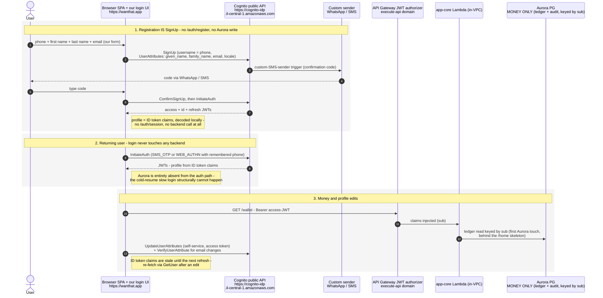
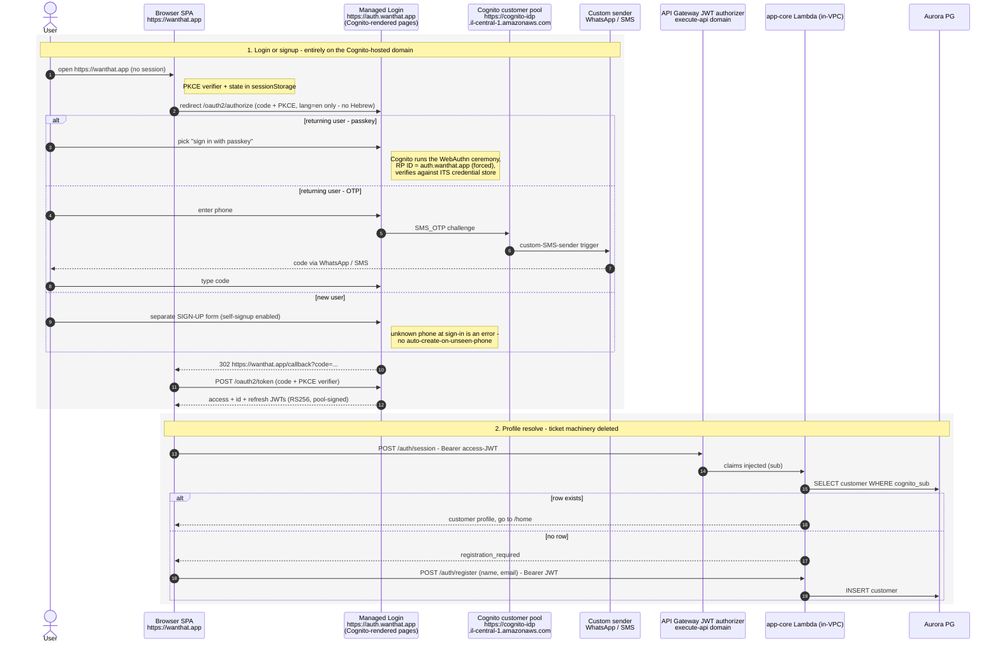
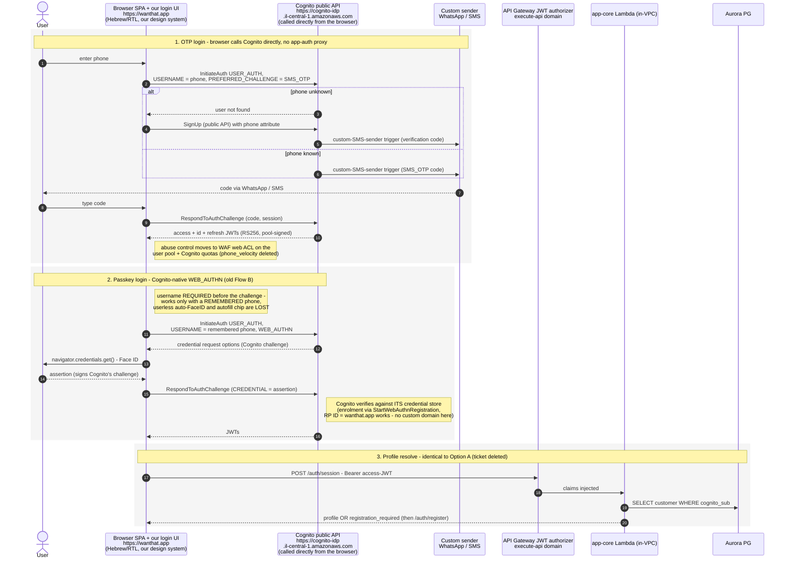

# ADR 0006 — Cognito-native customer authentication; all customer PII in Cognito

- **Status:** Accepted
- **Date:** 2026-07-09
- **Replaces (pre-release, in place):** the former identity, auth-foundation, and FaceID
  passkey records — their surviving decisions are restated here; their replaced designs live
  under *Alternatives considered*.
- **Amends:** [ADR-0002](0002-app-compute-topology.md) (identity module removed),
  [ADR-0003](0003-datastore-aurora-and-dynamodb.md) (Aurora is money-only),
  [ADR-0005](0005-disaster-recovery-posture.md) (PII residency/DR shift),
  [ADR-0007](0007-landing-path-and-latency.md) (landing login),
  [ADR-0019](0019-whatsapp-messaging-capability.md) (channel signal),
  [ADR-0020](0020-canonical-user-identifier.md) (sub keys money rows directly)
- **Related:** [docs/auth-cognito-native-plan.md](../docs/auth-cognito-native-plan.md)
  (execution plan); the evaluated option space with sources is the appendix below

## Context

The pre-0027 design owned every auth ceremony in app code: `app-auth` proxied each OTP step
to Cognito, ran the WebAuthn ceremony itself against its own `passkey_credential` store,
bridged verified passkeys into Cognito with an ephemeral admin-set password, and handed
tokens to `app-core` via a seconds-lived Ed25519 ticket. That bought exactly one product
property — **userless automatic passkey login** (Face ID with zero typed input on an
unrecognised device) — at the price of: two auth Lambdas, a signing keypair + deploy-time
keygen custom resource, three auth DynamoDB tables, the most security-sensitive code path in
the system (`AdminSetUserPassword`), and Aurora on the login critical path (the scale-to-zero
cold resume made logins take ~20 s after idle).

Two things changed:

1. **The userless requirement is waived.** Native Cognito `WEB_AUTHN` with a *remembered*
   phone still gives a one-prompt Face ID login on returning devices — the auto-prompt the
   product actually demonstrates. Only the type-nothing-on-a-new-device case is lost, and a
   synced passkey still works there after typing the phone once.
2. **We are pre-release.** There are no production users to migrate (one dev user, deleted
   with its recommendations), so both the auth topology and the PII home can change in place.

## Decision

1. **The browser talks to Cognito directly.** OTP sign-in is `InitiateAuth(USER_AUTH,
   PREFERRED_CHALLENGE=SMS_OTP)` + `RespondToAuthChallenge` from the SPA against the public
   `cognito-idp` endpoint; new users self-register with the public `SignUp` +
   `ConfirmSignUp`. No app code proxies authentication. **`app-auth` loses its entire auth surface** (all
   `/auth/*` routes) and survives only as the non-VPC `links` edge (ADR-0004) — rename to
   `app-links` as part of the work. The Ed25519 ticket (+ `ticket-keygen` custom resource +
   secret) and the `auth_challenge` and `phone_velocity` tables are deleted.
2. **Passkeys are Cognito-native.** Enrolment via `StartWebAuthnRegistration` /
   `CompleteWebAuthnRegistration` (access-token authorized); login via
   `InitiateAuth(USER_AUTH, WEB_AUTHN, USERNAME = remembered phone)`. Cognito stores and
   verifies credentials; `@wanthat/webauthn` and the `passkey_credential` table are deleted,
   as is the admin-password token exchange. The pool's `passkeyRelyingPartyId` stays the
   site domain (`wanthat.app` / `dev.wanthat.app`) — valid because we use neither managed
   login nor a Cognito custom domain. Userless/conditional-UI login is **waived**; the SPA
   auto-arms the ceremony on focus only when a remembered phone exists. Device-matched
   labelling (Face ID / Touch ID / Windows Hello) and the no-localhost / no dev↔prod
   credential-migration constraints carry over from the replaced passkey record unchanged.
3. **All customer PII lives in Cognito user attributes** — `phone_number` (sign-in alias),
   `given_name`, `family_name`, `email`, `locale`, plus `custom:otpChannel`. The profile the
   SPA displays is the **ID-token claims**, decoded locally; edits go through
   `UpdateUserAttributes` (+ `VerifyUserAttribute` for email). Registration is the `SignUp`
   call itself, carrying the profile attributes — there is no separate registration step
   against our backend.
4. **Aurora holds money only** — wallet ledger + hash-chained audit log, keyed directly by
   the Cognito `sub` (ADR-0020). The `customer` table is dropped; `/auth/session`,
   `/auth/register`, and `/me` are deleted from `app-core`, which becomes the wallet
   service. Nothing on the authentication path touches Aurora.
5. **OTP channel is a sticky user preference, enforced in the sender.** Cognito forwards no
   `ClientMetadata` to custom-sender triggers, so the per-request channel write that
   `/auth/start` performed cannot exist. Instead: `custom:otpChannel` is set at `SignUp`
   (rides `UserAttributes`) and edited post-auth from the profile; the **message-sender
   trigger becomes the enforcement point** — it reads the runtime-config kill switches
   (`auth.whatsappEnabled`, `auth.smsEnabled`, `whatsapp.phoneNumberId`,
   `auth.defaultOtpChannel`), honours the user's preference when available, and falls back
   to the other enabled channel otherwise. The kill switch survives, one layer lower. The
   SNS `MonthlySpendLimit` hard cap remains.
6. **Abuse control moves to the pool boundary.** The per-phone velocity table dies with the
   proxy; protection = AWS WAF web ACL on the user pool (rate-based rules on the
   unauthenticated operations) + Cognito's own request quotas + the SMS spend cap.
   (Verify WAF-for-Cognito availability in il-central-1 before build — spike task.)
7. **Welcome message via Post-Confirmation trigger.** The welcome `notification_outbox`
   write (previously in `/auth/register`) moves to a small non-VPC Cognito
   Post-Confirmation trigger writing DynamoDB only. The former auth foundation's "no Post-Confirmation
   trigger" stance existed to keep Aurora provisioning out of triggers; with no Aurora on
   the path, that objection is void.
8. **Lifecycle & moderation.** Suspend = `AdminDisableUser` (reversible; profile, sub, and
   passkeys preserved); kick = `AdminUserGlobalSignOut`; erase = `AdminDeleteUser` (a
   returning user gets a NEW sub — a new identity, unlinkable from prior wallet history, so
   disable is the moderation tool and delete is for true erasure). Known caveat: the API
   Gateway JWT authorizer validates statelessly, so already-issued access tokens pass until
   expiry (1 h) after a disable; acceptable for MVP (wallet reads are the only customer
   money surface; mutations flow through the poller). admin-api gains the disable / enable /
   global-sign-out grants beside its existing delete grant, and deleting a user also deletes
   their DynamoDB recommendations (by `byOwner` GSI) with a counter decrement.
9. **Two Cognito pools stay** (carried from the former auth foundation): customers (phone, passwordless,
   ESSENTIALS) and employees (email + password + mandatory TOTP, Managed Login + PKCE for
   the admin console). Nothing here changes the employee side.

## Decided flow (sequence)

The end state - authentication needs zero backend calls; Aurora appears only at the wallet
read:

## Alternatives considered

- **The replaced design: app-owned ceremonies + ticket bridge +
  admin-password exchange.** Worked and shipped; existed to deliver userless automatic
  passkey login, which Cognito cannot do (its `WEB_AUTHN` challenge is username-gated and it
  neither accepts external challenges nor exports stored public keys — verification and
  userless-ness are mutually exclusive). With that requirement waived, the design's entire
  cost column buys nothing. Its key artefacts: non-VPC `app-auth` + in-VPC `app-core` split
  with an Ed25519 ticket handoff (secretless verification); server-side unified flow
  (`AdminCreateUser(SUPPRESS)` on unseen phones); app-run WebAuthn ceremony over
  `passkey_credential` with conditional UI + focus-armed auto-modal; `CUSTOM_AUTH` trigger
  bridge (built, then dead on arrival — ESSENTIALS choice-based pools reject
  `AuthFlow=CUSTOM_AUTH`); admin token exchange as its replacement.
- **Managed Login (hosted pages) for customers** — no Hebrew/RTL (12 languages, text not
  editable), forces the passkey RP ID to the auth custom domain (silos credentials to the
  hosted page — WebAuthn scoping permits parent-domain claims only), full-page redirect UX,
  and the unified phone-first flow is unexpressible. Remains right for the admin console.
- **Hosted UI (classic)** — no passwordless and no passkeys at all (password-only for our
  purposes), no localization; first-generation experience. Strictly worse than Managed
  Login here.
- **Hybrid: native OTP + app-owned passkey ceremony** — the fallback if userless login is
  ever re-required. Keeps `passkey_credential`, the ceremony code, and the admin bridge;
  deletes only the OTP half of the complexity. Not chosen because the userless requirement
  is waived.
- **PII stays in Aurora (`/auth/session` + `/auth/register` kept, JWT-authorized)** — keeps
  SQL query power for admin/reporting and an auditable profile row, but keeps Aurora coupled
  to registration, keeps two app-core auth endpoints, and leaves profile data split across
  two stores. Rejected for MVP; its query power is the thing we knowingly give up.
- **Dual-write (Cognito authoritative + lazy Aurora projection)** — restores SQL reporting
  at the cost of sync complexity and a second PII copy. Deliberately deferred; revisit when
  admin/BI outgrows `ListUsers`.
- **Self-minted session JWTs** — rejected again for the same reason as before: a second
  validation path across every API; Cognito remains the only token issuer.

## Consequences

- **Login latency:** authentication requires zero backend calls; the first Aurora touch is
  the wallet read behind the `/home` skeleton. The idle-resume slow login is structurally
  gone.
- **Deleted:** app-auth's auth routes (the function survives as the `links` edge, renamed
  `app-links`), `packages/auth` (tickets),
  `packages/webauthn`, `ticket-keygen` + secret, `auth_challenge`, `passkey_credential`,
  `phone_velocity`, `/auth/session`, `/auth/register`, `/me`, the Aurora `customer` table.
- **Admin user views** move from SQL to `ListUsers`: one-attribute exact/prefix filter, no
  sorting, no joins. Acceptable at MVP scale; the dual-write alternative is the escape
  hatch.
- **DR / residency shift (amends ADR-0005):** cross-region Aurora backups now carry no
  customer PII (money only). ALL customer PII sits in Cognito, which has no cross-region
  replication in MVP — the accepted-limitation scope grows from "identity credentials" to
  "identity + profile PII". Attribute changes have no built-in history; profile-change
  auditing, if ever needed, requires a Lambda trigger.
- **Schema bounds:** 25 standard + max 50 custom attributes; custom attributes are
  add-only (never removable or renamable), 2048 chars, strings in the ID token. Fits the
  thin MVP profile.
- **User-existence errors:** the SPA branches sign-in vs sign-up on Cognito's
  user-not-found signal; the pool's "prevent user existence errors" setting must stay
  compatible with that UX (settle in the build — phone enumeration risk vs flow
  simplicity).
- **No user migration:** the single dev user is deleted (Cognito + its DynamoDB
  recommendations); dev passkeys are re-enrolled through the native flow.

## Appendix - evaluated option space (diagrams and sourced comparison)

Preserved from the pre-decision evaluation (2026-07-08/09). Sources inline.

The current customer flow (see [auth-flows-customer.md](./auth-flows-customer.md)) is complex
because the app owns the ceremonies: app-auth proxies every OTP step, runs the WebAuthn
verification itself against its own credential store, bridges into Cognito with an ephemeral
password, and hands tokens to app-core via an Ed25519 ticket. This page compares the two ways
to push that work into Cognito:

- **Option A - Managed Login**: Cognito hosts the login/signup pages on a custom auth domain
  (the pattern the admin console already uses).
- **Option B - app login page, Cognito-native flows**: we keep our own login UI on
  `wanthat.app`, but the browser talks to Cognito's public API directly
  (`USER_AUTH` / `SignUp` / native `WEB_AUTHN`) - app-auth stops proxying.

In BOTH options the Ed25519 ticket machinery disappears: the SPA already holds Cognito JWTs
when it calls app-core, so `/auth/session` becomes a normal JWT-authorized endpoint (the
Aurora login-vs-register branch stays, unchanged).

Domains used below (prod / dev):

- SPA: `https://wanthat.app` / `https://dev.wanthat.app`
- Managed Login custom domain (Option A only): `https://auth.wanthat.app` / `https://auth.dev.wanthat.app`
- Cognito public API (Option B): `https://cognito-idp.il-central-1.amazonaws.com`
- App HTTP API: `https://<app-api-id>.execute-api.il-central-1.amazonaws.com`

### Option A - Managed Login (hosted pages)

#### Variant considered: Hosted UI (Classic) - ruled out

The classic hosted UI is the first-generation version of the same idea (same OAuth
redirect shape as the Option A diagram, same domains), so it needs no separate diagram.
It fails harder than Managed Login on every dimension that matters to us:

- **No passwordless at all.** AWS states that "users can do passwordless and passkey
  authentication only in managed login" and "passkey sign-in isn't available in the classic
  hosted UI" - so customers would need PASSWORDS: no SMS-OTP first factor, no passkeys.
  That alone disqualifies it for a passwordless product.
  ([Authentication with user pools](https://docs.aws.amazon.com/cognito/latest/developerguide/authentication.html),
  [User pool managed login](https://docs.aws.amazon.com/cognito/latest/developerguide/cognito-user-pools-managed-login.html))
- **No localization** (Managed Login at least has 12 non-Hebrew languages; classic has none)
  and customization is a logo plus a fixed list of CSS classes - no layout or text control.
  ([AWS decision matrix: classic = "Passwordless: Not available, Localization: Not available"](https://aws.amazon.com/blogs/security/use-the-hosted-ui-or-create-a-custom-ui-in-amazon-cognito/),
  [Hosted UI (classic) branding](https://docs.aws.amazon.com/cognito/latest/developerguide/hosted-ui-classic-branding.html))
- **Legacy positioning.** AWS describes it as the "first-generation" experience with "a simpler
  design and fewer features", relevant mainly as the only option on the Lite feature plan -
  we are on Essentials, so there is no reason to prefer it.
  ([User pool managed login](https://docs.aws.amazon.com/cognito/latest/developerguide/cognito-user-pools-managed-login.html),
  [Feature plans comparison](https://aws.amazon.com/cognito/pricing/))

Classic hosted UI is the pattern for password-plus-federation apps, which we are not.
It is not evaluated further in the table below - where a row says "Managed Login", classic
is equal or worse.

### Option B - app login page, Cognito-native flows

### Option B variant - all customer PII in Cognito

Takes Option B one step further: the Aurora `customer` table is deleted and Cognito user
attributes (`given_name`, `family_name`, `email`, `locale`, `phone_number`) become the PII
system of record. Aurora keeps ONLY money (wallet ledger + audit log), keyed by `sub`
(already the canonical id, ADR-0020). Authentication then needs ZERO backend calls:

What it buys and what it costs (sourced):

- **Buys:** `/auth/session` and `/auth/register` deleted (app-core = wallet only), login is
  token-decode with zero backend latency, GDPR deletion is one `DeleteUser` call while the
  ledger stays pseudonymous under the orphaned sub.
  ([SignUp with UserAttributes](https://docs.aws.amazon.com/botocore/latest/reference/services/cognito-idp/client/sign_up.html),
  [user attributes](https://docs.aws.amazon.com/cognito/latest/developerguide/user-pool-settings-attributes.html))
- **Costs - admin search.** `ListUsers` filters on ONE attribute at a time, exact or prefix
  (`^=`) only, no sorting, no joins, custom attributes not filterable. Fine at MVP scale,
  weak for reporting - later BI would stream pool changes to S3/Athena, re-creating PII
  copies deliberately.
  ([ListUsers](https://docs.aws.amazon.com/boto3/latest/reference/services/cognito-idp/paginator/ListUsers.html),
  [managing user accounts](https://docs.aws.amazon.com/cognito/latest/developerguide/how-to-manage-user-accounts.html))
- **Costs - durability and audit.** No point-in-time recovery for user pools, export is DIY
  via `ListUsers`, multi-region replication is a paid add-on (ADR-0005 backup posture must be
  re-argued), and attribute changes have no built-in history (Aurora rows can be audited).
  ([feature plans / replication add-on](https://aws.amazon.com/cognito/pricing/))
- **Costs - schema rigidity.** 25 standard + max 50 custom attributes, custom ones cannot be
  renamed or removed once added, 2048 chars max, strings in the ID token. Fits the MVP's thin
  profile, cramped if the customer model grows.
  ([custom attributes](https://docs.aws.amazon.com/cognito/latest/developerguide/user-pool-settings-attributes.html))
- Middle path if reporting needs return: Cognito stays the auth-path source (claims for
  display) with a lazy non-blocking sync into an Aurora row - dual-write complexity traded
  for SQL query power.

This makes storing PII in Cognito an ADR-0003/0005-level decision (system of record moves),
not a refactor detail.

### User lifecycle in Cognito (applies to every option)

- **States:** created via `SignUp` (`UNCONFIRMED` until the code is entered, then
  `CONFIRMED`) or via `AdminCreateUser` (the current unified flow). The password states
  `FORCE_CHANGE_PASSWORD` / `RESET_REQUIRED` are effectively dead for passwordless customers
  (relevant to the employee pool).
  ([managing user accounts](https://docs.aws.amazon.com/cognito/latest/developerguide/how-to-manage-user-accounts.html),
  [AdminSetUserPassword](https://docs.aws.amazon.com/cognito-user-identity-pools/latest/APIReference/API_AdminSetUserPassword.html))
- **Suspend (ban):** `AdminDisableUser` deactivates the profile and revokes all access
  tokens - the user cannot sign in, refresh fails, but profile/sub/passkeys are preserved and
  the user still appears in `ListUsers`. Fully reversible with `AdminEnableUser`.
  ([AdminDisableUser](https://docs.aws.amazon.com/cognito-user-identity-pools/latest/APIReference/API_AdminDisableUser.html))
- **Revocation caveat for OUR APIs:** the API Gateway JWT authorizer validates statelessly
  against the JWKS and never consults Cognito, so an already-issued access token keeps
  passing our authorizer until expiry (1 h today, 5 min minimum). Cognito's own endpoints
  (GetUser, refresh) reject immediately. Instant bans need shorter token validity or an
  in-handler check on sensitive routes.
- **Kick sessions:** `AdminUserGlobalSignOut` (all refresh tokens) or `RevokeToken` (one
  refresh token - already used by `/auth/signout`). Same stateless-authorizer caveat.
- **Delete:** `AdminDeleteUser` / self-service `DeleteUser` is irreversible, and a returning
  user gets a NEW `sub` - a new canonical identity, unlinkable from the old wallet history
  (correct GDPR shape, but it means delete is a business decision: use disable for anything
  temporary).
- Admin-console ban tooling = three IAM grants on the customer pool (disable, global
  sign-out, delete - the delete grant already exists in the admin stack).

### Pros and cons (every statement sourced)

| # | Dimension | Option A - Managed Login | Option B - app page + Cognito-native | Source |
|---|-----------|--------------------------|--------------------------------------|--------|
| 1 | Hebrew / RTL | **Blocker.** Managed Login localization offers 12 languages (de, en, es, fr, id, nl, it, ja, ko, pt-BR, zh-CN, zh-TW) - no Hebrew, no RTL; the branding editor cannot modify or localize text. | Our page - full Hebrew/RTL, existing design system. | [Managed login localization](https://docs.aws.amazon.com/cognito/latest/developerguide/cognito-user-pools-managed-login.html), [Branding editor](https://docs.aws.amazon.com/cognito/latest/developerguide/managed-login-brandingeditor.html) |
| 2 | Userless / automatic passkey login | Cognito runs a discoverable ceremony on ITS page, but only after a full-page redirect there. | **Lost.** Native `USER_AUTH` requires `USERNAME` before Cognito issues the WebAuthn challenge; conditional UI / autofill needs a challenge before the user is known - only an app-run ceremony can do that. Works solely with a remembered phone (old Flow B). | [InitiateAuth (USERNAME required)](https://docs.aws.amazon.com/cli/latest/reference/cognito-idp/initiate-auth.html), [Passkey form autofill (web.dev)](https://web.dev/articles/passkey-form-autofill), [Bootstrapping (passkeys.dev)](https://passkeys.dev/docs/use-cases/bootstrapping/) |
| 3 | Passkey domain scope | **Silo.** With passkeys + custom domain + managed login, the RP ID MUST be the custom domain FQDN (`auth.wanthat.app`); WebAuthn lets a page claim only parent domains, so `wanthat.app` can never use those credentials. All existing passkeys (RP ID `wanthat.app`) require re-enrolment. | RP ID stays `wanthat.app` (pool `WebAuthnConfiguration`); existing credential KEYS are reusable in principle, but Cognito has no import API - users re-enrol via `StartWebAuthnRegistration`. | [webAuthnRelyingPartyId rule (CloudFormation)](https://docs.aws.amazon.com/AWSCloudFormation/latest/UserGuide/aws-resource-cognito-userpool.html#cfn-cognito-userpool-webauthnrelyingpartyid), [Discoverable credentials deep dive (web.dev)](https://web.dev/articles/webauthn-discoverable-credentials), [StartWebAuthnRegistration](https://docs.aws.amazon.com/cognito-user-identity-pools/latest/APIReference/API_StartWebAuthnRegistration.html) |
| 4 | Login UX shape | Full-page redirect to `auth.wanthat.app` and back (OAuth code + PKCE) - same as the admin console. | Stays in-page on `wanthat.app`; no redirect. | [Authentication flows (managed login sections)](https://docs.aws.amazon.com/cognito/latest/developerguide/amazon-cognito-user-pools-authentication-flow-methods.html) |
| 5 | Unified "enter phone, we figure it out" flow | **Lost.** Hosted pages separate sign-in from sign-up; self-signup must be enabled and an unknown phone at sign-in is an error, not an auto-create. | Approximated client-side: try `InitiateAuth`, fall back to public `SignUp` on user-not-found (two visible paths instead of one silent one). | [SignUp API (public, no IAM)](https://docs.aws.amazon.com/botocore/latest/reference/services/cognito-idp/client/sign_up.html), [Self-signup warning (AWS Security Blog)](https://aws.amazon.com/blogs/security/protect-your-amazon-cognito-user-pool-with-aws-waf/) |
| 6 | WhatsApp OTP delivery | Works - the custom SMS sender trigger fires regardless of who drives the challenge. Caveat: the user's hosted-page language choice is NOT passed to the trigger. | Works identically (same trigger, same pipeline). | [Custom SMS sender trigger](https://docs.aws.amazon.com/cognito/latest/developerguide/user-pool-lambda-custom-sms-sender.html), [WhatsApp via custom sender (AWS blog)](https://aws.amazon.com/blogs/security/how-to-use-whatsapp-to-send-amazon-cognito-notification-messages/), [lang not passed to sender triggers](https://docs.aws.amazon.com/cognito/latest/developerguide/cognito-user-pools-managed-login.html) |
| 7 | Abuse / SMS-pump protection (replaces phone_velocity) | Hosted endpoints sit on the Cognito domain; attach a WAF web ACL to the user pool (rate limits, CAPTCHA). | Browser hits Cognito's UNAUTHENTICATED public APIs directly; Cognito applies its own request quotas, WAF on the user pool covers rate rules; risk-based blocking (threat protection) needs the PLUS feature plan (we are on Essentials). | [WAF for user pools](https://docs.aws.amazon.com/cognito/latest/developerguide/user-pool-security-best-practices.html), [Public clients + quotas (AWS blog)](https://aws.amazon.com/blogs/security/protect-public-clients-for-amazon-cognito-by-using-an-amazon-cloudfront-proxy/), [Threat protection = Plus plan](https://docs.aws.amazon.com/cognito/latest/developerguide/cognito-user-pool-settings-threat-protection.html) |
| 8 | Code deleted (both delete the ticket + keygen + admin bridge) | Nearly all of app-auth: OTP endpoints, passkey endpoints, `@wanthat/webauthn`, `auth_challenge` + `passkey_credential` + `phone_velocity` tables, the login UI itself. | app-auth OTP proxy endpoints, ticket machinery, `@wanthat/webauthn`, the three auth DynamoDB tables; login UI kept. | internal (this repo: `services/app-auth`, `packages/auth`, `packages/webauthn`, ADR-0006) |
| 9 | What Cognito still cannot do | The Aurora login-vs-register branch and PII profile - `/auth/session` + `/auth/register` on app-core survive in both options (JWT-authorized, ticket-free). | Same. | internal (ADR-0003: PII only in Aurora) |

### Bottom line

- **Option A** is disqualified for customers today by row 1 alone (no Hebrew/RTL, text not
  customizable), and row 3 makes its passkeys strictly worse. It remains the right pattern for
  the (English-only, redirect-tolerant) admin console.
- **Option B** is a genuine simplification with one real casualty: **userless automatic
  Face ID** (row 2) - the flagship login UX. Everything else survives or improves.
- The pragmatic middle: **Option B for OTP** (delete the proxy endpoints, ticket, velocity
  table; add WAF to the pool) while **keeping the app-run ceremony only for passkeys**
  (ADR-0006 as-is). That removes most of the complexity without giving up the auto-FaceID
  differentiator.
- If the userless auto-FaceID requirement is WAIVED, full Option B wins outright (native
  WEB_AUTHN with a remembered phone keeps the returning-device prompt), and the
  **PII-in-Cognito variant** above is the maximal simplification - at the price of making
  Cognito the PII system of record (weak querying, no PITR, no attribute audit trail).
