# Wanthat — AWS Architecture (MVP)

*The authoritative source for architecture decisions is [`../adrs/`](../adrs) (see
[`adrs/README.md`](../adrs/README.md) for the index). This document is the consolidated overview;
where it and an ADR differ, the ADR wins. Last verified on **2026-07-14** against both the
code (`infra/lib/`, `services/*/src`, `packages/db/migrations/`) and the **live AWS account**:
every stack, function (incl. VPC placement), table, route, schedule, Cognito trigger, WAF ACL,
secret, and the Firehose/Glue pipeline below was confirmed deployed and matching in **dev and
prod** (17 stacks in il-central-1 + 2 edge stacks in us-east-1).*

Architecture diagram: inline **Mermaid** in §2 below (renders on GitHub and in most Markdown
viewers).

## 1. Why serverless

The MVP is bursty and unpredictable (a link goes viral in a WhatsApp group → thousands of
redirects in minutes, then quiet). Lambda + pay-per-use managed services mean we pay per request,
scale to zero between bursts, and have no servers to patch. (ADR-0007.) Every function is
Node 24 on arm64, 256 MB, X-Ray traced, with retention-bounded log groups (dev 1 month,
prod 6 months). No function currently reserves concurrency — the account limit (10) is the cap
until the quota is raised.

## 2. High-level architecture

```mermaid
flowchart TB
  member(["Member SPA - browser"])
  friend(["Friend / guest - browser"])
  adminUser(["Admin - browser"])
  crawler(["Social crawler - OG preview"])
  ali[("AliExpress affiliate API<br>api-sg.aliexpress.com - IPv4-only, HMAC")]
  meta[("Meta WhatsApp - eu-central-1<br>SNS SMS")]

  subgraph edge["Edge - CloudFront cert + WAF in us-east-1"]
    cf["CloudFront + WAF<br>default -> SPA, /p/* -> landing API"]
    s3site[("S3 - SPA + config.json")]
  end

  subgraph region["AWS il-central-1"]
    custpool["Cognito CUSTOMER pool - ESSENTIALS<br>phone OTP + passkeys<br>PII in user attributes"]
    emppool["Cognito EMPLOYEE pool<br>email + mandatory TOTP<br>Managed Login + PKCE"]
    sender["message-sender<br>custom SMS sender, kill-switched"]
    postconf["post-confirmation<br>welcome + attribution + counters"]

    appgw["App HTTP API<br>JWT authorizer - customer pool"]
    admingw["Admin HTTP API<br>JWT authorizer - employee pool"]
    landinggw["Landing HTTP API - public"]

    applinks["app-links - non-VPC<br>products.resolve + recommendations"]
    admincred["admin-credentials - non-VPC<br>Cognito user moderation + secret write"]
    landing["landing - non-VPC<br>OG shell + attributed redirect"]
    proxy["retailer-proxy - non-VPC<br>sole retailer egress, sole secret reader"]
    fx["fx-rates - non-VPC"]
    dispatcher["whatsapp-dispatcher - non-VPC<br>outbox stream consumer + DLQ"]
    sched["EventBridge Scheduler<br>orders 15 min + FX 12 h"]

    secrets["Secrets Manager<br>retailer credential"]
    funnel[("Firehose -> S3 -> Glue/Athena<br>impression, click, conversion, order_untracked")]

    subgraph dynamo["DynamoDB - on-demand, PITR. Logical view: one node per table - NO cross-table transactions"]
      t_prod[("product<br>+ counter row - same-table tx")]
      t_rec[("recommendation<br>+ counter row - same-table tx<br>byOwner GSI")]
      t_guest[("guest_attribution")]
      t_state[("poller_state")]
      t_unattr[("unattributed_order<br>byState GSI")]
      t_cfg[("runtime_config")]
      t_ops[("ops_counters")]
      t_fx[("fx_rate")]
      t_outbox[("notification_outbox<br>TTL 30 d + stream")]
      t_otp[("otp_sink<br>TTL 5 min")]
    end

    subgraph vpc["VPC - isolated subnets, no NAT, no RDS Proxy, no interface endpoints"]
      appcore["app-core<br>wallet + activity"]
      adminsvc["admin-api<br>stats, config, unattributed orders"]
      writer["conversion-poller<br>the ONLY money writer"]
      migrator["db-migrator - deploy-time"]
      subgraph aurora["Aurora Serverless v2 - PG 16.13, 0 to 2 ACU, IAM auth. Sequential idempotent appends - NOT one tx"]
        t_wallet[("wallet_entry<br>append-only ledger, keyed by sub<br>unique order_id+kind+status")]
        t_audit[("audit_log<br>hash-chained, SECURITY DEFINER only")]
      end
    end
  end

  member -- "SPA assets + config.json" --> cf
  friend -- "GET /p/:id + resolve" --> cf
  crawler -- "GET /p/:id" --> cf
  cf -- "default" --> s3site
  cf -- "/p/*" --> landinggw --> landing

  member -- "browser-direct: SignUp,<br>InitiateAuth, WEB_AUTHN" --> custpool
  custpool -. "custom SMS sender" .-> sender
  sender -- "WhatsApp default, SMS fallback" --> meta
  sender -- "park every code" --> t_otp
  custpool -. "post confirmation" .-> postconf
  postconf -- "optin_welcome" --> t_outbox
  postconf -- "guest -> member" --> t_guest
  postconf -- "customer counter" --> t_ops
  t_outbox -. "stream" .-> dispatcher
  dispatcher -- "template send" --> meta

  member -- "Bearer JWT" --> appgw
  appgw --> applinks
  appgw --> appcore
  appgw -. "validate via JWKS" .-> custpool
  admingw -. "validate via JWKS" .-> emppool
  adminUser -- "PKCE code flow<br>Managed Login" --> emppool
  adminUser -- "Bearer JWT" --> admingw
  admingw --> adminsvc
  admingw --> admincred
  admincred -- "ListUsers, disable, enable,<br>sign-out, delete - CUSTOMER pool" --> custpool
  admincred -- "PutSecretValue - write only" --> secrets
  admincred -- "delete by owner + counter" --> t_rec

  applinks -- "create: put + counter - one tx" --> t_rec
  applinks -- "cache read" --> t_prod
  applinks -- "invoke generateLink" --> proxy
  appcore -- "app_rw - balance + history reads" --> t_wallet
  adminsvc -- "app_ro - money KPIs" --> t_wallet
  adminsvc -- "config audit fn - app_ro" --> t_audit
  adminsvc -- "sole writer" --> t_cfg
  adminsvc -- "claim / dismiss" --> t_unattr
  landing -- "short id -> product + owner" --> t_rec
  landing -- "impression / click log lines" --> funnel
  landing -. "302 to store with custom_parameters" .-> ali

  sched -- "listOrders heartbeat" --> proxy
  sched --> fx
  fx -- "USD-ILS rate" --> t_fx
  proxy -- "HMAC: getProductDetail,<br>generatePromotionLink, listOrdersByIndex" --> ali
  proxy -- "read credential" --> secrets
  proxy -- "cache put + counter - one tx" --> t_prod
  proxy -- "poll cursor" --> t_state
  proxy -- "park unmatched orders" --> t_unattr
  proxy -- "attribution reads" --> t_guest
  proxy -- "invoke WriteConversions" --> writer
  proxy -- "order_untracked log line" --> funnel
  writer -- "poller_writer - append rows" --> t_wallet
  writer -- "audit_append per row" --> t_audit
  writer -- "per-link stats" --> t_rec
  migrator -- "wanthat_migrator - DDL" --> aurora

  classDef invpc fill:#e6f0ff,stroke:#3b6fb3,color:#0b2545
  classDef novpc fill:#eafaf1,stroke:#2e8b57,color:#0b3d2e
  classDef data fill:#fff4e6,stroke:#cc8400,color:#5c3b00
  classDef ext fill:#f3f0f7,stroke:#7a5fa3,color:#33235c
  class appcore,adminsvc,writer,migrator invpc
  class applinks,admincred,landing,proxy,fx,dispatcher,sender,postconf novpc
  class t_prod,t_rec,t_guest,t_state,t_unattr,t_cfg,t_ops,t_fx,t_outbox,t_otp,t_wallet,t_audit,s3site,funnel data
  class ali,meta,custpool,emppool ext
  style vpc fill:#f3f0f7
```

*Legend: blue = in-VPC Lambdas, green = non-VPC Lambdas, orange = data stores, purple =
external/managed. Solid arrows are synchronous data/HTTP, dotted arrows are async (triggers,
streams, redirects). The datastores are drawn **one node per table** (logical view): no two
tables ever share a transaction — every DynamoDB `TransactWriteItems` is single-table (the
item plus its counter row live in the same table by design), and the Aurora ledger + audit
writes are sequential idempotent statements, not one SQL transaction. Read edges for
`runtime_config` (read by almost every function), `fx_rate` (read by app-links, app-core,
admin-api, landing), and admin-api's read-only taps on ops_counters / otp_sink /
notification_outbox / product / recommendation are omitted to keep the diagram legible.*

Compute is sliced by real seams (ADR-0002, reshaped by ADR-0006): the member surface is split
into the non-VPC **app-links** (catalog + recommendations, no database) and the in-VPC
**app-core** (wallet, the only customer-facing Aurora reader); the admin surface into the
in-VPC **admin-api** (SQL stats + config) and the non-VPC **admin-credentials** (Cognito
moderation + secret writes); plus the public **landing**, the scheduled conversion pipeline
(**retailer-proxy** fetcher → in-VPC **conversion-poller** writer), and the messaging pair
(**message-sender**, **whatsapp-dispatcher**). There is **no auth service**: the browser talks
to Cognito directly (ADR-0006), and all money mutations flow through the poller-writer into the
append-only ledger + hash-chained audit log.

## 3. Components

### 3.1 Edge & front-end
- **CloudFront** (EdgeStack, pinned to us-east-1 for the ACM cert + CLOUDFRONT-scope WAF —
  control plane only; PRICE_CLASS_200 includes the Israel edge) — one distribution:
  - **default** → private **S3 SPA bucket** via Origin Access Control; 403/404 rewritten to
    `/index.html` (SPA routing), so the landing path must answer its own not-found as 200.
  - **`/p/*`** → the landing HTTP API as a cross-region HTTP origin, caching disabled, all
    methods (the resolve call is a POST).
  - WAF web ACL: `AWSManagedRulesCommonRuleSet` + a 2000 req/IP rate rule.
- **SPA** — Vite + React (ADR-0016), cookieless: tokens in localStorage, every API call a
  Bearer XHR. It learns its backend URLs + Cognito client ids from a runtime **`config.json`**
  the EdgeStack writes into the bucket at deploy (no build-time env), `Cache-Control: no-cache`.
- **DNS**: Route 53 alias to CloudFront — apex `wanthat.app` (prod) / `dev.wanthat.app` (dev),
  same hosted zone. A prod-only **DnsStack** adds Zoho mail records (MX/SPF/DKIM/DMARC).

### 3.2 Identity & messaging (ADR-0006, ADR-0019)
- **Cognito, two pools** (both ESSENTIALS):
  - **Customer pool** `wanthat-{env}` — self-signup on; sign-in aliases phone + email;
    first-auth factors `smsOtp` + `passkey` (choice-based `USER_AUTH`; password never enabled
    on the client). **The browser calls Cognito directly** — `SignUp`/`ConfirmSignUp`,
    `InitiateAuth`, `RespondToAuthChallenge`, native `WEB_AUTHN` — no app code proxies auth.
    All customer PII lives in user attributes (`phone_number`, `email`, `given_name`,
    `family_name`, `locale`, `custom:otpChannel`); the profile the SPA shows is the ID-token
    claims. Passkeys are Cognito-native (`WebAuthnConfiguration` RP id = the site domain,
    user verification required). SPA client: 1 h access/id tokens, 30 d refresh,
    `preventUserExistenceErrors` LEGACY (the SPA branches sign-in vs sign-up on
    user-not-found; phone enumeration accepted for MVP).
  - **Employee pool** `wanthat-{env}-employees` — no self-signup, email sign-in, password
    (min 12) + **mandatory TOTP**; `admin` group; **Managed Login** hosted UI (branded) with
    the OAuth code + PKCE flow for the admin console; 7 d refresh.
- **OTP delivery** — the pool's CUSTOM_SMS_SENDER trigger invokes **message-sender**
  (non-VPC): decrypts the code (KMS custom-sender key), resolves the channel from runtime
  config (`auth.whatsappEnabled` / `auth.smsEnabled` / `auth.defaultOtpChannel` /
  `whatsapp.phoneNumberId` — the kill switches), parks every code in the TTL'd **otp_sink**
  table (5 min; the admin activity feed reads it — permanent in every env), then sends via
  **End User Messaging Social** (WhatsApp, `eu-central-1` — not available in il-central-1) or
  SNS SMS (Transactional, direct-to-phone only).
- **Welcome path** — the POST_CONFIRMATION trigger (**post-confirmation**, non-VPC) writes an
  `optin_welcome` item to **notification_outbox**, stamps **guest_attribution**, and bumps the
  customer counter. The table's stream feeds **whatsapp-dispatcher** (batch 10, 3 retries,
  bisect-on-error, SQS DLQ, 14 d retention), gated by `notifications.whatsappEnabled` (ships
  OFF) + a configured `whatsapp.phoneNumberId`; skipped items age out by TTL (~30 d).
- **Abuse control sits at the pool boundary** (no app-side velocity tables): a REGIONAL WAF
  web ACL on the customer pool rate-limits the unauthenticated Cognito operations
  (SignUp / ConfirmSignUp / ResendConfirmationCode / InitiateAuth / RespondToAuthChallenge,
  100 req/IP/5 min, plus a 500 req/IP backstop) + Cognito's own quotas + the **SNS monthly SMS
  spend hard cap** ($1 today — an account-wide setting shared by dev and prod, capped at the
  SMS-sandbox ceiling; raise after AWS lifts it).

### 3.3 APIs
Three HTTP APIs (API Gateway v2), each throttled on `$default`:

| API | Authorizer | Throttle (rate/burst) | Backends |
|---|---|---|---|
| `wanthat-{env}-app` | JWT, customer pool | 500 / 1000 | app-links (non-VPC), app-core (in-VPC) |
| `wanthat-{env}-admin` | JWT, employee pool (+ in-handler `admin`-group re-check) | 50 / 100 | admin-api (in-VPC), admin-credentials (non-VPC) |
| `wanthat-{env}-landing` | none (public) | 2000 / 4000 | landing (non-VPC) |

- **App API routes**: public `GET /healthz`, `GET /config` (allow-listed runtime-config keys),
  `GET /healthz/db` (Aurora warm-up probe); JWT-protected `POST /products/resolve`,
  `GET|POST /recommendations`, `GET|PATCH /recommendations/{id}` (→ app-links) and
  `GET /wallet`, `GET /wallet/entries`, `GET /activity` (→ app-core).
- **Admin API routes**: user moderation + retailer credentials → **admin-credentials**
  (`GET /admin/users`, `GET /admin/users/{sub}`, `POST /admin/users/{disable|enable|
  global-signout|cognito-delete}`, `GET|PUT /admin/retailer/aliexpress/credentials`);
  everything else → **admin-api** (`GET|PUT /admin/config[/{key}]`,
  `GET /admin/stats/{overview|users|catalog|money}`, `GET /admin/activity`,
  `GET /admin/orders/unattributed` + `POST .../{orderId}/claim|dismiss`,
  `GET /admin/users/{sub}/recommendations|wallet`).
- **Landing API**: `GET /p/{id}` (OG-injected SPA shell + content snapshot; bots get previews,
  humans boot the SPA; always 200) and `POST /p/{id}/resolve` (the attributed redirect;
  verifies a member's Bearer token **offline via JWKS** — landing never calls Cognito).

### 3.4 Compute (Lambda, Node 24, arm64)
- **app-links** *(non-VPC, 15 s)* — product resolve (cache-first against the `product` table,
  cache-miss → sync invoke of retailer-proxy `generateLink`), recommendation CRUD (short
  base62 ids), ILS display estimates from the FX cache. No Aurora, no Cognito.
- **app-core** *(in-VPC, 30 s)* — the wallet service: balances + ledger history derived from
  `wallet_entry` (as `app_rw`), the merged member activity feed, and `GET /healthz/db` (the
  SPA fires it on auth surfaces to overlap the Aurora scale-to-zero resume with the human).
- **admin-api** *(in-VPC, 30 s)* — employee-authorized: dashboard stats (users/catalog/money —
  money KPIs are ledger-derived SQL as `app_ro`), runtime-config editor (**sole
  runtime_config writer**; every change audited into Aurora via the
  `admin_audit_config_change` SECURITY DEFINER function), the unattributed-order claim queue,
  and per-user drill-downs.
- **admin-credentials** *(non-VPC, 10 s)* — the Cognito-touching half of admin: user
  search/list (`ListUsers`), disable/enable/global-sign-out/delete on the customer pool, and
  retailer-credential rotation (Secrets Manager `PutSecretValue` — **write-only**; it can
  never read the secret back). Deleting a Cognito user also deletes their recommendations
  (byOwner GSI).
- **landing** *(non-VPC, 15 s)* — the `/p/` hot path: DynamoDB lookup, OG shell, attributed
  302 with `custom_parameters` (member sub or guest id), impression/click log lines → the
  funnel pipeline. Built to absorb viral bursts without touching Aurora.
- **retailer-proxy** *(non-VPC, 300 s)* — the **sole retailer egress** and sole reader of the
  retailer credential. Live HMAC-SHA256 client for the AliExpress System Interface
  (`getProductDetail`, `generatePromotionLink`, `listOrdersByIndex`). On the poll heartbeat it
  pages new orders (cursor in `poller_state`), resolves attribution
  (`custom_parameters` → recommendation / guest), parks unmatched orders in
  `unattributed_order`, settles admin claim intents, and invokes the in-VPC writer.
- **conversion-poller** *(in-VPC, 90 s)* — the writer half: validates the proxy's
  `WriteConversions` payload and appends `pending → confirmed → clawback` ledger rows +
  audit-log entries as `poller_writer`. **Invoked only by retailer-proxy** — the only path
  that mutates money.
- **fx-rates** *(non-VPC, 15 s)* — refreshes the `fx_rate` cache (`USD#ILS`, Bank of Israel
  source per ADR-0017) every 12 h.
- **message-sender / post-confirmation / whatsapp-dispatcher** — see §3.2.
- **db-migrator** *(in-VPC, 5 min, deploy-time)* — a CDK Trigger runs the plain-SQL Kysely
  migrations as `wanthat_migrator` (IAM DB auth) on every deploy; a brand-new environment's
  first run needs master credentials once (see migration `0003`).

### 3.5 Data (polyglot — ADR-0003)
- **Aurora Serverless v2** (PostgreSQL **16.13**, min **0** / max **2** ACU, `max_connections=50`,
  IAM database auth, no RDS Proxy, storage encrypted) — **money only** since migration
  `0006_money_only`:
  - **`wallet_entry`** — append-only ledger keyed directly by **`cognito_sub`** (the canonical
    user id, ADR-0020 — the `customer` table is gone). Kinds: `referrer_cashback`,
    `consumer_reward`, `adjustment`, `withdrawal`; statuses `pending → confirmed → clawback`;
    a unique `(order_id, kind, status)` index makes the poller idempotent. Balances are
    **derived, never stored**. UPDATE/DELETE revoked from every role.
  - **`audit_log`** — hash-chained append-only, written only via the SECURITY DEFINER
    functions `audit_append` (poller_writer) and `admin_audit_config_change` (app_ro).
  - Postgres roles = the enforcement layer: `app_rw` (SELECT wallet_entry), `app_ro` (SELECT +
    the config-audit function), `poller_writer` (SELECT + INSERT + audit_append),
    `wanthat_migrator` (DDL). All `rds_iam`.
- **DynamoDB** (all on-demand, PITR) — everything non-money:

  | Table | Keys / extras | Purpose |
  |---|---|---|
  | `product` | storeId + storeProductId | retailer product cache (written by retailer-proxy) |
  | `recommendation` | recommendationId; GSI `byOwner` | short-link projection + per-link stats |
  | `guest_attribution` | guestId | guest → member carry-over (written at post-confirmation) |
  | `poller_state` | stateKey | order-poll cursor (retailer-proxy only) |
  | `unattributed_order` | orderId; GSI `byState` | orders with no attribution — admin claim queue |
  | `runtime_config` | configKey | kill switches + tunables; **admin-api is the sole writer** |
  | `ops_counters` | counterKey | exact customer/link counters + daily stats for the dashboard |
  | `fx_rate` | pair (`USD#ILS`) | FX display-estimate cache |
  | `notification_outbox` | outboxId; TTL ~30 d; **stream** | WhatsApp outbox → dispatcher |
  | `otp_sink` | phone; TTL 5 min | every OTP parked pre-send; admin activity feed |

- **Transaction boundaries (why the diagram draws one node per table):** no two tables ever
  participate in the same transaction. Exact counters are kept transactional by co-locating
  the counter row **inside the counted table** (`product` and `recommendation` each pair the
  conditional put/delete with an `ADD itemCount` on their own counter item in one
  single-table `TransactWriteItems`). The Aurora pair is **not** atomic either: the writer
  appends a `wallet_entry` row, then chains `audit_append` as a second statement — replay
  safety comes from the ledger's unique `(order_id, kind, status)` index, not from a wrapping
  transaction.
- **Funnel analytics** (ObservabilityStack construct — live): CloudWatch Logs subscription
  filters on landing / retailer-proxy / conversion-poller pick out
  `impression | click | conversion | order_untracked` events → Firehose
  `wanthat-{env}-funnel` → S3 (date-partitioned) → Glue table `funnel_events`, queryable in
  Athena with partition projection.
- **Secrets Manager** — one runtime secret: the retailer credential
  `wanthat/{env}/retailer/aliexpress` (created empty; populated via the admin panel;
  **retailer-proxy is the only principal that can read it**). The Aurora master secret exists
  for bootstrap only — nothing reads it at runtime.

### 3.6 Network (NAT-free — ADR-0004)
Only Aurora and the four functions that touch it (`app-core`, `admin-api`,
`conversion-poller`, `db-migrator`) live in the VPC (2 AZs, isolated subnets, security groups
scoped Lambda→Aurora:5432). They reach DynamoDB via the free gateway endpoint. **Zero paid
interface endpoints, no NAT Gateway, no RDS Proxy** — nothing in the VPC calls the internet,
Cognito, or Secrets Manager. Everything else runs outside the VPC over public AWS endpoints
(IAM + TLS). The IPv4-only retailer API is reached only from retailer-proxy; in-VPC functions
cannot invoke outward, so the conversion chain is always proxy → writer, and admin claim
intents are settled asynchronously by the next heartbeat.

### 3.7 Schedules & async wiring
- **EventBridge Scheduler**: `OrderPollHeartbeat` — `rate(15 minutes)`, enabled in every env,
  target retailer-proxy `{op: listOrders}`; the op self-gates on the `poller.intervalMinutes`
  runtime config (default 30) and settles claims every beat. `FxRatesSchedule` —
  `rate(720 minutes)` → fx-rates.
- **DynamoDB stream**: notification_outbox → whatsapp-dispatcher (with SQS DLQ).
- **Deploy trigger**: MigrateTrigger → db-migrator after Aurora updates.

### 3.8 Observability & security
- **ObservabilityStack** (deploys last): SNS alarm topic (email subs), alarms on per-Lambda
  errors, per-API 5xx, Aurora connections (80% of the 50 cap), and month-to-date SMS spend
  (80% of the cap); a per-surface CloudWatch dashboard (API count/5xx/p95, Lambda
  errors/throttles/p95, Aurora ACU + connections, SMS spend). The CloudFront/WAF dashboard
  lives on the EdgeStack (us-east-1, where those metrics publish).
- **Two WAF web ACLs**: CLOUDFRONT scope on the distribution; REGIONAL scope on the customer
  pool (§3.2).
- **Least privilege**: per-function IAM; money invariants enforced by Postgres GRANTs (not
  just IAM); the retailer secret readable by exactly one function; customer/admin separated
  at the pool level; admin-credentials can rotate but never read the secret.
- **Region** `il-central-1`; `eu-central-1` is the DR/restore target (ADR-0005) and hosts the
  WhatsApp Social endpoint. il-central-1 feature gaps that shaped the design: no Lambda
  Function URLs (landing sits behind an HTTP API), no RDS Data API (killed the no-VPC data
  path), no End User Messaging Social (WhatsApp sends cross-region).

## 4. Request flows

**Sign-up / sign-in (zero backend calls — ADR-0006):** SPA → Cognito `SignUp` (attributes
carry the whole profile) or `InitiateAuth(USER_AUTH, SMS_OTP | WEB_AUTHN)` → custom sender →
WhatsApp/SMS → `RespondToAuthChallenge` → JWTs. Profile = ID-token claims decoded locally.
The first backend touch is `GET /wallet` behind the JWT authorizer; the first Aurora touch is
that wallet read (behind the `/home` skeleton + the `healthz/db` warm-up probe).

**Create a link:** SPA → `POST /products/resolve` (app-links) → product cache hit, or sync
invoke of retailer-proxy → AliExpress `getProductDetail` + `generatePromotionLink` →
`POST /recommendations` writes the short-id projection → SPA shares
`wanthat.app/p/{shortId}`.

**Landing → conversion:** visitor hits `/p/{id}` → CloudFront → landing → DynamoDB lookup →
OG-injected shell (impression) → `POST /p/{id}/resolve` with member token (offline JWKS
verify) or guest id → 302 to the retailer with `custom_parameters` (click) → purchase →
`OrderPollHeartbeat` → retailer-proxy `listOrdersByIndex` pages new orders, resolves
attribution (unmatched → `unattributed_order` for admin claim) → invokes conversion-poller →
append-only ledger rows (`pending → confirmed → clawback`) + hash-chained audit entries +
conversion funnel event.

**Wallet & activity:** `GET /wallet` derives balances per currency from the ledger (headline
is an ILS display **estimate** via the fx_rate cache — ADR-0017: hold settlement currency,
convert at withdrawal); `GET /wallet/entries` + `GET /activity` serve history.

**Admin:** employee signs in via Managed Login (PKCE, TOTP) → the admin SPA calls the admin
API with the employee JWT → SQL stats + config edits (audited) via admin-api (in-VPC), user
moderation + credential rotation via admin-credentials (non-VPC → Cognito/Secrets). Claim
intents on unattributed orders are picked up by the next poll heartbeat.

## 5. Cost posture (MVP scale)

Per-request compute + scale-to-zero data (Aurora paused ≈ storage only; DynamoDB $0 idle).
**No NAT Gateway, no RDS Proxy, zero VPC interface endpoints**; the retailer-proxy invoke
chain keeps non-VPC→VPC calls free. The dominant line item is OTP delivery, not
infrastructure — and even that is hard-capped ($1/month SNS limit while the account is in the
SMS sandbox).

## 6. Deployment

Infrastructure as code via **AWS CDK**; stacks ordered `Network → Data → Identity → Api /
Admin / EdgeServices / WhatsApp → Edge → Observability` (+ a prod-only `Dns` stack); see
[`infra/lib/README.md`](../infra/lib/README.md). Per-environment stacks (dev/prod, selected by
`WANTHAT_ENV`, single AWS account); removal policies RETAIN in prod, DESTROY in dev; no manual
console changes. CI/CD via GitHub Actions (OIDC): PRs run CI + a `cdk diff` dry run
(destructive-change warnings); merge to `main` deploys dev; prod promotes explicitly.
Migrations run automatically in-deploy via the db-migrator trigger.
