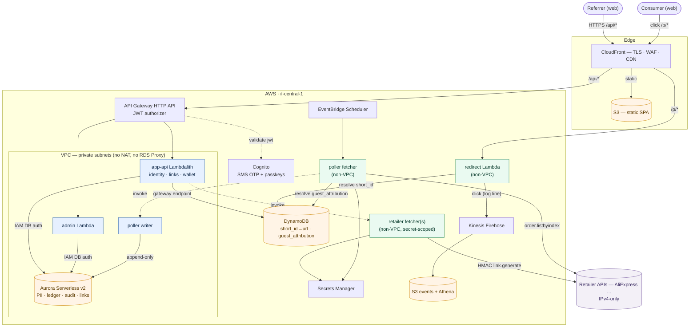

# Wanthat — AWS Architecture (MVP)

*The authoritative source for architecture decisions is [`../adrs/`](../adrs) (ADR-0001–0009).
This document is the consolidated overview; where it and an ADR differ, the ADR wins.*

Architecture diagram: inline **Mermaid** in §2 below (renders on GitHub and in most Markdown
viewers).

## 1. Why serverless

The MVP is bursty and unpredictable (a link goes viral in a WhatsApp group → thousands of
redirects in minutes, then quiet). Lambda + pay-per-use managed services mean we pay per request,
scale to zero between bursts, and have no servers to patch. (ADR-0007.)

## 2. High-level architecture

*Legend: blue = in-VPC Lambdas · green = non-VPC Lambdas · orange = data stores · purple =
external. Solid arrows are data/HTTP; dotted arrows are Lambda-to-Lambda invokes.*

Four compute units sliced by real seams (ADR-0002): the **app-api Lambdalith**
(identity · links · wallet), a separate **admin** API, the public **redirect** service, and the
scheduled **conversion poller** (a non-VPC fetcher + in-VPC writer). All money mutations flow
through the poller-writer into the append-only PostgreSQL ledger + hash-chained audit log.

## 3. Components

### 3.1 Edge & front-end
- **CloudFront** — CDN + TLS + WAF. Routes `/api/*` → API Gateway, `/p/*` → redirect, static → S3.
- **S3** — static Next.js/React SPA (web-first MVP).

### 3.2 API & identity
- **API Gateway (HTTP API)** — single HTTPS entry. JWT authorizer validates Cognito tokens;
  `cognito:groups` gates `admin`.
- **Cognito** — passwordless **SMS OTP** (`ALLOW_USER_AUTH`) + opt-in **passkeys/WebAuthn**
  step-up. Our own `/auth/*` fronts Cognito so we gate before any SMS (the SMS kill switch).
  WhatsApp deferred. (ADR-0006.)

### 3.3 Compute (Lambda, Node 20)
- **app-api Lambdalith** *(in-VPC)* — `identity` (`/auth/*`, `/me`), `links` (`/links`,
  `/products/*`), `wallet` (`/wallet*`). Shared Postgres schema + cross-table transactions.
- **admin** *(in-VPC)* — separate role/exposure; the only app surface that may write money
  (audited adjustments).
- **redirect** *(non-VPC)* — resolves `short_id → affiliate_url` in **DynamoDB**; member →
  auto-301 (+`customer_id` in `custom_parameters`), anon → OG landing (+`guestId` cookie); emits
  the click off the 301 path via a structured log line → Firehose. (ADR-0007.)
- **conversion poller** — non-VPC **fetcher** (calls the IPv4-only retailer API, resolves
  attribution) invokes an in-VPC **writer** (ledger + audit). Scheduled via EventBridge. (ADR-0009.)
- **retailer fetcher(s)** *(non-VPC)* — hold the secret-scoped retailer credential + HMAC client;
  the only code with internet egress (ADR-0004).

### 3.4 Data (polyglot — ADR-0003)
- **Aurora Serverless v2 (PostgreSQL, scale-to-zero)** — system of record: `customer` (PII),
  `wallet_entry` (append-only ledger), `audit_log` (append-only, hash-chained), referral graph,
  authoritative `link` records. **IAM database auth, no RDS Proxy**; per-function Postgres roles
  enforce the money guarantee (poller-writer append-only; others read-only on money tables).
- **DynamoDB (on-demand)** — the two non-PII hot-path lookups: `short_id → affiliate_url`
  (redirect projection, immutable per link) and `guest_attribution` (guestId → customer_id,
  best-effort).
- **Kinesis Firehose → S3 (+ Athena)** — impression/click/conversion event stream, off the OLTP
  path.
- **Secrets Manager** — retailer credentials (held only by the non-VPC fetchers); rotation.

### 3.5 Network (NAT-free — ADR-0004)
Only Aurora and the functions that touch it are in the VPC; they reach DynamoDB via a free gateway
endpoint and log out-of-band. Redirect and the retailer fetchers run outside the VPC. **No NAT
Gateway, no RDS Proxy.** Retailer APIs are IPv4-only, reached only from the non-VPC fetchers
(IPv6/egress-only gateway was ruled out — the retailer hosts publish no AAAA records).

### 3.6 Observability & security
- **CloudWatch Logs/Metrics + X-Ray** — structured logs with a correlation id; RED metrics + the
  funnel (impressions → clicks → conversions).
- **WAF + rate limiting** on `/p/*` and `/auth/*` (click-fraud, SMS toll-fraud, enumeration).
- **Least-privilege:** coarse per-function Lambda IAM; the money guarantee is enforced by
  per-function Postgres GRANTs, not IAM (ADR-0002). Retailer secret scoped to the fetchers.
- **Region** `il-central-1`; `eu-central-1` is a DR/restore target (ADR-0005).

## 4. Request flows

**Registration:** Browser → CloudFront → API Gateway `POST /auth/register` → `/auth` gates
(kill switch) → Cognito sign-up → **SMS OTP** → `POST /auth/verify` → Post-Confirmation trigger
provisions `customer` + empty `wallet` in PostgreSQL (single Aurora transaction).

**Link generation:** Authenticated browser → `POST /links` (JWT) → a non-VPC fetcher reads the
retailer creds and signs `aliexpress.affiliate.link.generate` (SubID = `short_id`) → writes
`short_id → affiliate_url` to DynamoDB (returned to the user) and the authoritative `link` to
Aurora via the in-VPC writer.

**Redirect → conversion:** Consumer hits `/p/{id}` → redirect resolves `short_id` in DynamoDB →
emits the click and 301s to the retailer with `custom_parameters` → purchase within the network
window → the poller fetcher pulls `aliexpress.affiliate.order.listbyindex`, resolves attribution
(`ref`/`c`/`g`) → the in-VPC writer credits the ledger (pending → confirmed → clawback; referrer
always, consumer reward from margin when attributed) and writes the audit log.

## 5. Cost posture (MVP scale)

Per-request compute + scale-to-zero data (Aurora paused ≈ storage; DynamoDB $0 idle). **No NAT
Gateway, no RDS Proxy** — the dominant line item is OTP delivery, not infrastructure.

## 6. Deployment

Infrastructure as code via **AWS CDK**. Per-environment stacks (`dev`/`staging`/`prod`); no
manual console changes. CI/CD via GitHub Actions, with `cdk diff` gating deploy.
