# Wanthat — AWS Architecture (MVP)

*The authoritative source for architecture decisions is [`../adrs/`](../adrs) (see
[`adrs/README.md`](../adrs/README.md) for the index). This document is the consolidated overview;
where it and an ADR differ, the ADR wins. Last updated **2026-07-17** for the lambda-topology
refactor (fifteen functions, ADR-0002 rewrite), verified against the code (`infra/lib/`,
`services/*/src`, `packages/db/migrations/`); the refactor is deployed in **dev and prod**
(the 2026-07-14 full live-account verification predates it — 17 stacks in il-central-1 + 2
edge stacks in us-east-1, stack set unchanged since).*

Architecture diagram: inline **Mermaid** in §2 below (renders on GitHub and in most Markdown
viewers). A flat machine-readable inventory of every component (functions, tables, gateways,
edge, security, deploy plumbing) lives in
[`architecture-components.csv`](./architecture-components.csv).

## 1. Why serverless

The MVP is bursty and unpredictable (a link goes viral in a WhatsApp group → thousands of
redirects in minutes, then quiet). Lambda + pay-per-use managed services mean we pay per request,
scale to zero between bursts, and have no servers to patch. (ADR-0007.) Every function is
Node 24 on arm64, 256 MB, X-Ray traced, with retention-bounded log groups (dev 1 month,
prod 6 months). No function currently reserves concurrency — the account limit (10) is the cap
until the quota is raised.

## 2. High-level architecture

```mermaid
flowchart TB
  member(["Member SPA - browser"])
  friend(["Friend / guest - browser"])
  adminUser(["Admin - browser"])
  crawler(["Social crawler - OG preview"])
  ali[("AliExpress affiliate API<br>api-sg.aliexpress.com - IPv4-only, HMAC")]
  meta[("Meta WhatsApp - eu-central-1<br>SNS SMS")]

  subgraph edge["Edge - CloudFront cert + WAF in us-east-1"]
    cf["Member CloudFront + WAF<br>default -> site bucket, /p/* -> landing API"]
    s3site[("S3 site bucket - member SPA index.html + assets<br>landing app landing.html + landing-assets<br>config.json")]
    cfadmin["Admin CloudFront - admin subdomain<br>same WAF ACL, strict CSP"]
    s3admin[("S3 - admin SPA + config.json")]
    edgedash["CloudWatch edge dashboard<br>CloudFront + WAF metrics - us-east-1"]
  end

  subgraph region["AWS il-central-1"]
    custpool["Cognito CUSTOMER pool - ESSENTIALS<br>phone OTP + passkeys<br>PII in user attributes"]
    emppool["Cognito EMPLOYEE pool<br>email + mandatory TOTP<br>Managed Login + PKCE"]
    otpsender["otp-sender<br>custom SMS sender, kill-switched"]
    postconf["post-confirmation<br>async fan-out + attribution + counters"]
    notifysender["notification-sender<br>async invoked - retry x2 then SQS DLQ"]

    appgw["App HTTP API<br>JWT authorizer - customer pool"]
    admingw["Admin HTTP API<br>JWT authorizer - employee pool"]
    landinggw["Landing HTTP API - public"]

    catalog["member-catalog - non-VPC<br>products.resolve + recommendations"]
    admincon["admin-console - non-VPC<br>ALL admin actions + Dynamo views"]
    landing["landing - non-VPC<br>OG shell + attributed redirect"]
    linkgen["retailer-linkgen - non-VPC<br>sync link mint, invoke-only"]
    settlement["retailer-settlement - non-VPC<br>15-min poll + attribution + claims"]
    fx["fx-rates - non-VPC"]
    sched["EventBridge Scheduler<br>orders 15 min + FX 12 h"]

    secrets["Secrets Manager<br>retailer credential"]
    funnel[("Funnel analytics - CW Logs subscription filters<br>-> Firehose -> S3 date-partitioned -> Glue funnel_events<br>-> Athena. Events: impression, click, conversion, order_untracked")]

    subgraph dynamo["DynamoDB - on-demand, PITR. Logical view: one node per table - NO cross-table transactions"]
      t_prod[("product<br>+ counter row - same-table tx")]
      t_rec[("recommendation<br>+ counter row - same-table tx<br>byOwner GSI")]
      t_guest[("guest_attribution")]
      t_state[("poller_state")]
      t_unattr[("unattributed_order<br>byState GSI")]
      t_cfg[("runtime_config<br>read by EVERY service - edges omitted")]
      t_ops[("ops_counters")]
      t_fx[("fx_rate")]
      t_otp[("otp_sink<br>TTL 5 min")]
    end

    subgraph vpc["VPC - isolated subnets, no NAT, no RDS Proxy, no interface endpoints"]
      wallet["member-wallet<br>wallet views - wallet_reader"]
      ledgerview["admin-ledger-view<br>money stats + audit feed - ledger_reader"]
      writer["ledger-writer<br>the ONLY money writer - ledger_writer"]
      auditw["audit-writer<br>audit_append only"]
      bootstrap["role-bootstrap - deploy-time<br>creates the service roles as master"]
      migrator["db-migrator - deploy-time"]
      subgraph aurora["Aurora Serverless v2 - PG 16.13, 0 to 2 ACU, IAM auth. Sequential idempotent appends - NOT one tx"]
        t_wallet[("wallet_entry<br>append-only ledger, keyed by sub<br>unique order_id+kind+status")]
        t_audit[("audit_log<br>hash-chained, SECURITY DEFINER only")]
      end
    end
  end

  member -- "SPA assets + config.json" --> cf
  friend -- "GET /p/:id + resolve" --> cf
  crawler -- "GET /p/:id" --> cf
  adminUser -- "admin SPA assets + config.json" --> cfadmin
  cfadmin -- "default" --> s3admin
  cf -- "default" --> s3site
  cf -- "/p/*" --> landinggw --> landing
  landing -. "fetch landing.html shell" .-> cf

  member -- "browser-direct: SignUp,<br>InitiateAuth, WEB_AUTHN" --> custpool
  custpool -. "custom SMS sender" .-> otpsender
  otpsender -- "WhatsApp default, SMS fallback" --> meta
  otpsender -- "park every code" --> t_otp
  custpool -. "post confirmation" .-> postconf
  postconf -. "async invoke - welcome" .-> notifysender
  postconf -. "async invoke - user_registered" .-> auditw
  postconf -- "guest -> member" --> t_guest
  postconf -- "customer counter" --> t_ops
  notifysender -- "template send" --> meta

  member -- "Bearer JWT" --> appgw
  appgw --> catalog
  appgw --> wallet
  appgw -. "validate via JWKS" .-> custpool
  admingw -. "validate via JWKS" .-> emppool
  adminUser -- "PKCE code flow<br>Managed Login" --> emppool
  adminUser -- "Bearer JWT" --> admingw
  admingw --> ledgerview
  admingw --> admincon
  admincon -- "ListUsers, disable, enable,<br>sign-out, delete - CUSTOMER pool" --> custpool
  admincon -- "PutSecretValue - write only" --> secrets
  admincon -- "sole writer" --> t_cfg
  admincon <-- "claim queue r/w" --> t_unattr
  admincon -- "invoke - audit or fail" --> auditw
  admincon -- "invoke - manual FX refresh" --> fx

  catalog -- "create: put + counter - one tx" --> t_rec
  t_prod -- "cache read" --> catalog
  catalog -- "invoke generateLink" --> linkgen
  t_wallet -- "balance + history reads - wallet_reader" --> wallet
  t_wallet -- "money KPIs + user wallet - ledger_reader" --> ledgerview
  t_audit -- "admin activity feed" --> ledgerview
  t_rec -- "short id -> product + owner" --> landing
  landing -- "impression / click log lines" --> funnel
  landing -. "302 to store with custom_parameters" .-> ali

  sched -- "listOrders heartbeat" --> settlement
  sched --> fx
  fx -- "USD-ILS rate" --> t_fx
  linkgen -- "HMAC: getProductDetail,<br>generatePromotionLink" --> ali
  secrets -- "credential read" --> linkgen
  secrets -- "credential read" --> settlement
  linkgen -- "cache put + counter - one tx" --> t_prod
  settlement -- "HMAC: listOrdersByIndex" --> ali
  settlement <-- "poll cursor r/w" --> t_state
  settlement -- "park unmatched orders" --> t_unattr
  t_unattr -- "settle reads" --> settlement
  t_guest -- "attribution reads" --> settlement
  settlement -- "conversion totals - absolute SETs" --> t_rec
  settlement -- "invoke WriteConversions" --> writer
  settlement -- "order_untracked log line" --> funnel
  writer -- "ledger_writer - append rows" --> t_wallet
  writer -- "audit_append per row" --> t_audit
  writer -- "conversion log line" --> funnel
  auditw -- "audit_append" --> t_audit
  bootstrap -- "wanthat_master - create roles" --> aurora
  migrator -- "wanthat_migrator - DDL" --> aurora

  t_fx --> catalog
  t_fx --> wallet
  t_fx --> ledgerview
  t_fx --> admincon
  t_fx --> landing
  t_rec --> catalog
  t_rec --> settlement
  t_rec --> admincon
  t_prod --> admincon
  t_ops --> admincon
  t_otp --> admincon

  subgraph obs["Observability - ObservabilityStack, deploys last"]
    cw["CloudWatch + X-Ray<br>per-surface dashboards - retention-bounded log groups<br>alarms: Lambda errors, API 5xx, Aurora conns 80% of 50, SMS spend 80% of cap"]
    alarmtopic["SNS wanthat-env-alarms<br>-> ops email"]
  end
  region -. "traces, metrics, structured logs<br>from every function and API" .-> cw
  cw -- "threshold alarms" --> alarmtopic
  cf -. "requests + WAF metrics" .-> edgedash

  classDef invpc fill:#e6f0ff,stroke:#3b6fb3,color:#0b2545
  classDef novpc fill:#eafaf1,stroke:#2e8b57,color:#0b3d2e
  classDef data fill:#fff4e6,stroke:#cc8400,color:#5c3b00
  classDef ext fill:#f3f0f7,stroke:#7a5fa3,color:#33235c
  class wallet,ledgerview,writer,auditw,bootstrap,migrator invpc
  class catalog,admincon,landing,linkgen,settlement,fx,notifysender,otpsender,postconf novpc
  class t_prod,t_rec,t_guest,t_state,t_unattr,t_cfg,t_ops,t_fx,t_otp,t_wallet,t_audit,s3site,funnel data
  class ali,meta,custpool,emppool,cw,alarmtopic,edgedash ext
  style vpc fill:#f3f0f7
```

*Legend: blue = in-VPC Lambdas, green = non-VPC Lambdas, orange = data stores, purple =
external/managed. Solid arrows are synchronous data/HTTP, dotted arrows are async (triggers,
async invokes, redirects). The datastores are drawn **one node per table** (logical view): no two
tables ever share a transaction — every DynamoDB `TransactWriteItems` is single-table (the
item plus its counter row live in the same table by design), and the Aurora ledger + audit
writes are sequential idempotent statements, not one SQL transaction. Arrow direction follows the data:
writes point into a store, reads point out of it (unlabeled arrows out of a store are plain
reads), r/w access is drawn bidirectional. Every read path is drawn except `runtime_config` reads — that table is read by every
service, so its read edges are omitted and noted on the node.*

Compute is sliced by real seams (ADR-0002, rewritten 2026-07-17 for the fifteen-function
topology): the member surface splits into the non-VPC **member-catalog** (catalog +
recommendations, no database) and the in-VPC **member-wallet** (the only customer-facing
Aurora reader, read-only — the activity feed is composed client-side in the SPA); the admin
surface into the non-VPC **admin-console** (all actions + DynamoDB views, audit-or-fail via
**audit-writer**) and the in-VPC **admin-ledger-view** (Aurora record-reads); plus the public
**landing**, the scheduled conversion pipeline (**retailer-settlement** poll → in-VPC
**ledger-writer**), the invoke-only **retailer-linkgen**, and the messaging pair
(**otp-sender**, **notification-sender**). There is **no auth service**: the browser talks
to Cognito directly (ADR-0006), and all money mutations flow through `ledger-writer` into the
append-only ledger + hash-chained audit log. The **only six** Lambda-to-Lambda arrows are:
member-catalog→retailer-linkgen (sync), retailer-settlement→ledger-writer (sync),
admin-console→audit-writer (sync), admin-console→fx-rates (sync),
post-confirmation→notification-sender (async), post-confirmation→audit-writer (async).

## 3. Components

### 3.1 Edge & front-end
- **CloudFront** (EdgeStack, pinned to us-east-1 for the ACM cert + CLOUDFRONT-scope WAF —
  control plane only; PRICE_CLASS_200 includes the Israel edge) — two distributions:
  - **Member site** (`wanthat.app` / `dev.wanthat.app`):
    - **default** → a private **S3 site bucket** via Origin Access Control holding TWO builds:
      the member SPA (`index.html` + `/assets/*`, apps/web) and the lean **landing app**
      (`landing.html` + `/landing-assets/*`, apps/landing) whose shell the landing Lambda
      fetches and injects — so a guest opening a viral `/p/*` link never downloads the member
      bundle. Disjoint filenames by construction; one BucketDeployment publishes both. 403/404
      rewritten to `/index.html` (SPA routing), so the landing path must answer its own
      not-found as 200.
    - **`/p/*`** → the landing HTTP API as a cross-region HTTP origin, all methods (the resolve
      call is a POST), origin-controlled cache (opt-in `max-age=60`, path-only key — the
      viral-burst shield).
  - **Admin console** (`admin.{domain}`) → its own private S3 bucket + OAC serving the admin
    SPA (apps/admin) with strict CSP response headers — employee tokens are storage-isolated
    from all customer-facing code.
  - One WAF web ACL fronts both: `AWSManagedRulesCommonRuleSet` + a 2000 req/IP rate rule.
- **SPAs** — three Vite + React apps (ADR-0016), all cookieless (tokens in localStorage, every
  API call a Bearer XHR): the **member SPA** (apps/web), the **admin console** (apps/admin, its
  own origin), and the **landing app** (apps/landing — same origin as the member site, served
  only through the landing Lambda's shell injection on `/p/*`). Member + admin learn their
  backend URLs + Cognito client ids from a runtime **`config.json`** the EdgeStack writes into
  each bucket at deploy (no build-time env), `Cache-Control: no-cache`; the landing app reads
  the member site's same-origin `config.json` for its Cognito coordinates.
- **DNS**: Route 53 aliases to CloudFront — apex `wanthat.app` (prod) / `dev.wanthat.app` (dev)
  for the member site plus `admin.{domain}` for the console, same hosted zone. A prod-only
  **DnsStack** adds Zoho mail records (MX/SPF/DKIM/DMARC).

### 3.2 Identity & messaging (ADR-0006, ADR-0019)
- **Cognito, two pools** (both ESSENTIALS):
  - **Customer pool** `wanthat-{env}` — self-signup on; sign-in aliases phone + email;
    first-auth factors `smsOtp` + `passkey` (choice-based `USER_AUTH`; password never enabled
    on the client). **The browser calls Cognito directly** — `SignUp`/`ConfirmSignUp`,
    `InitiateAuth`, `RespondToAuthChallenge`, native `WEB_AUTHN` — no app code proxies auth.
    All customer PII lives in user attributes (`phone_number`, `email`, `given_name`,
    `family_name`, `locale`, `custom:otpChannel`); the profile the SPA shows is the ID-token
    claims. Passkeys are Cognito-native (`WebAuthnConfiguration` RP id = the site domain,
    user verification required). SPA client: 1 h access/id tokens, 30 d refresh,
    `preventUserExistenceErrors` LEGACY (the SPA branches sign-in vs sign-up on
    user-not-found; phone enumeration accepted for MVP).
  - **Employee pool** `wanthat-{env}-employees` — no self-signup, email sign-in, password
    (min 12) + **mandatory TOTP**; `admin` group; **Managed Login** hosted UI (branded) with
    the OAuth code + PKCE flow for the admin console; 7 d refresh.
- **OTP delivery** — the pool's CUSTOM_SMS_SENDER trigger invokes **otp-sender**
  (non-VPC): decrypts the code (KMS custom-sender key), resolves the channel from runtime
  config (`auth.whatsappEnabled` / `auth.smsEnabled` / `auth.defaultOtpChannel` /
  `whatsapp.phoneNumberId` — the kill switches), parks every code in the TTL'd **otp_sink**
  table (5 min; `GET /admin/otp-sink` reads it — permanent in every env), then sends via
  **End User Messaging Social** (WhatsApp, `eu-central-1` — not available in il-central-1,
  scoped to `phone-number-id/*`) or SNS SMS (Transactional, direct-to-phone only).
- **Welcome + registration audit** — the POST_CONFIRMATION trigger (**post-confirmation**,
  non-VPC) fires two **async (Event) invokes** — **notification-sender** (the
  `optin_welcome` message) and **audit-writer** (a `user_registered` audit event) — then
  stamps **guest_attribution** and bumps the customer counter. The trigger never throws
  (sign-up is never blocked by messaging).
- **Notification delivery** — **notification-sender** (non-VPC) is async-invoked directly by
  producers (no outbox table, no stream — deleted in the 2026-07 refactor, ADR-0019):
  Lambda's async retry (×2) covers transient failures; exhausted invokes land the **real
  payload** in the SQS DLQ `wanthat-{env}-notification-sender-dlq`. Gated by
  `notifications.whatsappEnabled` (ships OFF) + a configured `whatsapp.phoneNumberId`; a
  kill-switched send returns success (deliberate skips never DLQ).
- **Abuse control sits at the pool boundary** (no app-side velocity tables): a REGIONAL WAF
  web ACL on the customer pool rate-limits the unauthenticated Cognito operations
  (SignUp / ConfirmSignUp / ResendConfirmationCode / InitiateAuth / RespondToAuthChallenge,
  100 req/IP/5 min, plus a 500 req/IP backstop) + Cognito's own quotas + the **SNS monthly SMS
  spend hard cap** ($1 today — an account-wide setting shared by dev and prod, capped at the
  SMS-sandbox ceiling; raise after AWS lifts it).

### 3.3 APIs
Three HTTP APIs (API Gateway v2), each throttled on `$default`:

| API | Authorizer | Throttle (rate/burst) | Backends |
|---|---|---|---|
| `wanthat-{env}-app` | JWT, customer pool | 500 / 1000 | member-catalog (non-VPC), member-wallet (in-VPC) |
| `wanthat-{env}-admin` | JWT, employee pool (+ in-handler `admin`-group re-check) | 50 / 100 | admin-console (non-VPC), admin-ledger-view (in-VPC) |
| `wanthat-{env}-landing` | none (public) | 2000 / 4000 | landing (non-VPC) |

- **App API routes**: public `GET /healthz`, `GET /config` (allow-listed runtime-config keys),
  `GET /healthz/db` (Aurora warm-up probe); JWT-protected `POST /products/resolve`,
  `GET|POST /recommendations`, `GET|PATCH /recommendations/{id}` (→ member-catalog) and
  `GET /wallet`, `GET /wallet/entries` (→ member-wallet). The former merged `GET /activity`
  is **deleted**: the SPA composes the member feed client-side from `GET /recommendations` +
  `GET /wallet/entries`, each with its own keyset cursor.
- **Admin API routes**: the four Aurora record-reads → **admin-ledger-view**
  (`GET /admin/stats/money`, `GET /admin/activity`, `GET /admin/users/{sub}/wallet`,
  `GET /admin/health`); everything else → **admin-console** (`GET|PUT /admin/config[/{key}]`,
  `GET /admin/stats/{overview|users|catalog}`, `GET /admin/users`, `GET /admin/users/{sub}`,
  `POST /admin/users/{disable|enable|global-signout|cognito-delete}`,
  `GET|PUT /admin/retailer/aliexpress/credentials`, `GET /admin/orders/unattributed` +
  `POST .../{orderId}/claim|dismiss`, `GET /admin/users/{sub}/recommendations`,
  `GET /admin/otp-sink`, `POST /admin/fx-rates/refresh`). The money-stats active-member
  figure moved out of SQL — the admin SPA composes it from the users stats.
- **Landing API**: `GET /p/{id}` (OG-injected `landing.html` shell — the lean apps/landing
  build, not the member SPA — + content snapshot; bots get previews, humans boot the landing
  app; always 200) and `POST /p/{id}/resolve` (the attributed redirect; verifies a member's
  Bearer token **offline via JWKS** — landing never calls Cognito).

### 3.4 Compute (Lambda, Node 24, arm64 — 15 functions, `wanthat-{env}-{slug}`)

Naming and wiring derive from the **service registry** (`infra/lib/config.ts` `SERVICES` —
slug → construct id / physical name / alarm + funnel membership). Grammar:
`{audience}-{concern}` for request surfaces, `retailer-*` for the egress tier,
`{object}-{action}` for workers.

- **landing** *(non-VPC, 15 s)* — the `/p/` hot path: DynamoDB lookup (Recommendation +
  RuntimeConfig + FxRate reads only), OG shell, attributed 302 with `custom_parameters`
  (member sub or guest id), impression/click log lines → the funnel pipeline. Built to
  absorb viral bursts without touching Aurora.
- **member-catalog** *(non-VPC, 15 s)* — product resolve (cache-first against the `product`
  table, cache-miss → sync invoke of retailer-linkgen), recommendation CRUD (short base62
  ids), the public `/config` allow-list, ILS display estimates from the FX cache. No Aurora,
  no Cognito.
- **member-wallet** *(in-VPC, 30 s)* — the wallet service: balances + ledger history derived
  from `wallet_entry` (as **`wallet_reader`**, genuinely SELECT-only), and `GET /healthz/db`
  (the SPA fires it on auth surfaces to overlap the Aurora scale-to-zero resume with the
  human). **No Recommendation-table access** — the activity feed is composed client-side.
- **admin-console** *(non-VPC, 10 s)* — ALL admin actions + the DynamoDB-backed views:
  Cognito user moderation (list/search, disable/enable/global-sign-out/delete), runtime-config
  editing (**sole runtime_config writer**), the unattributed-order claim queue, ops stats,
  per-user recommendation views, `GET /admin/otp-sink`, retailer-credential status + rotation
  (Secrets Manager `PutSecretValue` — **write-only**, it can never read the secret back;
  deliberately an admin-panel feature so a non-technical operator can rotate keys), and the
  manual `POST /admin/fx-rates/refresh` (sync fx-rates invoke). Moderation and config changes
  are **audit-or-fail**: the mutation succeeds only if the sync `audit-writer` invoke does.
  Its Recommendation grant is **read-only** (deletion keeps the member's recommendations —
  ADR-0006 d8 amended 2026-07-18).
- **admin-ledger-view** *(in-VPC, 30 s)* — the Aurora-reading half of admin, as
  **`ledger_reader`** (genuinely SELECT-only): `GET /admin/stats/money`, `GET /admin/activity`
  (audit rows), `GET /admin/users/{sub}/wallet`, `GET /admin/health`.
- **retailer-linkgen** *(non-VPC, 30 s)* — the sync half of the retailer tier, invoke-only
  from member-catalog: live HMAC-SHA256 client (`getProductDetail`,
  `generatePromotionLink`), upserts the `product` cache (sole writer). Parses
  customer-pasted input — which is exactly why it **cannot** reach the money path.
- **retailer-settlement** *(non-VPC, 300 s)* — the scheduled half, EventBridge-only: pages
  new orders on the 15-min heartbeat (`listOrdersByIndex`, cursor in `poller_state`),
  resolves attribution (`custom_parameters` → recommendation / guest), parks unmatched
  orders in `unattributed_order`, settles admin claim intents, invokes **ledger-writer**
  (**sole invoker**), then applies the writer's returned absolute conversion totals to
  `recommendation` items as idempotent SETs (`UpdateItem`-only grant). Emits
  `order_untracked` funnel lines.
- **ledger-writer** *(in-VPC, 90 s)* — **the only money writer**, as **`ledger_writer`**:
  validates the settlement payload and appends `pending → confirmed → clawback` ledger rows
  + audit entries (`audit_append`). **Pure Aurora — zero DynamoDB**: it returns absolute
  per-recommendation conversion totals (`count(DISTINCT order_id)`, `referrer_cashback`
  sums, via the partial index of migration `0009`) for the caller to project. The
  recommendation conversion stat is thus a **derived projection of the ledger**. Emits the
  conversion funnel lines.
- **audit-writer** *(in-VPC, 30 s)* — appends hash-chained audit events as
  **`audit_writer`**, whose entire privilege is EXECUTE on `audit_append`. Payload shaping
  in TypeScript; invoked **sync** by admin-console (audit-or-fail) and **async** by
  post-confirmation (`user_registered`).
- **otp-sender / post-confirmation / notification-sender** — see §3.2.
- **fx-rates** *(non-VPC, 15 s)* — refreshes the `fx_rate` cache (`USD#ILS`, provider per
  ADR-0017) every 12 h, plus on-demand via the sync admin-console invoke.
- **role-bootstrap** *(in-VPC, deploy-time)* — a **permanent** CDK Trigger that runs
  **before** the migrator on every deploy: connects as **`wanthat_master` via IAM token**
  (master **password** auth is PAM-disabled cluster-wide — migration `0003` made master a
  transitive `rds_iam` member, and RDS routes any rds_iam member through IAM auth) and
  idempotently creates the service roles + `GRANT rds_iam` + schema USAGE (R1 as code; the
  refactor's R2 legacy-role retirement ran through the same path). No Secrets Manager, no
  interface endpoints.
- **db-migrator** *(in-VPC, 5 min, deploy-time)* — a CDK Trigger runs the plain-SQL Kysely
  migrations as `wanthat_migrator` (IAM DB auth) on every deploy, after role-bootstrap.

### 3.5 Data (polyglot — ADR-0003)
- **Aurora Serverless v2** (PostgreSQL **16.13**, min **0** / max **2** ACU, `max_connections=50`,
  IAM database auth, no RDS Proxy, storage encrypted) — **money only** since migration
  `0006_money_only`:
  - **`wallet_entry`** — append-only ledger keyed directly by **`cognito_sub`** (the canonical
    user id, ADR-0020 — the `customer` table is gone). Kinds: `referrer_cashback`,
    `consumer_reward`, `adjustment`, `withdrawal`; statuses `pending → confirmed → clawback`;
    a unique `(order_id, kind, status)` index makes the poll idempotent, and a partial index
    on `recommendation_id` (migration `0009`) serves the conversion-total derivation.
    Balances are **derived, never stored**. UPDATE/DELETE revoked from every role.
  - **`audit_log`** — hash-chained append-only; the SECURITY DEFINER function
    **`audit_append` is the only door in** (EXECUTE granted to `ledger_writer` +
    `audit_writer`; `ledger_reader` SELECTs it for the activity feed).
  - Postgres roles = the enforcement layer, one per function: **`wallet_reader`**
    (SELECT `wallet_entry`), **`ledger_reader`** (SELECT `wallet_entry` + `audit_log`),
    **`ledger_writer`** (SELECT + INSERT `wallet_entry` + `audit_append`), **`audit_writer`**
    (EXECUTE `audit_append` ONLY), **`wanthat_migrator`** (DDL). All `rds_iam`; created by
    the deploy-time role-bootstrap as `wanthat_master` (the legacy `app_rw` / `app_ro` /
    `poller_writer` roles were retired by the refactor).
- **DynamoDB** (all on-demand, PITR) — everything non-money, **nine tables**
  (`notification_outbox` was deleted with the outbox pattern, ADR-0019):

  | Table | Keys / extras | Purpose |
  |---|---|---|
  | `product` | storeId + storeProductId | retailer product cache (written by retailer-linkgen) |
  | `recommendation` | recommendationId; GSI `byOwner` | short-link projection + per-link stats (conversion stats = ledger-derived SETs) |
  | `guest_attribution` | guestId | guest → member carry-over (written at post-confirmation) |
  | `poller_state` | stateKey | order-poll cursor (retailer-settlement only) |
  | `unattributed_order` | orderId; GSI `byState` | orders with no attribution — admin claim queue |
  | `runtime_config` | configKey | kill switches + tunables; **admin-console is the sole writer** |
  | `ops_counters` | counterKey | exact customer/link counters + daily stats for the dashboard |
  | `fx_rate` | pair (`USD#ILS`) | FX display-estimate cache |
  | `otp_sink` | phone; TTL 5 min | every OTP parked pre-send; `GET /admin/otp-sink` |

- **Transaction boundaries (why the diagram draws one node per table):** no two tables ever
  participate in the same transaction. Exact counters are kept transactional by co-locating
  the counter row **inside the counted table** (`product` and `recommendation` each pair the
  conditional put/delete with an `ADD itemCount` on their own counter item in one
  single-table `TransactWriteItems`). The Aurora pair is **not** atomic either: the writer
  appends a `wallet_entry` row, then chains `audit_append` as a second statement — replay
  safety comes from the ledger's unique `(order_id, kind, status)` index, not from a wrapping
  transaction. The same idempotency shape covers the cross-store projection: conversion
  totals land in DynamoDB as absolute SETs re-derived from the ledger, so replays converge.
- **Funnel analytics** (ObservabilityStack construct — live): CloudWatch Logs subscription
  filters on **landing / retailer-settlement / ledger-writer** pick out
  `impression | click | conversion | order_untracked` events → Firehose
  `wanthat-{env}-funnel` → S3 (date-partitioned) → Glue table `funnel_events`, queryable in
  Athena with partition projection.
- **Secrets Manager** — one runtime secret: the retailer credential
  `wanthat/{env}/retailer/aliexpress` (created empty; populated via the admin panel;
  **readable only by retailer-linkgen and retailer-settlement**; admin-console can
  `PutSecretValue`/`DescribeSecret` but never read). The Aurora master secret exists as the
  credential of record only — **nothing reads it at runtime**: even the deploy-time
  role-bootstrap connects as master via IAM token (master password auth is PAM-disabled).

### 3.6 Network (NAT-free — ADR-0004)
Only Aurora and the **six** functions that touch it (`member-wallet`, `admin-ledger-view`,
`ledger-writer`, `audit-writer`, and the deploy-time `role-bootstrap` + `db-migrator`) live
in the VPC (2 AZs, isolated subnets, security groups scoped Lambda→Aurora:5432). They reach
DynamoDB via the free gateway endpoint. **Zero paid interface endpoints, no NAT Gateway, no
RDS Proxy** — nothing in the VPC calls the internet, Cognito, or Secrets Manager. Everything
else runs outside the VPC over public AWS endpoints (IAM + TLS). The IPv4-only retailer API
is reached only from the `retailer-*` tier; in-VPC functions cannot invoke outward — all six
invoke-matrix arrows originate outside the VPC, so the conversion chain is always
settlement → writer, and admin claim intents are settled asynchronously by the next
heartbeat. Architectural corollary (ADR-0002): in-VPC functions are **transactional** —
succeed-entirely-or-fail, no notifications; their non-VPC orchestrators emit after success.

### 3.7 Schedules & async wiring
- **EventBridge Scheduler**: `OrderPollHeartbeat` — `rate(15 minutes)`, enabled in every env,
  target retailer-settlement; the run self-gates on the `poller.intervalMinutes` runtime
  config (default 30) and settles claims every beat. `FxRatesSchedule` — `rate(720 minutes)` → fx-rates.
- **Async invokes**: post-confirmation → notification-sender (welcome) and → audit-writer
  (`user_registered`), both Event-type; notification-sender failures go retry ×2 → SQS DLQ
  `wanthat-{env}-notification-sender-dlq` (real payloads, redrivable).
- **Deploy triggers**: RoleBootstrapTrigger → role-bootstrap, then MigrateTrigger →
  db-migrator, after Aurora updates.

### 3.8 Observability & security
- **ObservabilityStack** (deploys last): SNS alarm topic (email subs), alarms on per-Lambda
  errors (13 steady-state functions — the two deploy-time triggers are excluded by design:
  their failures fail the deploy), per-API 5xx, Aurora connections (80% of the 50 cap), and
  month-to-date SMS spend (80% of the cap); a per-surface CloudWatch dashboard (API
  count/5xx/p95, Lambda errors/throttles/p95 in registry order, Aurora ACU + connections,
  SMS spend). The CloudFront/WAF dashboard lives on the EdgeStack (us-east-1, where those
  metrics publish).
- **Two WAF web ACLs**: CLOUDFRONT scope shared by both distributions (member + admin);
  REGIONAL scope on the customer pool (§3.2).
- **Least privilege**: per-function IAM; money invariants enforced by Postgres GRANTs (not
  just IAM — one role per function, §3.5); the retailer secret readable by exactly two
  functions; customer/admin separated at the pool level; admin-console can rotate but never
  read the secret; workers are invoke-only (never HTTP-exposed — the ADR-0002 exposure
  rule).
- **Region** `il-central-1`; `eu-central-1` is the DR/restore target (ADR-0005) and hosts the
  WhatsApp Social endpoint. il-central-1 feature gaps that shaped the design: no Lambda
  Function URLs (landing sits behind an HTTP API), no RDS Data API (killed the no-VPC data
  path), no End User Messaging Social (WhatsApp sends cross-region).

## 4. Request flows

**Sign-up / sign-in (zero backend calls — ADR-0006):** SPA → Cognito `SignUp` (attributes
carry the whole profile) or `InitiateAuth(USER_AUTH, SMS_OTP | WEB_AUTHN)` → otp-sender →
WhatsApp/SMS → `RespondToAuthChallenge` → JWTs. On confirmation, the post-confirmation
trigger async-invokes **notification-sender** (welcome message, kill-switched) and
**audit-writer** (`user_registered`), stamps guest attribution, bumps the counter — and
never throws. Profile = ID-token claims decoded locally. The first backend touch is
`GET /wallet` behind the JWT authorizer; the first Aurora touch is that wallet read (behind
the `/home` skeleton + the `healthz/db` warm-up probe).

**Create a link:** SPA → `POST /products/resolve` (member-catalog) → product cache hit, or
sync invoke of retailer-linkgen → AliExpress `getProductDetail` + `generatePromotionLink` +
product cache upsert → `POST /recommendations` writes the short-id projection → SPA shares
`wanthat.app/p/{shortId}`.

**Landing → conversion:** visitor hits `/p/{id}` → CloudFront → landing → DynamoDB lookup →
OG-injected shell (impression) → `POST /p/{id}/resolve` with member token (offline JWKS
verify) or guest id → 302 to the retailer with `custom_parameters` (click) → purchase →
`OrderPollHeartbeat` → retailer-settlement `listOrdersByIndex` pages new orders, resolves
attribution (unmatched → `unattributed_order` for admin claim) → sync-invokes ledger-writer →
append-only ledger rows (`pending → confirmed → clawback`) + hash-chained audit entries +
conversion funnel event → the writer returns **absolute per-recommendation conversion
totals**, which settlement applies to the `recommendation` items as idempotent SETs (the
stat is a derived projection of the ledger).

**Wallet & activity:** `GET /wallet` derives balances per currency from the ledger (headline
is an ILS display **estimate** via the fx_rate cache — ADR-0017: hold settlement currency,
convert at withdrawal); `GET /wallet/entries` serves history; the SPA composes the activity
feed client-side by merging `GET /recommendations` + `GET /wallet/entries` (per-source
keyset cursors).

**Admin:** employee signs in via Managed Login (PKCE, TOTP) → the admin SPA calls the admin
API with the employee ID token → Aurora record-reads (money stats, activity, per-user
wallet) via admin-ledger-view (in-VPC, `ledger_reader`); everything else via admin-console
(non-VPC → Cognito / DynamoDB / Secrets). A config edit or moderation action in
admin-console first **sync-invokes audit-writer — if the audit append fails, the change
fails** (audit-or-fail); claim intents on unattributed orders are picked up by the next poll
heartbeat.

## 5. Cost posture (MVP scale)

Per-request compute + scale-to-zero data (Aurora paused ≈ storage only; DynamoDB $0 idle).
**No NAT Gateway, no RDS Proxy, zero VPC interface endpoints**; every Lambda-to-Lambda
invoke originates outside the VPC, keeping non-VPC→VPC calls free. The dominant line item is
OTP delivery, not infrastructure — and even that is hard-capped ($1/month SNS limit while
the account is in the SMS sandbox).

## 6. Deployment

Infrastructure as code via **AWS CDK**; stacks ordered `Network → Data → Identity → Api /
Admin / EdgeServices / WhatsApp → Edge → Observability` (+ a prod-only `Dns` stack); see
[`infra/lib/README.md`](../infra/lib/README.md). Per-environment stacks (dev/prod, selected by
`WANTHAT_ENV`, single AWS account); removal policies RETAIN in prod, DESTROY in dev; no manual
console changes. CI/CD via GitHub Actions (OIDC): PRs run CI + a `cdk diff` dry run
(destructive-change warnings); merge to `main` deploys dev; prod promotes explicitly.
Postgres roles and migrations run automatically in-deploy via the role-bootstrap +
db-migrator triggers (in that order).
