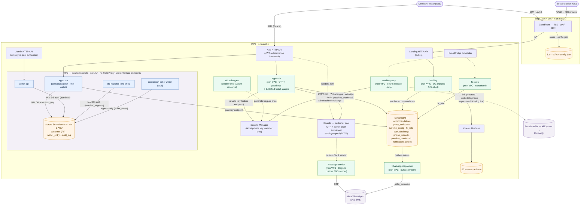

# Wanthat — AWS Architecture (MVP)

*The authoritative source for architecture decisions is [`../adrs/`](../adrs) (see
[`adrs/README.md`](../adrs/README.md) for the index). This document is the consolidated overview;
where it and an ADR differ, the ADR wins.*

Architecture diagram: inline **Mermaid** in §2 below (renders on GitHub and in most Markdown
viewers).

## 1. Why serverless

The MVP is bursty and unpredictable (a link goes viral in a WhatsApp group → thousands of
redirects in minutes, then quiet). Lambda + pay-per-use managed services mean we pay per request,
scale to zero between bursts, and have no servers to patch. (ADR-0007.)

## 2. High-level architecture

*Legend: blue = in-VPC Lambdas · green = non-VPC Lambdas · orange = data stores · purple =
external. Solid arrows are data/HTTP; dotted arrows are async (streams, schedules, triggers).*

Compute is sliced by real seams (ADR-0002, refined by ADR-0020): the **auth edge / core split**
(`app-auth` non-VPC ↔ `app-core` in-VPC, bridged by a signed ticket), a separate **admin-api**, the
public **landing**, the scheduled **conversion poller** (stub) with the shared **retailer-proxy**
(sole retailer egress, stub), and the messaging pair (**message-sender**, **whatsapp-dispatcher**).
All money mutations will flow through the poller-writer into the append-only ledger + hash-chained
audit log.

## 3. Components

### 3.1 Edge & front-end
- **CloudFront** (cert + WAF web ACL live in us-east-1, control-plane only) — one distribution:
  static SPA from **S3** (default), `/p/*` → the landing HTTP API. `config.json` in the SPA bucket
  carries the public runtime config (API URLs, client ids).
- **SPA** — Vite + React (ADR-0016), cookieless: access/id tokens in memory, refresh token in
  localStorage; every API call is a Bearer XHR.

### 3.2 APIs & identity
- **App HTTP API** — one HTTPS entry for the SPA. Public token-issuing routes (`/auth/*`) →
  `app-auth`; public ticket exchange (`/auth/session`, `/auth/register`) + JWT-authorized `/me*` →
  `app-core`. Per-surface throttling on the `$default` stage.
- **Admin HTTP API** — separate API + authorizer bound to the **employee pool**, so a customer
  token structurally cannot reach `/admin` (ADR-0020).
- **Cognito, two pools** (ADR-0006/0020/0022): the **customer pool** (ESSENTIALS, choice-based
  sign-in) does passwordless **OTP** (WhatsApp-default / SMS via a **custom SMS sender** →
  `message-sender`, kill-switched in DynamoDB runtime config) and mints tokens for passkey logins
  via the **admin token exchange**; the **employee pool** (email + mandatory TOTP) guards admin.
- **Passkeys are app-managed** (ADR-0022): the WebAuthn ceremony, credential store
  (`passkey_credential` in DynamoDB) and assertion verification live on `app-auth`
  (`@wanthat/webauthn`); Cognito only issues the session tokens. Automatic biometric login:
  auto-modal armed on document focus (returning devices) / conditional-UI autofill (first-time),
  OTP as universal fallback.
- **Registration ticket** (ADR-0020): `app-auth` signs `{sub, phone, tokens, exp}` with an
  **Ed25519 private key** (Secrets Manager, generated once by the `ticket-keygen` custom
  resource); `app-core` verifies with the **public key from env** — no secret reads in the VPC.

### 3.3 Compute (Lambda, Node 24)
- **app-auth** *(non-VPC)* — OTP flow (`/auth/start|resend|verify|refresh|signout`), passkey
  enrolment + login, ticket signing. Cognito + DynamoDB only; no Aurora.
- **app-core** *(in-VPC)* — ticket resolve (`/auth/session`), `customer` provisioning
  (`/auth/register`), `/me*`, (later) wallet; writes the notification outbox. Aurora via IAM DB
  auth as `app_rw`; no Cognito, no secrets. Also serves `GET /healthz/db` (a warm-up probe the SPA
  fires on auth surfaces to overlap the Aurora scale-to-zero resume with the human).
- **admin-api** *(in-VPC)* — employee-pool-authorized admin surface (users stats, runtime config);
  Aurora read-only role.
- **landing** *(non-VPC)* — `GET /p/{id}`: injects product OG tags + a content snapshot into the
  SPA shell (bots get previews; humans boot the SPA, which runs the same session/passkey machinery
  as the app and never touches Aurora). Emits impression/click log lines → Firehose. (ADR-0007.)
- **message-sender** *(non-VPC)* — Cognito custom-SMS-sender target: decrypts the OTP, delivers
  WhatsApp-first / SMS (ADR-0023); dev uses a TTL'd `dev_otp_sink` table instead of live sends.
- **whatsapp-dispatcher** *(non-VPC)* — consumes the `notification_outbox` DynamoDB stream
  (at-least-once, idempotent on `status`) and sends templated messages (`optin_welcome`);
  kill-switched.
- **conversion-poller / retailer-proxy / fx-rates** — the conversion pipeline (ADR-0008/0009/0017):
  scheduled poller → retailer-proxy (sole retailer egress, secret-scoped, HMAC client) → in-VPC
  writer appends to the ledger. Poller + proxy are stubs pending AliExpress onboarding; `fx-rates`
  refreshes the `fx_rate` cache on schedule (live).
- **db-migrator** *(in-VPC, one-shot)* — CDK-trigger-invoked on deploy; runs plain-SQL Kysely
  migrations as `wanthat_migrator` via IAM DB auth (bootstrap caveat: a brand-new environment's
  first run needs master credentials once — see migration `0003`).
- **ticket-keygen** *(non-VPC, custom resource)* — generates the Ed25519 ticket keypair into
  Secrets Manager on first deploy; idempotent afterwards (never silently rotates).

### 3.4 Data (polyglot — ADR-0003)
- **Aurora Serverless v2 (PostgreSQL, min 0 ACU)** — **PII + money only**: `customer` (PII),
  `wallet_entry` (append-only ledger), `audit_log` (append-only, hash-chained). **IAM database
  auth, no RDS Proxy**; per-function Postgres roles (`app_rw`, `app_ro`, `poller_writer`,
  `wanthat_migrator`) enforce the money guarantee in the DB, not IAM. Scale-to-zero is kept
  deliberately: the ~20s cold resume is mitigated by connect retries, a 60s pg timeout, and the
  client-side warm-up probe.
- **DynamoDB (on-demand)** — everything else (non-PII operational/catalog):
  **recommendation** (redirect projection), **guest_attribution**, **runtime_config** (admin-tunable
  kill switches & settings), **fx_rate** cache, **auth_challenge** (in-flight OTP/passkey
  challenges, TTL'd), **phone_velocity** (hashed phone counters), **passkey_credential** (WebAuthn
  public keys), **notification_outbox** (streams to the dispatcher), and dev-only **dev_otp_sink**.
  Operational PII exception: `auth_challenge`/`notification_outbox` hold a plaintext phone for the
  duration of their TTL (delivery/verification needs it; the non-VPC edge can't reach Aurora).
- **Kinesis Firehose → S3 (+ Athena)** — impression/click/conversion funnel events via CloudWatch
  Logs subscription filters, off the OLTP path.
- **Secrets Manager** — the Ed25519 ticket **private** key (read only by non-VPC `app-auth` over
  the free public endpoint) and the retailer credential (read only by `retailer-proxy`; will be
  entered via the admin panel once retailer onboarding lands).

### 3.5 Network (NAT-free — ADR-0004)
Only Aurora and the functions that touch it (`app-core`, `admin-api`, poller-writer, `db-migrator`)
are in the VPC; they reach DynamoDB via the free gateway endpoint. **Zero paid interface
endpoints** — nothing in the VPC calls Cognito (ADR-0020 split) or reads Secrets Manager (Ed25519
verification is env-config; the migrator uses IAM DB auth). Everything else runs outside the VPC
over public AWS endpoints (IAM-authenticated + TLS; ingress is only ever the HTTP APIs). **No NAT
Gateway, no RDS Proxy.** Retailer APIs are IPv4-only, reached only from `retailer-proxy`.

### 3.6 Observability & security
- **CloudWatch Logs/Metrics + X-Ray** — structured logs, retention-bounded per-service log groups,
  alarms in the ObservabilityStack; funnel events via subscription filters → Firehose.
- **WAF + throttling** on the edge and per-API stages (click-fraud, SMS toll-fraud, enumeration);
  the SMS abuse stack: per-phone velocity counter → `auth.smsEnabled` kill switch → SNS spend cap.
- **Least privilege:** per-function IAM; money invariants enforced by Postgres GRANTs; the
  retailer secret scoped to one function; customer/admin separated at the *pool* level.
- **Region** `il-central-1`; `eu-central-1` is a DR/restore target (ADR-0005). Note il-central-1
  feature gaps (no Lambda Function URLs, no RDS Data API) have shaped several decisions.

## 4. Request flows

**Onboard / sign-in (OTP):** SPA → `POST /auth/start` (`app-auth`; kill-switch + velocity gates;
unknown numbers are created on the fly, uniform responses) → Cognito custom sender →
`message-sender` → WhatsApp/SMS → `POST /auth/verify` → Ed25519 ticket → `POST /auth/session`
(`app-core`): existing `customer` row → tokens (login); otherwise `registration_required` →
`POST /auth/register` provisions `customer` (single Aurora txn) and queues `optin_welcome` via the
outbox.

**Automatic biometric login:** page load (auth screen or `/p/` landing) → passkey ceremony armed,
fires on document focus → `GET /auth/passkey/login/challenge` → biometric → `POST
/auth/passkey/login/verify` (`app-auth` verifies the assertion against `passkey_credential`, mints
Cognito tokens via the admin exchange) → `/auth` resolves the session for `/home`; the landing uses
the returned tokens directly (Aurora-free) and redirects to the store.

**Landing → conversion:** visitor hits `/p/{id}` → OG-injected SPA shell (impression) → client
identity (member recognised by token refresh / passkey auto-login / guest) → redirect to the
retailer with `custom_parameters` (`ref` + `c`/`g`) (click) → purchase → scheduled poller →
`retailer-proxy.order.listbyindex` resolves attribution → in-VPC writer credits the ledger
(pending → confirmed → clawback), writes the audit log, emits the conversion event. *(Poller/proxy
are stubs pending retailer onboarding; the landing currently serves a mock product.)*

## 5. Cost posture (MVP scale)

Per-request compute + scale-to-zero data (Aurora paused ≈ storage; DynamoDB $0 idle). **No NAT
Gateway, no RDS Proxy, zero VPC interface endpoints** — the dominant line item is OTP delivery,
not infrastructure.

## 6. Deployment

Infrastructure as code via **AWS CDK**; stacks ordered `Network → Data → Identity → Api / Admin /
EdgeServices / WhatsApp → Edge → Observability` (see [`infra/lib/README.md`](../infra/lib/README.md)).
Per-environment stacks (dev/prod); no manual console changes. CI/CD via GitHub Actions (OIDC):
PRs run CI + a `cdk diff` dry run (destructive-change warnings); merge to `main` deploys dev;
prod promotes explicitly.
