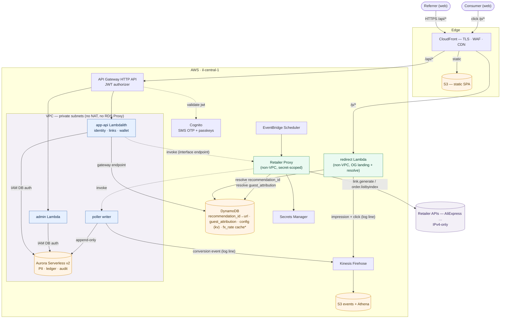

# Wanthat — AWS Architecture (MVP)

*The authoritative source for architecture decisions is [`../adrs/`](../adrs) (ADR-0001–0009).
This document is the consolidated overview; where it and an ADR differ, the ADR wins.*

Architecture diagram: inline **Mermaid** in §2 below (renders on GitHub and in most Markdown
viewers).

## 1. Why serverless

The MVP is bursty and unpredictable (a link goes viral in a WhatsApp group → thousands of
redirects in minutes, then quiet). Lambda + pay-per-use managed services mean we pay per request,
scale to zero between bursts, and have no servers to patch. (ADR-0007.)

## 2. High-level architecture

*Legend: blue = in-VPC Lambdas · green = non-VPC Lambdas · orange = data stores · purple =
external. Solid arrows are data/HTTP; dotted arrows are Lambda-to-Lambda invokes.*

Four compute units sliced by real seams (ADR-0002): the **app-api Lambdalith**
(identity · links · wallet), a separate **admin** API, the public **redirect** service, and the
scheduled **conversion poller** (EventBridge → Retailer Proxy → in-VPC writer), plus the shared
**Retailer Proxy** — the sole non-VPC egress to retailer APIs. All money mutations flow through
the poller-writer into the append-only PostgreSQL ledger + hash-chained audit log.

## 3. Components

### 3.1 Edge & front-end
- **CloudFront** — CDN + TLS + WAF. Routes `/api/*` → API Gateway, `/p/*` → redirect, static → S3.
- **S3** — static Next.js/React SPA (web-first MVP).

### 3.2 API & identity
- **API Gateway (HTTP API)** — single HTTPS entry. JWT authorizer validates Cognito tokens;
  `cognito:groups` gates `admin`.
- **Cognito** — passwordless **SMS OTP** (`ALLOW_USER_AUTH`) + opt-in **passkeys/WebAuthn**
  step-up. Our own `/auth/*` fronts Cognito so we gate before any SMS (the SMS kill switch).
  WhatsApp deferred. (ADR-0006.)

### 3.3 Compute (Lambda, Node 20)
- **app-api Lambdalith** *(in-VPC)* — `identity` (`/auth/*`, `/me`), `links` (`/links`,
  `/products/*`), `wallet` (`/wallet*`). Shared Postgres schema + cross-table transactions.
- **admin** *(in-VPC)* — separate role/exposure; the only app surface that may write money
  (audited adjustments).
- **redirect** *(non-VPC, CloudFront → Lambda Function URL)* — `GET /p/{id}` resolves `recommendation_id`
  in **DynamoDB** and returns an OG-tagged landing page; client-side JS then resolves identity
  (member → Bearer token validated **offline against JWKS** → inject `customer_id`; guest →
  `guestId` from **localStorage** → inject `g`) and redirects, or renders
  login/signup/continue-as-guest. Emits impression + click off the path via structured log lines →
  Firehose. **Cookieless; not behind the JWT authorizer.** (ADR-0007.)
- **conversion poller** — `EventBridge → Retailer Proxy.listOrders` (resolves attribution) invokes
  an in-VPC **writer** (ledger + audit) that also emits conversion events → Firehose. (ADR-0009.)
  Alongside it, a pending scheduled **rates-updater** (an FX-provider adapter) will refresh the
  `fx_rate` cache table on a schedule (decided, build pending).
- **Retailer Proxy** *(non-VPC)* — the single secret-scoped function holding the retailer
  credential + HMAC client; sole egress to retailer APIs (`generateLink`, `listOrders`); the only
  code with internet egress (ADR-0004).

### 3.4 Data (polyglot — ADR-0003)
- **Aurora Serverless v2 (PostgreSQL, scale-to-zero)** — **PII + money only**: `customer` (PII),
  `wallet_entry` (append-only ledger), `audit_log` (append-only, hash-chained). **IAM database auth,
  no RDS Proxy**; per-function Postgres roles enforce the money guarantee (poller-writer
  append-only; others read-only on money tables).
- **DynamoDB (on-demand)** — everything else (catalog/operational, non-PII): **Product** (keyed by
  `(store_id, store_product_id)`, with the product-level `affiliate_url`), **Recommendation** (keyed
  by `recommendation_id`, resolves the redirect in one lookup), `guest_attribution`
  (guestId → customer_id, best-effort), **`config`** (a generic key-value table of admin-tunable
  runtime settings — e.g. `landing.countdownSeconds`, `cashback.referrerBps`, `cashback.consumerBps`,
  `fx.conversionCommissionBps` — written by `admin-api` and read where needed; distinct from the
  boot-time `Env` env-var contract), and a pending **`fx_rate`** cache table keyed by `(base, quote)`
  with an `asOf` timestamp (decided, build pending).
- **Kinesis Firehose → S3 (+ Athena)** — impression/click/conversion event stream, off the OLTP
  path.
- **Secrets Manager** — retailer credentials (held only by the non-VPC Retailer Proxy); rotation.

### 3.5 Network (NAT-free — ADR-0004)
Only Aurora and the functions that touch it are in the VPC; they reach DynamoDB via a free gateway
endpoint and log out-of-band. Redirect and the Retailer Proxy run outside the VPC. **No NAT
Gateway, no RDS Proxy.** Retailer APIs are IPv4-only, reached only from the non-VPC Retailer Proxy
(IPv6/egress-only gateway was ruled out — the retailer hosts publish no AAAA records).

### 3.6 Observability & security
- **CloudWatch Logs/Metrics + X-Ray** — structured logs with a correlation id; RED metrics + the
  funnel (impressions → clicks → conversions).
- **WAF + rate limiting** on `/p/*` and `/auth/*` (click-fraud, SMS toll-fraud, enumeration).
- **Least-privilege:** coarse per-function Lambda IAM; the money guarantee is enforced by
  per-function Postgres GRANTs, not IAM (ADR-0002). Retailer secret scoped to the Retailer Proxy.
- **Region** `il-central-1`; `eu-central-1` is a DR/restore target (ADR-0005).

## 4. Request flows

**Registration:** Browser → CloudFront → API Gateway `POST /auth/register` → `/auth` gates
(kill switch) → Cognito sign-up → **SMS OTP** → `POST /auth/verify` → Post-Confirmation trigger
provisions `customer` + empty `wallet` in PostgreSQL (single Aurora transaction).

**Link generation:** Authenticated browser → `POST /links` (JWT) → the Lambdalith invokes the
**Retailer Proxy** (Lambda interface endpoint), which signs `aliexpress.affiliate.link.generate`
(**product-level** — no per-referrer SubID) and **upserts the Product** (with its `affiliate_url`)
in DynamoDB; the Lambdalith then writes the member's **Recommendation** in DynamoDB and returns the
share URL. **No Aurora is touched.**

**Redirect → conversion:** Consumer hits `/p/{id}` → redirect returns the OG landing page
(impression) → client-side JS resolves identity and calls the resolve endpoint, which injects
`custom_parameters` (`ref`/`c`/`g`), emits the click, and redirects to the retailer → purchase
within the network window → `EventBridge → Retailer Proxy.listOrders` pulls the orders and
resolves attribution → the in-VPC writer credits the ledger (pending → confirmed → clawback;
referrer always, consumer reward from margin when attributed), writes the audit log, and emits a
conversion event to Firehose.

## 5. Cost posture (MVP scale)

Per-request compute + scale-to-zero data (Aurora paused ≈ storage; DynamoDB $0 idle). **No NAT
Gateway, no RDS Proxy** — the dominant line item is OTP delivery, not infrastructure.

## 6. Deployment

Infrastructure as code via **AWS CDK**. Per-environment stacks (`dev`/`staging`/`prod`); no
manual console changes. CI/CD via GitHub Actions, with `cdk diff` gating deploy.
