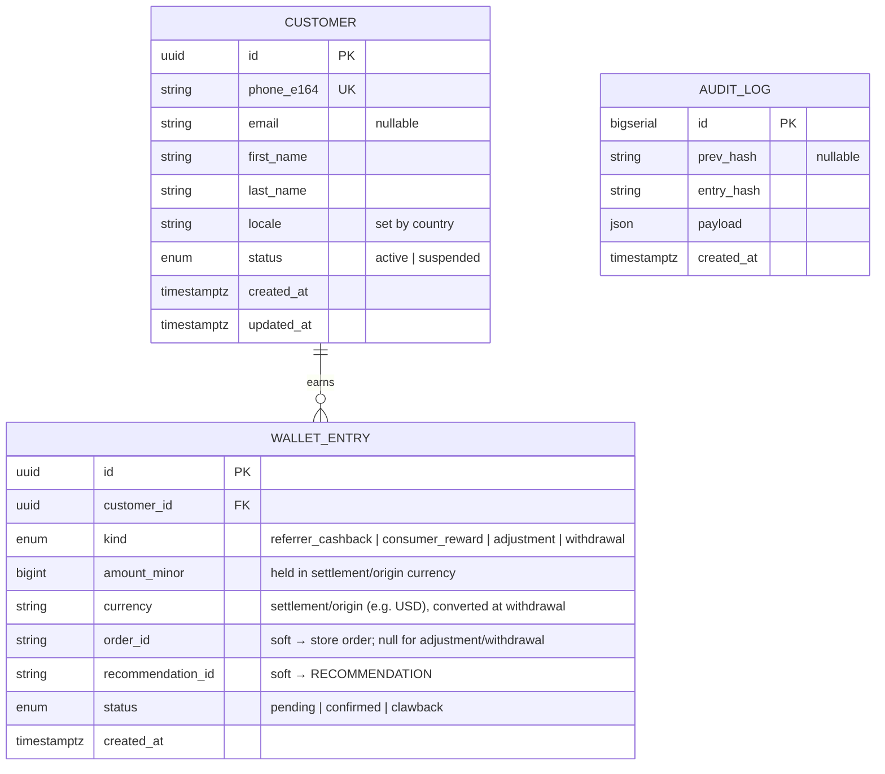
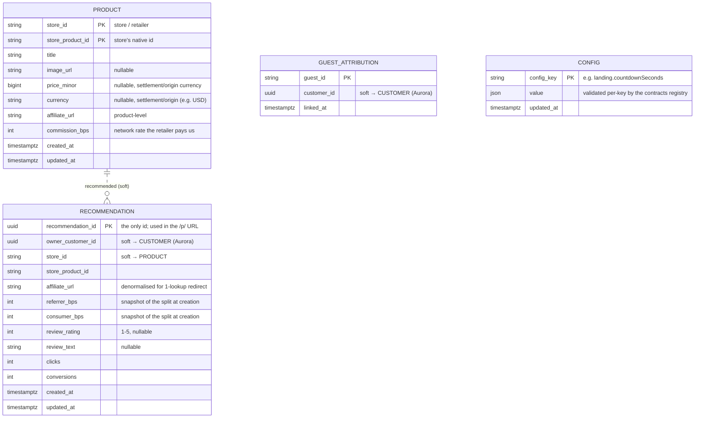

# Wanthat — Object Model

*Living document — the conceptual domain map. The **authoritative** schemas are the Zod
contracts in [`packages/contracts`](../packages/contracts) and the SQL in
[`packages/db/migrations`](../packages/db/migrations); this captures the entities,
relationships, and where each lives, and is updated as use cases are designed.*

**Coverage so far:** UC1 Onboard · UC2 Sign-in · UC3 Create recommendation · UC4 Click-through ·
UC5 Wallet · UC6 Profile · UC7 Conversion ingestion (system) — all use cases have contracts.

The model spans two stores (ADR-0003), shown as separate diagrams. **Aurora holds only PII
(Customer) + money (Wallet ledger + audit)** — the data that needs ACID, engine-enforced
immutability, and residency. Everything else (catalog + operational) is in **DynamoDB**. SQL has
enforced foreign keys; **KV has no foreign keys** — its references are *soft* (an attribute value
the app keeps consistent, not enforced), including cross-store refs into Aurora. Passkeys live in
**Cognito** (see notes).

## SQL — Aurora (PII + money only; enforced FKs)

## KV — DynamoDB (catalog + operational; no FKs, soft references)

## Notes

- **Aurora holds only Customer (PII) + Wallet (ledger + audit).** Catalog/operational data —
  Product, Recommendation, guest_attribution — lives in DynamoDB; the wallet links back to a
  recommendation/order via **soft** ids (cross-store, not FKs).
- **Product is keyed by `(store_id, store_product_id)`** — `store_id` = the store/retailer
  (`aliexpress` for MVP), `store_product_id` = the store's native id. Products are shared and
  looked up by that pair.
- **Recommendation has one id** — `recommendation_id` (uuid), used directly in `/p/{…}`. It
  denormalises `affiliate_url` (from Product) so redirect resolves in one DynamoDB lookup; a GSI
  on `owner_customer_id` backs "list my recommendations". Uniqueness per `(owner, product)` is a
  conditional write (no FK).
- **`updated_at`** on the mutable entities (Customer, Product, Recommendation). `WALLET_ENTRY` and
  `AUDIT_LOG` are **append-only** (no `updated_at`); `GUEST_ATTRIBUTION` is written once.
- **The wallet ledger is an append-only event log.** A reward advances through statuses as
  *separate* immutable rows — uniqueness on `(order_id, kind, status)` lets `(order_id, kind)` walk
  `pending → confirmed → clawback` while a poller re-read of an unchanged order no-ops. The balance
  is **derived** (take each reward's furthest-advanced status): `confirmed = Σ confirmed rewards +
  adjustments − withdrawals`, `pending = Σ pending rewards`, `clawback` contributes 0. `adjustment`
  and `withdrawal` are standalone events (`order_id` null); a `withdrawal` is a negative event.
- **Cashback = retailer commission × our split.** The retailer's `commission_bps` (network rate)
  lives on Product; **our split** (`referrer_bps` / `consumer_bps`) is admin policy in `CONFIG`,
  **snapshotted onto the Recommendation at creation** so a link's economics are locked (later admin
  changes affect only new links). The shown estimate is derived, never stored.
- **The wallet is held in the retailer's settlement (origin) currency** (e.g. USD) — our liability
  matches our receivable, so no FX float risk. Displayed converted to the member's currency for
  convenience; the real conversion happens only **at withdrawal**. `Money` is currency-agnostic and
  the wallet returns one balance **per currency** held.
- **Passkeys are Cognito-managed** (ADR-0006) — `credential_id` keyed, linked via the Cognito
  `sub`; not a table we own.
- **`CONFIG` is a generic key-value store** for admin-tunable **runtime** settings (distinct from
  the boot-time `Env` contract), keyed by `config_key`. New parameters are added without new tables
  or endpoints; each value is validated against its key's schema in the contracts registry
  (`CONFIG_SCHEMAS`). Written by `admin-api` (audited); read where needed — the redirect path reads
  `landing.countdownSeconds`.

## Persistence mapping (ADR-0003)

| Data | Store |
|---|---|
| **Customer (PII)**, **WalletEntry + AuditLog (money)** | **Aurora (SQL)** |
| Product, Recommendation, guest_attribution | **DynamoDB (KV)** |
| Runtime config (admin-tunable key-value, e.g. `landing.countdownSeconds`) — `CONFIG` table | **DynamoDB (KV)** |
| Passkeys + user pool | **Cognito** |
| impression / click / conversion events | **Firehose → S3 (Athena)** |

## Attribution model (current direction)

- The **affiliate URL is product-level** (one `link.generate` per product, shared) — *not*
  per-referrer.
- At redirect, `recommendation_id → affiliate_url`; the outgoing URL gets
  `custom_parameters = { ref: recommendation_id, c|g: consumer }` appended. `ref` (the
  `recommendation_id`) resolves to referrer + product at conversion.
- Reflected in **ADR-0007/0008** (edited in place): ref appended at redirect, not baked as the SubID
  at generate. Still rides the open "confirm the retailer round-trips a redirect-appended
  `custom_parameters` value" risk.

## Open items

- **Datastore scope** — done, in the ADRs *and* the code: `0001_init.sql` + `packages/db` now hold
  only Customer + Wallet/Audit (no `product`/`recommendation` SQL tables); `wallet_entry` carries a
  soft `recommendation_id`.
- **Propagate the model to code** — done in `packages/contracts`: Product keyed by
  `(storeId, storeProductId)` (no surrogate id); Recommendation has the single `recommendationId`
  uuid; `updatedAt` on Customer/Product/Recommendation. The DynamoDB *access* code (item shapes,
  GSIs, conditional writes) is still to be written when the services move past placeholders.
- Attribution mechanism + the `short_id → recommendation_id` rename are now in the ADRs (edited in
  place); ADR-0017 is no longer needed.
- UC4–7 entities added here as designed.
- **FX / multi-currency (decided, build pending).** The wallet is held in the settlement currency;
  display + payout convert to the member's currency **net of `fx.conversionCommissionBps`** (config
  key added), and withdrawal is gated on the **current converted (ILS)** value. Still to build:
  (a) a cached-rate store — a new DynamoDB `FX_RATE` table keyed by `(base, quote)` with an `asOf`;
  (b) a **rates-update function** (scheduled service + FX provider adapter) that refreshes it;
  (c) a pure **conversion function** in `packages/domain` (`amountMinor × rate × (1 − commission)`,
  exact bigint math); (d) surfacing the converted withdrawable figure on `WalletBalance`. Open:
  the ₪50 threshold is evaluated on the converted value, and the FX provider + spread/rounding
  policy.
