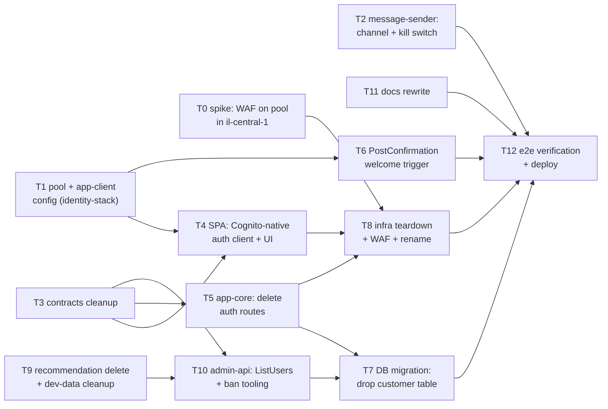

# Execution plan - ADR-0006: Cognito-native auth + PII in Cognito

Implements [ADR-0006](../adrs/0006-cognito-native-auth-and-pii.md). Tasks are sized for
parallel execution by independent agents; **Depends** lists are the hard ordering
constraints (same-file conflicts and functional prerequisites). Everything lands on one
integration branch (suggested: `auth-cognito-native`), with a single deploy at the end -
this is one breaking pre-release change, not incremental slices. `pnpm lint` before every
PR (CI runs biome); **always `cdk diff` before deploy** - the teardown WILL show
destructive changes (deleted tables and functions), which is expected and must be
reviewed, not suppressed.

## Task dependency graph



Parallel waves: **Wave 1** T0 T1 T2 T3 T9 T11 - **Wave 2** T4 T5 T6 T10 - **Wave 3** T7 T8 -
**Wave 4** T12.

## Tasks

### T0 - Spike: WAF-for-Cognito availability in il-central-1 - DONE 2026-07-09: AVAILABLE
**Verdict: AVAILABLE - GO for T8's WAF bullet** (fallback not needed). Evidence (read-only,
account 818913587533):
- `wafv2 get-web-acl-for-resource` on the dev customer pool ARN
  (`arn:aws:cognito-idp:il-central-1:818913587533:userpool/il-central-1_iUq0D1Gy5`,
  wanthat-dev) succeeds in-region, returning "no association" rather than
  WAFInvalidParameterException - the pool is an accepted protectable resource.
- `wafv2 list-resources-for-web-acl --resource-type COGNITO_USER_POOL` accepts the enum
  in il-central-1.
- AWS regional-availability data: the full WAFV2 API surface, including `AssociateWebACL`,
  is `isAvailableIn` il-central-1.
- `wafv2 check-capacity --scope REGIONAL` in-region validated the rate rule below (2 WCU).
Rule sketch (REGIONAL web ACL, default action Allow, associated to the customer pool):
1. `rate-limit-unauth-ops` - rate-based, aggregate per IP, limit 100 per 5 min, Block;
   scope-down: `x-amz-target` header matches `AWSCognitoIdentityProviderService.` +
   SignUp / ConfirmSignUp / ResendConfirmationCode / InitiateAuth / RespondToAuthChallenge.
2. `rate-limit-all` - rate-based per IP, limit 500 per 5 min, Block (backstop).
Thresholds are MVP guesses erring loose (IL mobile CGNAT stacks users behind one IP); tune
from CloudWatch sampled requests. CAPTCHA is Block-only deferred: the SPA calls cognito-idp
directly, so CAPTCHA would require the WAF JS integration SDK - revisit post-MVP.
**Depends:** none. **Blocks:** T8.

### T1 - Customer pool + app-client configuration (infra/identity-stack)
- Enable `selfSignUpEnabled` on the customer pool (public `SignUp` becomes the registration
  path; note the console warning: anyone can sign up - that is the product).
- Standard attributes: `given_name`, `family_name`, `email`, `locale` writable at signup;
  keep them optional (not required) so existing pool schema is not replaced. Verify
  `custom:otpChannel` schema already present (it is - message-sender reads it).
- App client: `USER_AUTH` flow on (present), plus explicit read/write attribute permissions
  for the five profile attributes and `custom:otpChannel`.
- Settle the "prevent user existence errors" setting: the SPA needs the user-not-found
  signal to branch sign-in vs sign-up (ADR-0006 consequence). Document the choice in code.
- Keep `passkeyRelyingPartyId` = site domain (already set).
- `cdk synth` + targeted assertions.
**Depends:** none. **Blocks:** T4, T6.

### T2 - message-sender becomes the channel decision point
- Read runtime-config kill switches in the sender (`auth.whatsappEnabled`, `auth.smsEnabled`,
  `whatsapp.phoneNumberId`, `auth.defaultOtpChannel`) - port `otpChannelAvailability` from
  app-auth's killswitch.ts (this logic must survive app-auth's deletion).
- Channel = `custom:otpChannel` preference when that channel is enabled, else fallback to an
  enabled channel, else fail (dev-otp-sink unaffected).
- Handle ALL trigger sources now reachable: `CustomSMSSender_SignUp`,
  `CustomSMSSender_Authentication`, `CustomSMSSender_ResendCode`,
  `CustomSMSSender_VerifyUserAttribute` (phone change).
- Infra: grant the sender read on the runtime-config table.
**Depends:** none (independent files). **Blocks:** T12.

### T3 - Contracts: add ban-tooling schemas, deprecate the obsolete auth surface
Add the small admin ban-tooling request/response schemas (T10). Mark the obsolete schemas
(ticket / `/auth/start` / `/auth/verify` / `/auth/session` / `/auth/register` / `/me` /
passkey-ceremony) `@deprecated - removed by ADR-0006, deleted in T8` but do NOT delete them
yet: their last consumers (app-auth source, app-core auth routes) go away in T5/T8, and
deleting schemas first would break the build for every intermediate wave. Keep wallet
schemas untouched. **Depends:** none. **Blocks:** T4, T5, T10.

### T4 - SPA: self-contained user module (Cognito-native auth) + UserChip
Build ALL auth functionality as one encapsulated module, `apps/web/src/user/`, consumed by
the rest of the app only through its index: `SessionProvider` + `useSession()` (token,
profile-from-claims, status) + actions (`signUpWithOtp`, `loginWithOtp`, `loginWithPasskey`,
`updateProfile`, `signOut`). The **UserChip** component (avatar/name + menu: profile,
passkeys, signout) is the module's exported UI face and consumes `useSession()` like any
other caller - logic lives in the module, never in the chip. `AuthPage` becomes a consumer
of the module's actions. Wallet/landing/create-link screens import only from `user/index.ts`.
Module internals:
- Thin `cognito.ts` client (plain fetch to `cognito-idp.il-central-1.amazonaws.com`,
  target headers - no Amplify, ADR-0016).
- Sign-up: registration form fields ride `SignUp.UserAttributes` (+ `custom:otpChannel`
  from the channel choice, + `guestId` in `ClientMetadata` for T6); `ConfirmSignUp` with the
  code; then `InitiateAuth`.
- OTP login: `InitiateAuth(USER_AUTH, SMS_OTP)` + `RespondToAuthChallenge`; branch to
  sign-up on user-not-found per T1's setting.
- Passkey: enrolment via `StartWebAuthnRegistration`/`Complete...`; login via
  `InitiateAuth(WEB_AUTHN, USERNAME = remembered phone)`, auto-armed on focus only when a
  remembered phone exists (ADR-0006: userless waived). Device-matched labels kept.
- Profile: decode ID-token claims (drop `/me` and the customer object from session state);
  edit via `UpdateUserAttributes` + `VerifyUserAttribute`; re-fetch via `GetUser` after
  edits (stale-claims note).
- Refresh via `InitiateAuth(REFRESH_TOKEN_AUTH)`; signout via `RevokeToken`.
- Delete: ticket handling, `/auth/*` API calls, `warmDb()` (nothing to warm), passkey
  ceremony code, `managed-login`-style session bits tied to app-auth; fold the remains of
  `lib/session.tsx` / `lib/passkey.ts` into the module (they cease to exist as separate
  libs).
- The module boundary is also the parallel-execution seam: T4's agent owns
  `apps/web/src/user/` exclusively; other tasks touching the SPA consume the interface and
  can develop against a mocked `useSession()`.
- Landing `/p/*`: member recognition stays token-based; passkey path = remembered-phone
  native login (ADR-0007 as amended).
**Depends:** T1, T3. **Blocks:** T8.

### T5 - app-core: delete the auth surface
Remove `/auth/session`, `/auth/register`, `/me` routes + the customer repo usage they pull
in; app-core is now wallet-only (+ `/healthz/db` for ops). Welcome-outbox write moves out
(T6). Keep wallet stubs untouched. **Depends:** T3. **Blocks:** T7, T8.

### T6 - Post-Confirmation trigger (welcome + guest attribution)
New small non-VPC Lambda on the customer pool's Post-Confirmation trigger:
- write the `optin_welcome` notification-outbox item (moved from `/auth/register`);
- write `guest_attribution` (guestId arrives via `SignUp.ClientMetadata` - Post-Confirmation
  receives `clientMetadata`; verify on-device early, fallback = SPA-side authenticated write).
Wire in identity-stack (same file as T1 - hence the dependency). DynamoDB-only writes, no
Aurora (ADR-0006 decision 7). **Depends:** T1. **Blocks:** T12.

### T7 - DB migration: Aurora money-only
- Inspect current schema: `wallet_entry` / `audit_log` FKs into `customer`.
- Migration: re-key money tables by `cognito_sub` directly (dev has no real money rows -
  drop-and-recreate is acceptable pre-release), drop `customer`.
- Update `packages/db` (delete customer.ts, adjust wallet queries), poller-writer resolution
  (ADR-0020 as amended: no sub-to-row resolution step), admin stats queries.
- Remember: migrations cannot CREATE ROLE (grants only).
**Depends:** T5, T10 (both stop reading `customer` first). **Blocks:** T12.

### T8 - Infra teardown + WAF + rename
- api-stack: remove all `/auth/*` routes; app-auth function loses auth env/permissions and
  is renamed `app-links` (keeps the links routes + retailer-proxy invoke).
- Delete: ticket-keygen custom resource + secret, `AUTH_TICKET_PUBLIC_KEYS` env,
  `auth_challenge`, `passkey_credential`, `phone_velocity` tables (data-stack).
- CAUTION - cross-stack export ordering: deleting exported resources fails on
  `cdk deploy --all` while consumers still import them; deploy consumers first
  (`--exclusively`), then the producer. Plan the two-step deploy explicitly.
- **Two-step deploy (T12 must follow this; dev shown, s/dev/prod/ for prod).** Three export
  removals are in play: (a) api imports the data-stack's `AuthChallenge`/`PhoneVelocity`/
  `PasskeyCredential` table exports; (b) the us-east-1 edge imports the identity stack's
  customer `ManagedLoginDomain` baseUrl (cross-region export) via `spaConfig.managedLoginUrl`;
  (c) observability imports api's OLD `AppAuth` function-ref export - (c) is handled inside
  api-stack by a TRANSITIONAL retained export (`...ExportsOutputRefAppAuthB8BC94674D7C9325`,
  stale literal value; drop it in a follow-up PR after every env's observability has
  redeployed), because observability cannot deploy first - the `AppLinks` export it needs
  does not exist until api deploys. From the repo root, after `pnpm build` (edge needs
  `apps/web/dist` at synth) and a reviewed `pnpm diff`:

  ```bash
  # Step 1 - consumers of the removed exports stop importing them (and the rename lands):
  #   api: app-auth -> app-links (CFN REPLACEMENT of fn + log group - expected, pre-release),
  #        drops the three table imports, deletes ticket-keygen + AuthTicketSecret;
  #   edge: config.json drops managedLoginUrl, gains cognitoRegion (a synth-time literal).
  cd infra
  pnpm exec cdk deploy wanthat-dev-api wanthat-dev-edge --exclusively --require-approval never

  # Step 2 - producers drop the now-unreferenced exports + everything else converges:
  #   data: deletes the AuthChallenge/PhoneVelocity/PasskeyCredential tables + exports;
  #   identity: deletes the customer ManagedLoginDomain/branding + its cross-region export,
  #             drops adminUserPassword, attaches the customer-pool WAF web ACL;
  #   observability: re-points the app-auth alarms/widgets at the AppLinks export.
  pnpm exec cdk deploy --all --require-approval never --concurrency 4
  ```
- Attach the WAF web ACL from T0 to the customer pool (or record the fallback).
- Delete `packages/auth` and `packages/webauthn`; remove them from infra devDependencies
  (filtered turbo Deploy build breaks otherwise - red check-deploy is blocking).
- Delete the app-auth auth source (`services/app-auth/src/auth/`, context/handler auth
  wiring) as part of the rename, and the now-consumerless deprecated contract schemas from
  T3 (ticket / start / verify / session / register / me / passkey-ceremony).
- ASCII-only in any new resource descriptions.
**Depends:** T0, T4, T5. **Blocks:** T12.

### T9 - Recommendation delete + dev-data cleanup
- Add `RecommendationRepo.deleteByOwner(sub)`: query `byOwner` GSI, delete each item by
  `recommendationId`, decrement the `#counter` item's `itemCount` per delete (transactional
  counter must stay exact).
- One-off dev cleanup script (aws CLI / small ts script): delete the single dev user from
  the customer pool (`AdminDeleteUser`) and run `deleteByOwner` for its sub. Run against dev
  only; document the sub it removed.
**Depends:** none. **Blocks:** T10.

### T10 - admin-api: users via ListUsers + ban tooling
- Users list/search: replace the Aurora customer read with `ListUsers` (one-attribute
  exact/prefix filter, token pagination - the UI should expose phone-prefix search and drop
  SQL-ish sorting).
- Ban tooling: endpoints for `AdminDisableUser` / `AdminEnableUser` /
  `AdminUserGlobalSignOut`; IAM grants in admin-stack beside the existing delete grant.
- Delete-user endpoint: `AdminDeleteUser` + `deleteByOwner(sub)` from T9.
- Stats: user counts via `DescribeUserPool.EstimatedNumberOfUsers` (approximate - note in
  the UI) or ListUsers page counting; wallet stats stay Aurora.
- Audit actors stay the ID-token email (existing convention - do not revert to access
  token).
**Depends:** T3, T9. **Blocks:** T7, T12.

### T11 - Docs rewrite
Rewrite `docs/auth-flows-customer.md` to the ADR-0006 flow (the decided-flow diagram in
ADR-0006 is the template); refresh `docs/Wanthat_SDD_Auth_and_LinkGeneration.md` auth
sections. Mermaid rules: pure ASCII, no semicolons, validate with mermaid.parse.
**Depends:** none. **Blocks:** T12.

### T12 - End-to-end verification + deploy
- Deploy to dev respecting T8's two-step export ordering; `cdk diff` reviewed first.
- e2e on dev: fresh signup (WhatsApp/dev-otp-sink code), OTP login, passkey enrol + login
  (remembered phone, auto-prompt on focus), profile edit + claim refresh, wallet loads,
  landing `/p/*` member + guest flows, admin users list / disable / enable / delete
  (verifies recommendations cleanup), kill-switch flip (WhatsApp off -> SMS fallback via
  message-sender).
- `pnpm lint && pnpm typecheck && pnpm build && pnpm test` green; check-deploy green.
- Confirm the deleted log groups / tables are gone and no auth route answers.
**Depends:** all. **Blocks:** release.

## Open items carried from the ADR
- T0 outcome (WAF availability) may downgrade decision 6 to quotas + spend cap.
- T1 settles "prevent user existence errors" vs the sign-in/sign-up branch UX.
- T6 verifies `ClientMetadata` reaches Post-Confirmation on-device (documented AWS behaviour,
  but this project verifies Cognito claims empirically - see the replaced passkey record's history in the auth ADR's alternatives).
