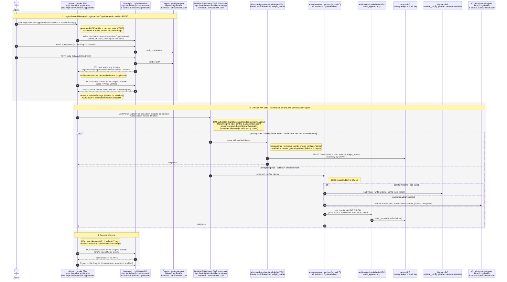

# Admin (employee) authentication flows - sequence diagram

Staff authentication for the admin console. Verified against
`infra/lib/identity-stack.ts` (employee pool), `apps/web/src/lib/admin-login.ts` (PKCE flow),
`services/admin-console/src/guard.ts` (group re-check), and `infra/lib/admin-stack.ts` (authorizer).

Domains (prod / dev):

- Admin console SPA: `https://wanthat.app/admin` / `https://dev.wanthat.app/admin` (same CloudFront app as customers)
- Managed Login hosted UI + OAuth endpoints: `https://wanthat-prod-admin.auth.il-central-1.amazoncognito.com` / `https://wanthat-dev-admin.auth.il-central-1.amazoncognito.com` (Cognito prefix domain - NOT an application domain)
- Admin HTTP API: `https://<admin-http-api-id>.execute-api.il-central-1.amazonaws.com` - called directly by the SPA (separate API from the customer app API)
- Token verification JWKS: `https://cognito-idp.il-central-1.amazonaws.com/<employee-pool-id>/.well-known/jwks.json`

Key properties (ADR-0006 two-pool, ADR-0002 defence in depth):

- **Separate Cognito pool** (`wanthat-<env>-employees`): email sign-in, provisioned only
  (no self-signup), 12+ char password policy, **mandatory TOTP MFA** (no SMS on the staff
  surface). Every employee is in the `admin` group for the MVP.
- Login runs on the employee pool's **Managed Login hosted UI** with OAuth
  **authorization-code + PKCE** - no client secret; callback at `/admin/callback` on the app domain.
- The console sends the **ID token** as the Bearer on purpose: the JWT authorizer verifies it
  (aud = admin SPA client) and its `email` claim gives audited actions a readable actor.
- Tokens live in **sessionStorage** (cleared on tab close); shorter refresh TTL (7 days) than
  customers. An admin session is structurally separate from a customer session - the admin
  API authorizer trusts only the employee pool.

