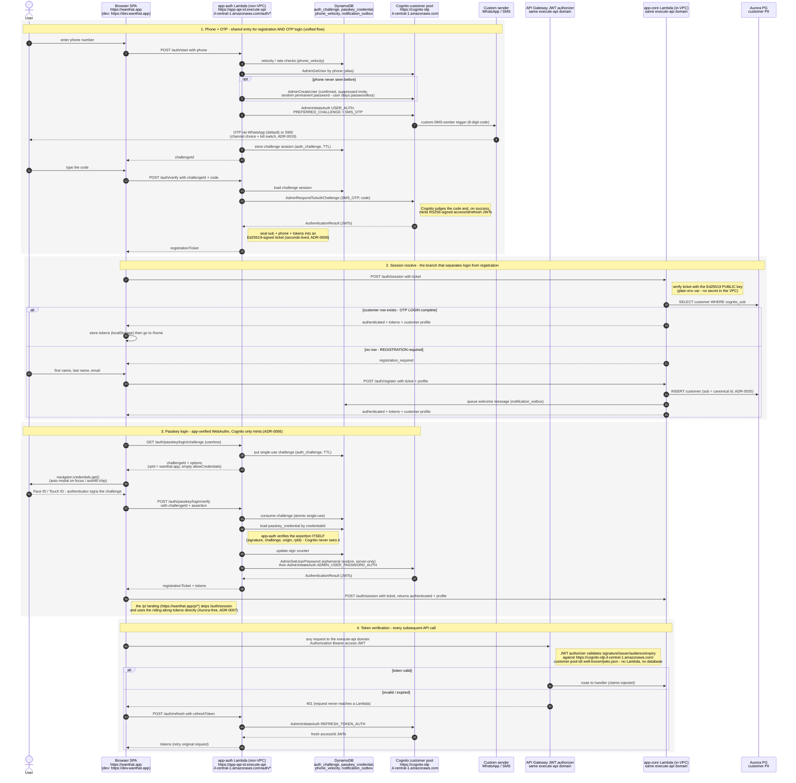

# Customer authentication flows - sequence diagram

One diagram covering the four customer-facing auth flows: **registration**, **OTP login**,
**passkey login**, and **per-request token verification**. Verified against
`services/app-auth/src/auth/router.ts`, `services/app-core/src/auth/register.ts`,
`packages/auth/src/tickets.ts`, and `infra/lib/api-stack.ts`.

Domains (prod / dev):

- SPA and passkey RP ID: `https://wanthat.app` / `https://dev.wanthat.app` (CloudFront; also fronts `/p/*` landing)
- App HTTP API (app-auth + app-core routes): `https://<app-api-id>.execute-api.il-central-1.amazonaws.com` - the SPA calls it directly (cookieless, not fronted by CloudFront)
- Cognito control plane (server-side admin calls from app-auth): `https://cognito-idp.il-central-1.amazonaws.com`
- Token verification JWKS: `https://cognito-idp.il-central-1.amazonaws.com/<customer-pool-id>/.well-known/jwks.json`

Key invariants (ADR-0006/0006, ADR-0020):

- **Cognito is the only issuer of session tokens** (RS256 JWTs signed by the customer pool).
  The app never mints session credentials.
- **app-auth** (non-VPC) owns the auth ceremonies: Cognito OTP challenges and app-verified
  WebAuthn assertions (DynamoDB `auth_challenge` + `passkey_credential`). It never touches Aurora.
- **app-core** (in-VPC) owns the Aurora `customer` row. The handoff between the two is a
  seconds-lived, single-purpose **Ed25519-signed ticket** - no shared session store.
- The SPA is **cookieless** (ADR-0007): tokens live in localStorage and travel as a Bearer header.

