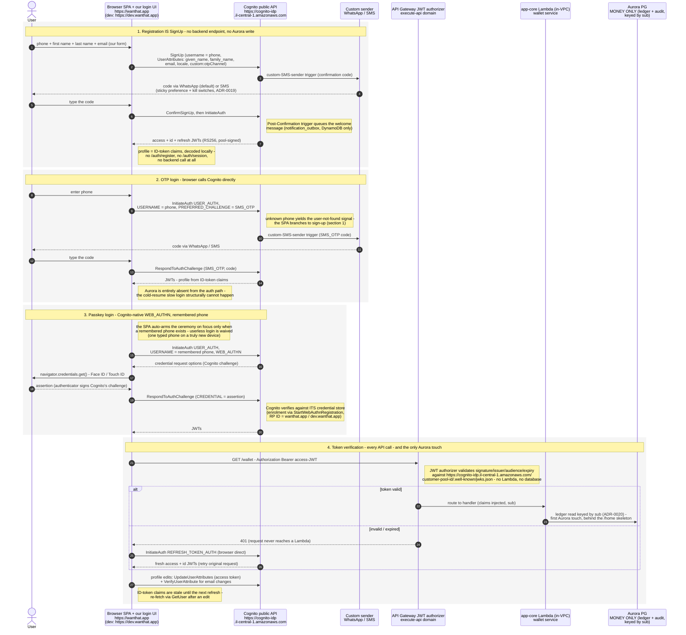

# Customer authentication flows - sequence diagram

> **Target state (ADR-0006).** This document describes the Cognito-native flow decided in
> [ADR-0006](../adrs/0006-cognito-native-auth-and-pii.md), currently being implemented
> (execution plan: [auth-cognito-native-plan.md](./auth-cognito-native-plan.md)). The
> previous app-owned design (app-auth proxy, Ed25519 tickets, app-verified WebAuthn) is
> preserved under *Alternatives considered* in the ADR.

One diagram covering the four customer-facing auth flows: **registration**, **OTP login**,
**passkey login**, and **per-request token verification**. Authentication needs zero backend
calls - the browser talks to Cognito directly; Aurora appears only at the wallet read.

Domains (prod / dev):

- SPA and passkey RP ID: `https://wanthat.app` / `https://dev.wanthat.app` (CloudFront; also fronts `/p/*` landing)
- Cognito public API (called directly from the browser): `https://cognito-idp.il-central-1.amazonaws.com`
- App HTTP API (app-core wallet routes): `https://<app-api-id>.execute-api.il-central-1.amazonaws.com` - the SPA calls it directly (cookieless, not fronted by CloudFront)
- Token verification JWKS: `https://cognito-idp.il-central-1.amazonaws.com/<customer-pool-id>/.well-known/jwks.json`

Key invariants (ADR-0006, ADR-0019, ADR-0020):

- **Cognito is the only issuer of session tokens** (RS256 JWTs signed by the customer pool).
  The app never mints session credentials (ADR-0006).
- **No app code proxies authentication.** The SPA calls the public `cognito-idp` endpoint
  directly for every ceremony: `SignUp` / `ConfirmSignUp`, `InitiateAuth(USER_AUTH)` +
  `RespondToAuthChallenge`, and native `WEB_AUTHN` (ADR-0006).
- **All customer PII lives in Cognito user attributes** (`phone_number`, `given_name`,
  `family_name`, `email`, `locale`, `custom:otpChannel`). The profile the SPA displays is
  the **ID-token claims**, decoded locally; edits go through `UpdateUserAttributes`
  (ADR-0006).
- **Aurora holds money only** - wallet ledger + hash-chained audit log, keyed directly by
  the Cognito `sub`, the canonical user id (ADR-0020). Nothing on the authentication path
  touches Aurora.
- **Passkeys are Cognito-native** (`StartWebAuthnRegistration` / `WEB_AUTHN` challenge);
  Cognito stores and verifies the credentials. RP ID = the site domain. Login requires a
  **remembered phone** - userless/conditional-UI login is waived (ADR-0006).
- **OTP channel** (WhatsApp default / SMS) is the sticky `custom:otpChannel` preference,
  enforced inside the custom-sender trigger against the runtime-config kill switches
  (ADR-0019).
- The SPA is **cookieless** (ADR-0007): tokens live in localStorage and travel as a Bearer
  header.
- **Abuse control sits at the pool boundary**: WAF web ACL on the user pool + Cognito
  request quotas + the SNS SMS spend cap (ADR-0006) - no app-side velocity table.

