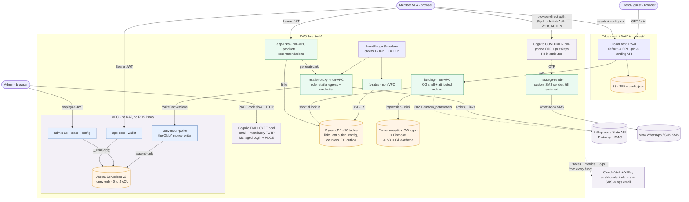
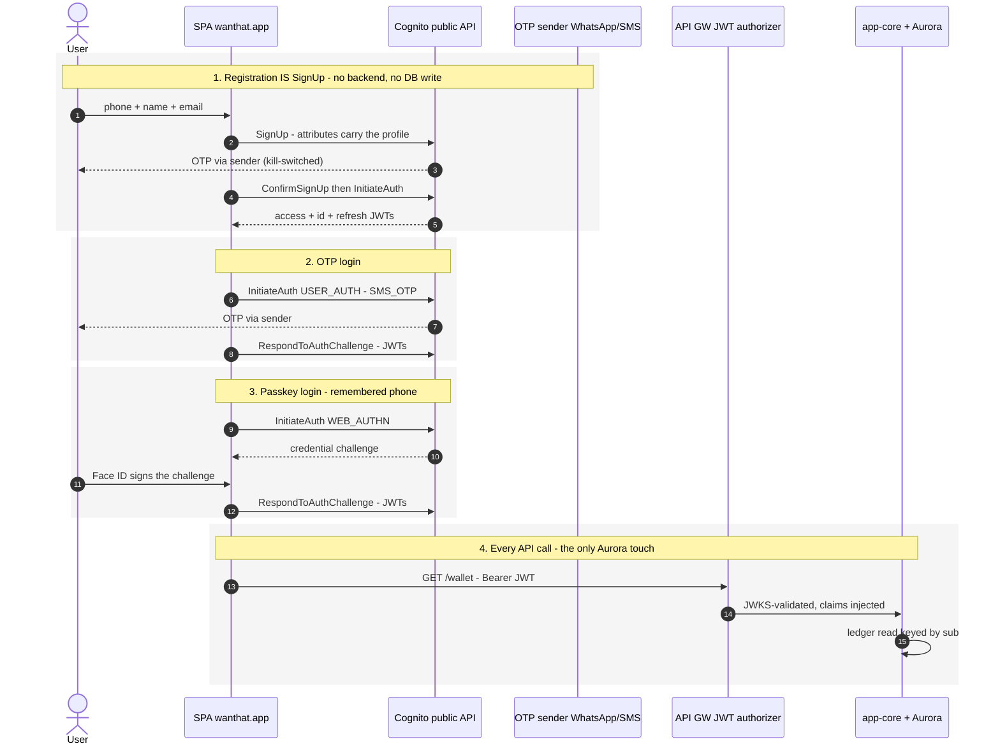
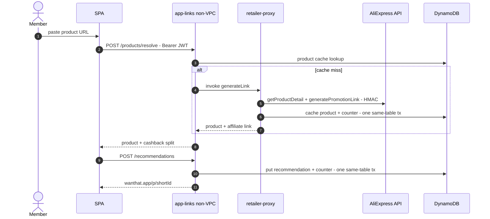
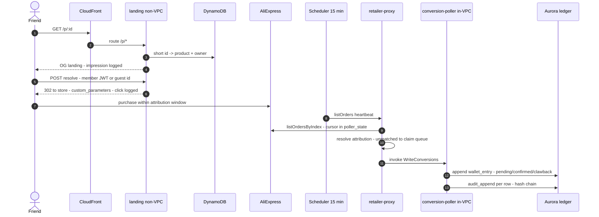
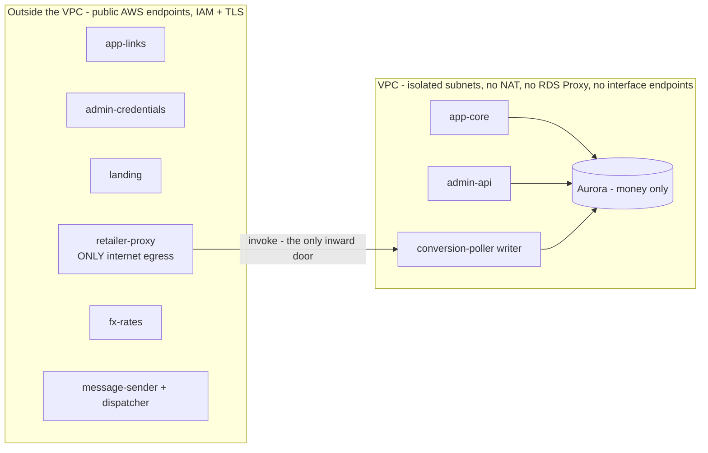
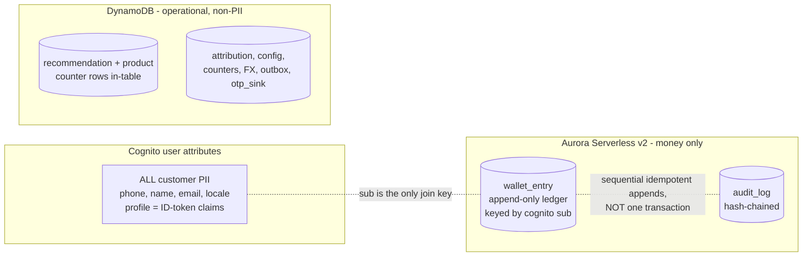

# Wanthat — 20-minute presentation script

> Input for a slides-generation agent. One `## Slide` section per slide: timing, layout hint,
> on-slide content, visual (image asset or mermaid source), and speaker notes. Facts are
> verified against code + the live AWS account (2026-07-14); the authoritative references are
> `docs/AWS_Architecture.md` and `adrs/`. Mermaid sources are ASCII-only with no semicolons.

**Global style:** clean startup-pitch look, white background, one teal-green accent
(evergreen `#1F7A57` — the product design-system accent), dark slate text. Diagram color
code (keep consistent everywhere): green = our compute, orange = data stores, purple =
external/managed services, gray = clients. Phone snapshots in `assets/` are ~2x captures of
340x587 frames — display at equal width in a row, card border + slight shadow.

**Timing plan (20:00):** title 0:30 - business 3:30 - user flows 2:00 - principles + architecture 5:00 - decisions and trade-offs (slides 8-13) 14:00 total with the above.
Backup slides are for Q&A only.

---

## Slide 1 — Title (0:30)

Layout: hero title.
- **wanthat** — Earn cashback by sharing what you love.
- Subtitle: Product and architecture overview.
- Footer chips: `Israel MVP` - `AWS serverless` - `il-central-1 (Tel Aviv)`.

Speaker notes: One sentence: "Wanthat turns the product links people already send to friends
into cashback — I'll show the product in two minutes, then spend the rest on how it's built."

## Slide 2 — The why (2:00)

Layout: two columns — problem left, insight right.

Left, "The gap" (three short rows):
- **Shoppers**: people share product links every day — "where did you get that?" — and earn
  nothing for the purchases they drive.
- **Cashback platforms**: Rakuten and Honey reward passive shopping through their own portal;
  the social recommendation goes unpaid and unmeasured.
- **Brands**: influencer budgets keep growing while organic word-of-mouth — which converts
  better — stays invisible.

Right, "The product":
- Wanthat turns the link you already send into a **tracked affiliate link**. Wanthat is the
  single registered affiliate across AliExpress / Awin / eBay; when a friend buys, the
  commission flows in and the **majority is credited back to the recommender** as cashback.
- Punchline: **it monetizes a behavior that already exists — without changing it.**

Speaker notes: word-of-mouth drives 20-50% of purchases and nobody pays for it. We are not
building an influencer platform — the persona is a regular person in four family WhatsApp
groups.

## Slide 3 — Why Israel, why now (1:30)

Layout: stat tiles (2x3) + one footer line.
- **66%** of Israeli online orders are AliExpress — the MVP integration.
- **#1** WhatsApp penetration among the highest globally — group sharing is a daily habit.
- **$17B+** global affiliate market — a proven commercial model.
- **3 days** AliExpress attribution window — sharing must be instant.
- **>=₪50** payout via bank / card / Bit / PayBox.
- Month-3 go/no-go gates: 500 active sharers, >20% CTR, >6% conversion, >50% 30-day return.

Speaker notes: the gates decide Phase 2 (group sharing, two-sided rewards) and a pre-seed
raise.

## Slide 4 — User flow: share a recommendation (1:00)

Layout: five phone snapshots left-to-right with arrows, a small URL chip above each, one-line
caption below each.

| # | Image | URL chip | Caption |
|---|---|---|---|
| 1 | `assets/flow-1-create-link.jpg` | `wanthat.app/create` | Member pastes a product link |
| 2 | `assets/flow-2-link-ready.jpg` | `wanthat.app/create` | Link ready — product pulled, cashback split shown |
| 3 | `assets/flow-3-whatsapp-share.png` | WhatsApp — off-platform | Shared on WhatsApp — disclosure included |
| 4 | `assets/flow-4-friend-landing.jpg` | `wanthat.app/p/Mx7Qa` | Friend opens the branded landing — with the review |
| 5 | `assets/flow-5-redirect-store.jpg` | `-> aliexpress.com — attributed` | Signed in, sent to the store — purchase attributed |

Speaker notes: the whole loop is two taps for the member; the friend's landing carries the
personal review, which is the trust mechanic. Screens are the design-handoff mocks.

## Slide 5 — User flow: the cashback comes back (1:00)

Layout: three phone snapshots with arrows, URL chips, captions.

| # | Image | URL chip | Caption |
|---|---|---|---|
| 1 | `assets/earn-1-activity.jpg` | `wanthat.app/activity` | Conversion tracked — pending until the store confirms |
| 2 | `assets/earn-2-wallet-home.jpg` | `wanthat.app/home` | Wallet credited — estimated ILS over real currencies |
| 3 | `assets/earn-3-withdraw.jpg` | `wanthat.app/withdraw` | Withdraw from ₪50 — bank, card, Bit or PayBox |

Speaker notes: note the "Estimated" chip — cashback is held in the settlement currency and
the ILS headline is a display estimate (ADR-0017); conversion happens at withdrawal.

## Slide 6 — Engineering principles (2:00)

Layout: five principle cards.
- **Monorepo, schema-first** — pnpm + Turborepo, TypeScript everywhere (Node 24, arm64);
  Zod contracts in one package are the single source of truth: inferred types + runtime
  validation at every boundary.
- **Everything as code** — AWS CDK v2; per-env stacks (dev/prod); zero manual console
  changes; PRs run CI + a `cdk diff` dry run that flags destructive changes; merge to main
  deploys dev, prod promotes explicitly; SQL migrations run in-deploy.
- **Decisions on record** — 21 ADRs beside the code; locked: change = a new superseding ADR,
  never an edit.
- **Optimize for cost** — no NAT Gateway, no RDS Proxy, zero VPC interface endpoints,
  scale-to-zero Aurora, on-demand DynamoDB; the dominant cost line is OTP delivery, not
  infrastructure.
- **Zero to scale** — a link going viral in a WhatsApp group is the design load: the redirect
  hot path is non-VPC Lambda + DynamoDB and never touches the SQL database.

Speaker notes: these five drove every decision that follows; when two conflicted, cost and
money-safety won.

## Slide 7 — Architecture (3:00)

Layout: full-slide diagram. Render the mermaid below (or restyle it) — keep the color code.

Speaker notes (walk it left to right): (1) there is **no auth service** — the browser talks
to Cognito directly; OTP rides a custom sender with WhatsApp-default and kill switches.
(2) The member APIs split into non-VPC app-links and in-VPC app-core — only what touches
money enters the VPC. (3) The friend's click never leaves DynamoDB. (4) Money enters only
through the scheduled pipeline on the right — retailer-proxy fetches, the in-VPC writer
appends. Full per-table version lives in `docs/AWS_Architecture.md`.

## Slide 8 — Data: one store per job, and what each costs us (2:30)

Layout: decision table (Data / Decision / Why / Trade-off accepted) + closing constraint line.

| Data | Decision | Why | Trade-off accepted |
|---|---|---|---|
| Money | Aurora Serverless v2 (0-2 ACU, IAM auth, no proxy) | ACID + Postgres GRANTs as the money invariant (app_rw SELECT-only, poller_writer INSERT-only); SQL for reconciliation | Scale-to-zero cold resume ~20 s (60 s connect timeout + SPA warm-up probe); 50-connection cap |
| Customer PII | Cognito user attributes are the system of record | Auth path touches zero databases; GDPR delete = one call; backups carry no PII | ListUsers-only queries (no joins, one filter); no PITR; no attribute history. Escape hatch: dual-write projection |
| Operational | DynamoDB on-demand (10 tables) | Viral bursts absorbed at $0 idle; access patterns modeled as projections (byOwner, byState GSIs) | No joins, no ad-hoc queries; counters kept exact via same-table transactions |

Closing line: **deliberate constraint — no cross-table transactions exist anywhere.** Counter
rows live inside the counted table (single-table TransactWriteItems); ledger + audit are
sequential idempotent appends behind a unique (order_id, kind, status) index. Cross-store
consistency is by keys and idempotency, not coordination.

Speaker notes: if asked why not one Postgres for everything — the redirect hot path must
absorb viral spikes at zero idle cost, and the auth path must not depend on a relational
database resume. (The data-homes diagram is in backup B6.)

## Slide 9 — Auth: three options, one deleted service (2:30)

Layout: three option cards (A/B/C) + two trade-off lines below.

- **A — Cognito Managed Login** (hosted pages, PKCE — zero auth code to own).
  **REJECTED**: no Hebrew/RTL (12 locales, text not editable); passkey RP-ID forced to the
  auth subdomain — credentials siloed off wanthat.app.
- **B — Cognito-native, own UI** (browser calls SignUp / InitiateAuth / WEB_AUTHN directly;
  profile = ID-token claims). **CHOSEN**: zero backend calls to authenticate; full RTL UI;
  pool WAF + quotas as abuse control.
- **C — App-owned ceremonies** (proxy every OTP step, own WebAuthn store, Ed25519 ticket
  bridge, AdminSetUserPassword exchange). **BUILT, THEN DELETED**: 2 Lambdas + 3 tables + a
  crypto path bought ONE feature — userless Face ID. Requirement waived, cost column deleted.

Trade-offs signed off with B: userless Face ID waived (remembered-phone one-prompt kept);
phone enumeration accepted (preventUserExistenceErrors LEGACY) — mitigated by pool WAF rate
rules; JWT revocation lags up to 1 h on our APIs (stateless authorizer) — acceptable while
the only member surface is a read-only wallet.
Measured effect: login requires zero backend calls; the Aurora cold-resume login stall
(~20 s) is structurally impossible.

Speaker notes: full sequence diagram in backup B1. The C-to-B migration was possible
pre-release — one dev user deleted, no migration burden.

## Slide 10 — Network: pay for nothing that idles (2:30)

Layout: avoided-cost table + three consequence lines.

| Component avoided | Fixed cost avoided | Replaced by |
|---|---|---|
| NAT Gateway | ~$33/mo + $0.045/GB | Non-VPC functions call public AWS endpoints (IAM + TLS); the only true internet egress is retailer-proxy |
| VPC interface endpoints | ~$7-15/mo each | Zero needed: nothing in-VPC calls Cognito, Secrets Manager, or the internet — by design, not by exception |
| RDS Proxy | per-ACU hourly | Direct IAM DB auth; 50-connection cap + no reserved concurrency keeps pressure bounded |
| DynamoDB access from VPC | — | Free gateway endpoint |

- Structural consequence: in-VPC functions cannot initiate outward calls — the conversion
  chain is always proxy → writer (invoke), and admin claim intents settle asynchronously on
  the next poll heartbeat.
- Blast-radius bonus: the retailer credential is readable by exactly one non-VPC function; a
  compromised in-VPC function has no path to it or to the internet.
- Revisit trigger: sustained Aurora connection pressure (alarm at 80% of 50) → RDS Proxy;
  steady traffic → reserved concurrency once the account quota (10) is raised.

Speaker notes: il-central-1 gaps shaped this too — no RDS Data API (killed the no-VPC data
path), no Lambda Function URLs (landing sits behind an HTTP API).

## Slide 11 — Money: poll over webhook, append over update (2:30)

Layout: two decision cards.

**Ingestion: scheduled reconciliation**
- Webhooks rejected: an inbound money-bearing endpoint is a spoofing surface, needs ordering
  and retry semantics, and the retailer offers no reliable one anyway (ADR-0009).
- Poll = a cursor in poller_state + listOrdersByIndex every 15 min: replayable from any
  point, idempotent by the ledger unique index, nothing to authenticate inbound.
- Accepted latency: minutes to surface, 24-48 h to confirm (retailer settlement dominates —
  the product promise is days, not seconds).
- Interim throttling (ADR-0021): sequential calls + one ban-window retry; revisit at volume.

**Storage: append-only + GRANT-enforced**
- Lifecycle is data, not mutation: pending → confirmed → clawback are separate immutable
  rows; balances are always derived.
- The invariant lives in Postgres, not app code: UPDATE/DELETE revoked from every role; only
  poller_writer can INSERT; audit_append is SECURITY DEFINER.
- Hash-chained audit log makes tampering evident; admin config changes audit the same way.
- Blast radius: a bug or compromise in any read path has zero write capability on money.

Speaker notes: sequence in backup B3. Unmatched orders are not dropped — they park in
unattributed_order and an admin claim settles on the next heartbeat.

## Slide 12 — Cost model: a measured floor, then linear (2:00)

Layout: cost table + two accepted-cost lines.

| Line item | Monthly | Note |
|---|---|---|
| Compute + APIs + DynamoDB idle | $0 | Everything scales from zero; Aurora paused = storage only (~$2) |
| WAF (2 web ACLs + rules) | ~$15 | The deliberate fixed floor: CloudFront ACL + Cognito-pool ACL |
| Secrets, Route 53, misc | ~$2 | 2 retailer secrets, hosted zone |
| OTP delivery | capped $1 | SNS hard cap (SMS sandbox); WhatsApp ~10x cheaper per message at scale — hence WhatsApp-default |
| NAT / proxies / endpoints | $0 | Architecturally eliminated (slide 10) |

- Costs accepted knowingly: cold-resume UX risk on first wallet read (mitigated by warm-up
  probe); one AWS account for dev+prod shares SMS caps and quotas — flagged for split.
- Unit economics guardrail: the redirect hot path costs micro-cents per thousand clicks and
  cannot touch Aurora — cost scales with revenue-bearing traffic, not with virality.

Speaker notes: numbers are il-central-1 approximations; the point is the shape — a ~$20
measured floor, then linear with usage.

## Slide 13 — Limits I know about, and their revisit triggers (2:00)

Layout: limits table + Questions line.

| Limitation | Current stance | Revisit trigger |
|---|---|---|
| Single active region | Cross-region backups only; RTO = hours (ADR-0005) | Revenue SLA or user base that prices an active-standby |
| Cognito PII: no PITR, weak queries | Accepted for MVP; profile is thin | Compliance/BI needs → dual-write projection to SQL |
| JWT revocation lag <= 1 h | Only member surface is a read-only wallet | Any sensitive member mutation → short tokens or in-handler check |
| Account concurrency = 10 | No reserved concurrency anywhere (deliberate) | Quota raise, then per-function caps return |
| dev + prod in one account | Shared SMS cap and service quotas | Before marketing push: account split |
| Retailer throttling interim | Sequential + one ban-window retry (ADR-0021) | Poller volume growth or AliExpress app approval |

Close: "Questions? Backup: sequence diagrams, failure modes, the rejected-alternatives list."

Speaker notes: every row is documented in an ADR or docs/AWS_Architecture.md — none of these
are surprises.

---

# Backup slides (Q&A)

## Slide B1 — Sequence: customer auth, all four flows

## Slide B2 — Sequence: create a link

## Slide B3 — Sequence: click to ledger

## Slide B4 — ADR map

Layout: two-column list; highlight the architecture set (0001-0009) vs stack set.
- 0001 monorepo + Zod contracts - 0002 compute seams - 0003 polyglot data, no RDS Proxy -
  0004 NAT-free network - 0005 single region + cross-region backups - 0006 Cognito-native
  auth + PII - 0007 landing path + latency - 0008 attribution via custom_parameters -
  0009 poller, not webhook.
- Stack: 0010 ESM/Node - 0011 Hono + Powertools - 0012 Kysely + SQL migrations -
  0013 Vitest + Testcontainers - 0014 Biome - 0015 GitHub Actions OIDC - 0016 Vite SPA.
- Extensions: 0017 currency + FX - 0018 CloudFront front door - 0019 WhatsApp messaging -
  0020 sub = canonical id - 0021 retailer throttling (interim).
- Policy: **locked — supersede, never edit.**

## Slide B5 — ADR-0002 + 0004: compute seams and the NAT-free bet

Talking points: only what touches Aurora enters the VPC; in-VPC functions cannot call out —
the conversion chain is always proxy -> writer; a NAT Gateway would be the single biggest
fixed cost in the account.

## Slide B6 — ADR-0003 + 0027: where data lives

Layout: diagram + three trade-off lines.

- The customer table was dropped when PII moved to Cognito (migration 0006_money_only) — the
  ledger is keyed by the Cognito sub directly.
- Admin user search runs on ListUsers (one-attribute filters); fine at MVP scale — dual-write
  projection is the escape hatch.
- Trade-offs accepted: no SQL over PII, no PITR for the user pool, attribute changes have no
  built-in history.

## Slide B7 — Failure modes and recovery

Layout: table.

| Failure | Behavior | Recovery |
|---|---|---|
| Aurora cold resume (~20 s) | First wallet read after idle stalls | SPA fires /healthz/db warm-up probe on auth screens; 60 s connect timeout rides it out |
| AliExpress ApiCallLimit ban window | Poll heartbeat calls rejected | Sequential calls + one ban-window retry (ADR-0021); cursor unmoved → next beat replays |
| WhatsApp delivery down | OTP channel unavailable | Sticky-preference fallback to SMS; runtime-config kill switches; SNS spend cap bounds abuse |
| Poller crash mid-batch | Partial writes | Cursor advances only after batch; ledger unique index makes replays no-ops |
| Dispatcher poison message | Outbox item repeatedly fails | bisectBatchOnError + 3 retries → SQS DLQ (14 d); items age out by TTL |
| Cognito outage | No new logins | Static SPA still serves; landing redirect works for guests (DynamoDB-only path) |

## Slide B8 — Rejected alternatives: the graveyard

Layout: two-column table.

| Alternative | Why not |
|---|---|
| RDS Data API (no-VPC SQL) | Not available in il-central-1 — verified, killed the design branch |
| Lambda Function URLs for landing | Not available in il-central-1 → HTTP API behind CloudFront /p/* |
| NAT + interface endpoints | Fixed monthly cost for idle capability; non-VPC chaining is $0 and least-privilege by construction |
| RDS Proxy | Cost + unneeded at 50-connection scale; revisit on connection-pressure alarm |
| Managed Login for customers | No Hebrew/RTL; passkey RP-ID silo on the auth subdomain (kept for the admin console, where it fits) |
| Conversion webhooks | Spoofable inbound money surface + no reliable retailer support; reconciliation poll is replayable and auditable |
| Self-minted session JWTs | A second token validation path across every API; Cognito stays the only issuer |
| Aurora customer table (PII in SQL) | Kept Aurora on the auth path and PII in two stores; moved to Cognito attributes (ADR-0027) |
