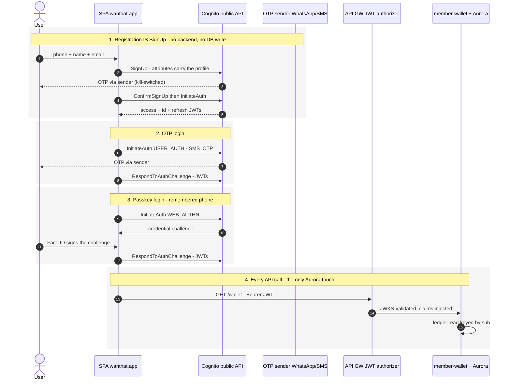
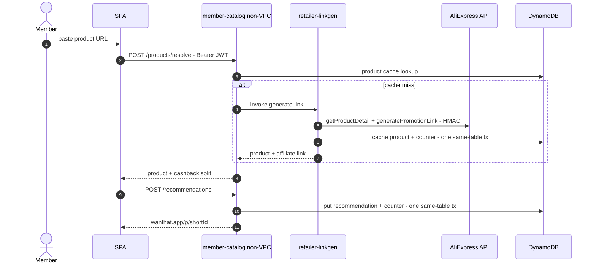
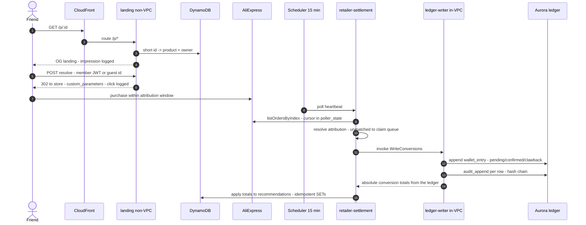
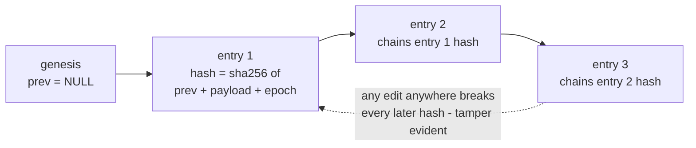
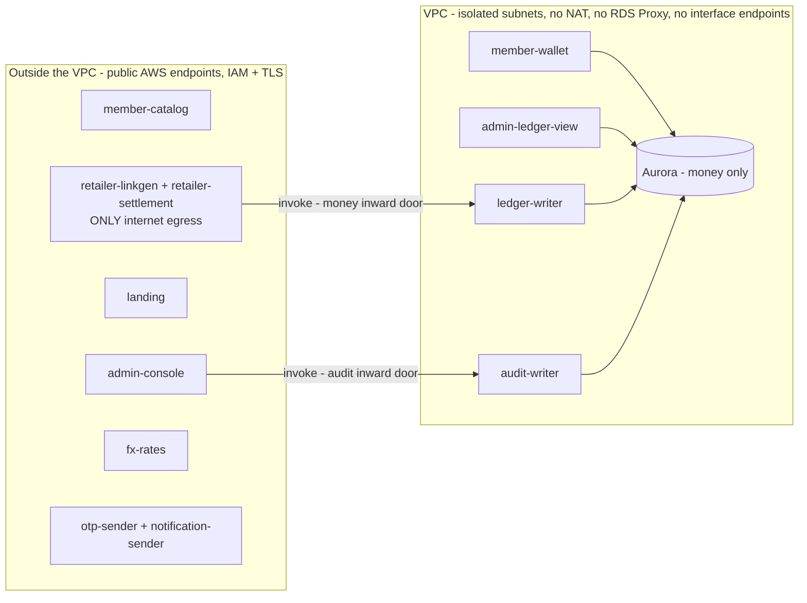
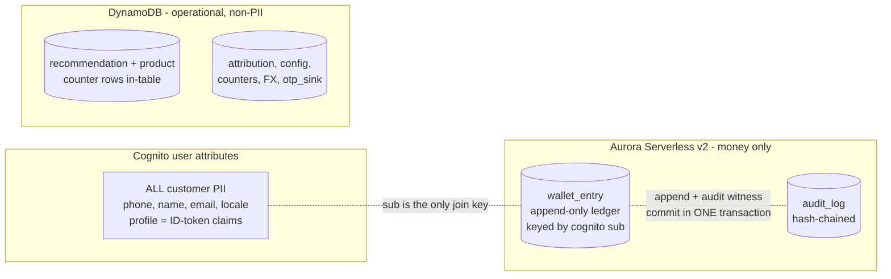

# Wanthat — 20-minute presentation script

> Input for a slides-generation agent. One `## Slide` section per slide: timing, layout hint,
> on-slide content, visual (image asset or mermaid source), and speaker notes. Facts are
> verified against code + the live AWS account (2026-07-14); the authoritative references are
> `docs/AWS_Architecture.md` and `adrs/`. Updated 2026-07-17 for the lambda-topology
> refactor (fifteen functions - ADR-0002 rewrite). Mermaid sources are ASCII-only with no
> semicolons.

**Global style:** clean startup-pitch look, white background, one teal-green accent
(evergreen `#1F7A57` — the product design-system accent), dark slate text. Diagram color
code (keep consistent everywhere): green = our compute, orange = data stores, purple =
external/managed services, gray = clients. Phone snapshots in `assets/` are ~2x captures of
340x587 frames — display at equal width in a row, card border + slight shadow.

**Timing plan (~21:00):** title 0:30 - business 3:30 - user flows 2:00 - principles 1:30 - data model 1:30 - data stores 2:00 - architecture walkthrough 6:00 (intro + 6 use cases + wrap) - cost 1:30 - cost projection 1:00 - limits 1:30.
Backup slides are for Q&A only. The architecture walkthrough diagrams are MAINTAINED BY DENNIS
in the working deck (Google Slides) - the script reserves the space and carries the talking
points only.

---

## Slide 1 — Title (0:30)

Layout: hero title.
- **wanthat** — Earn cashback by sharing what you love.
- Subtitle: Product and architecture overview.
- Byline: by Dennis Potashnik - July 2026.
- Footer chips: `Israel MVP` - `AWS serverless` - `il-central-1 (Tel Aviv)`.

Speaker notes: One sentence: "Wanthat turns the product links people already send to friends
into cashback — I'll show the product in two minutes, then spend the rest on how it's built."

## Slide 2 — The why (2:00)

Layout: two columns — problem left, insight right.

Left, "The gap" (three short rows):
- **Shoppers**: people share product links every day — "where did you get that?" — and earn
  nothing for the purchases they drive.
- **Cashback platforms**: Rakuten and Honey reward passive shopping through their own portal;
  the social recommendation goes unpaid and unmeasured.
- **Brands**: influencer budgets keep growing while organic word-of-mouth — which converts
  better — stays invisible.

Right, "The product":
- Wanthat turns the link you already send into a **tracked affiliate link**. Wanthat is the
  single registered affiliate across AliExpress / Shein / Amazon and others; when a friend
  buys, the commission flows in and is **split between the recommender and the buyer**.
- Punchline: **it monetizes a behavior that already exists.**

Speaker notes: word-of-mouth drives 20-50% of purchases and nobody pays for it. We are not
building an influencer platform — the persona is a regular person in four family WhatsApp
groups.

## Slide 3 — Why Israel, why now (1:30)

Layout: stat tiles (2x3) + one footer line.
- **66%** of Israeli online orders are AliExpress — the MVP integration.
- **#1** WhatsApp penetration among the highest globally — group sharing is a daily habit.
- **$17B+** global affiliate market — a proven commercial model.
- **3 days** AliExpress attribution window — sharing must be instant.
- **>=₪20** payout via bank / card / Bit / PayBox.
- Month-3 go/no-go gates: 500 active sharers, >20% CTR, >6% conversion, >50% 30-day return.

Speaker notes: the gates decide Phase 2 (group sharing, two-sided rewards) and a pre-seed
raise.

## Slide 4 — User flow: share a recommendation (1:00)

Layout: five phone snapshots left-to-right with arrows, a small URL chip above each, one-line
caption below each.

| # | Image | URL chip | Caption |
|---|---|---|---|
| 1 | `assets/flow-1-create-link.jpg` | `wanthat.app/create` | Member pastes a product link |
| 2 | `assets/flow-2-link-ready.jpg` | `wanthat.app/create` | Link ready — product pulled, cashback split shown |
| 3 | `assets/flow-3-whatsapp-share.png` | WhatsApp — off-platform | Shared on WhatsApp — disclosure included |
| 4 | `assets/flow-4-friend-landing.jpg` | `wanthat.app/p/Mx7Qa` | Friend opens the branded landing — with the review |
| 5 | `assets/flow-5-redirect-store.jpg` | `-> aliexpress.com — attributed` | Signed in, sent to the store — purchase attributed |

Speaker notes: the whole loop is two taps for the member; the friend's landing carries the
personal review, which is the trust mechanic. Screens are the design-handoff mocks.

## Slide 5 — User flow: the cashback comes back (1:00)

Layout: three phone snapshots with arrows, URL chips, captions.

| # | Image | URL chip | Caption |
|---|---|---|---|
| 1 | `assets/earn-1-activity.jpg` | `wanthat.app/activity` | Conversion tracked — pending until the store confirms |
| 2 | `assets/earn-2-wallet-home.jpg` | `wanthat.app/home` | Wallet credited — estimated ILS over real currencies |
| 3 | `assets/earn-3-withdraw.jpg` | `wanthat.app/withdraw` | Withdraw from ₪20 — bank, card, Bit or PayBox |

Speaker notes: note the "Estimated" chip — cashback is held in the settlement currency and
the ILS headline is a display estimate (ADR-0017); conversion happens at withdrawal.

## Slide 6 — Engineering principles (1:30)

Layout: six principle cards (3 x 2 grid), Dennis's order.
- **Optimize for cost** — avoid constant costs: zero interface endpoints, scale-to-zero,
  on-demand DBs.
- **Zero to scale** — a link going viral in a WhatsApp group is the potential spike.
- **Security by design** — the entire framework is about money movement. Apply least
  privilege access, MFA, data integrity provability, isolation of concerns, strict auditing
  and other security principles.
- **Monorepo, schema-first** — pnpm + Turborepo, TypeScript everywhere (Node 24, arm64);
  Zod contracts: inferred types + runtime validation at every boundary.
- **Everything as code** — AWS CDK v2; per-env stacks; zero console changes. PRs run CI +
  `cdk diff`; merge deploys dev; SQL migrations run in-deploy; verify no orphaned resources
  after deploys.
- **Decisions on record** — ADRs beside the code. Locked: change is a new superseding ADR,
  never an edit.

Speaker notes: these principles drove every decision that follows; when two conflicted, cost
and money-safety won.

## Slide 7 — Domain Object Model (1:30)

Layout: full-slide diagram — Dennis's domain model (source: the Google Slides deck; the
pptx embeds the exported page from `wanthat - technical.pdf`).

Entities: **wanthat** — User, Recommendation, Product, Wallet Entry (User 1-* Recommendation,
Product 1-* Recommendation, User 1-* Wallet Entry); **Retailer** — Affiliate Link (1-1
Product) and Order (1-* per Recommendation, feeding Wallet Entry).

Speaker notes: references across stores are soft — keys plus idempotency, never foreign keys
or cross-store transactions; the Cognito sub ties a member's PII, links and money together.
Per-column schemas are in backup B10/B11.

## Slide 8 — Data stores and cost (2:00)

Layout: decision table (Data / Decision / Why / Trade-off accepted) + closing constraint line.

| Data | Decision | Why | Trade-off accepted |
|---|---|---|---|
| Money + Audit Log | Aurora Serverless v2 (0-2 ACU, IAM auth, no proxy) | ACID; permissions enforced on DB level (GRANTs); storing the audit log with hashed chains | Scale-to-zero cold resume ~20 s (60 s connect timeout + SPA warm-up probe); 50-connection cap. Possible simple workaround — cached last known totals (display while reloading) per user on SPA or backend |
| Customer PII | Cognito user attributes are the system of record | Auth path touches zero databases; GDPR delete = one call; the only backup carrying PII is the Cognito backup | ListUsers-only queries (no joins, one filter); no PITR; no attribute history |
| Operational | DynamoDB on-demand (9 tables) | Viral bursts absorbed at $0 idle; access patterns modeled as projections (byOwner, byState GSIs) | No joins, no ad-hoc queries; counters kept exact via same-table transactions |

Closing line: **deliberate constraint — no cross-STORE transactions exist anywhere.** Counter
rows live inside the counted table (single-table TransactWriteItems); each ledger append
commits with its audit witness in ONE Aurora transaction (the single intra-store exception),
and replays stay no-ops via the unique (order_id, kind, status) index. Cross-store
consistency is by keys and idempotency, not coordination.

Speaker notes: if asked why not one Postgres for everything — the redirect hot path must
absorb viral spikes at zero idle cost, and the auth path must not depend on a relational
database resume. (The data-homes diagram is in backup B14.)

## Slide 9 — Architecture: the starting point (0:45)

Layout: reserved full-slide diagram card (Dennis's diagram) + one-line lead.
- Starting with: **in-VPC Aurora Serverless v2** and **DynamoDB on-demand**.

Visual: the exported page from `wanthat - technical.pdf` (Dennis's diagram), full-bleed.

## Slide 10 — Architecture UC1: member creates a recommendation (0:45)

Layout: left talking points + reserved diagram card.
- SPA is served from S3 via CloudFront.
- Cognito-native authentication at the application level.
- The retailer link is created ONCE per product (cache; linkgen is the sole writer).

Visual: the exported page from `wanthat - technical.pdf` (Dennis's diagram), full-bleed.

## Slide 11 — Architecture UC2: the recommendation is shared (0:45)

Layout: left talking points + reserved diagram card.
- This is the hot path.
- The recommendation page is server-rendered and cached on CloudFront (60 s, origin-controlled).
- The TS landing app boots on the page for auth / registration and redirect-link generation.

Visual: the exported page from `wanthat - technical.pdf` (Dennis's diagram), full-bleed.

## Slide 12 — Architecture UC3: registration, login, guest + redirect (0:45)

Layout: left talking points + reserved diagram card.
- Every registration appends a hash-chained audit row — each row carries the previous row's hash.
- `audit_writer` is granted EXECUTE on the procedure ONLY.
- The stored procedure serializes concurrent appends (advisory lock).

Visual: the exported page from `wanthat - technical.pdf` (Dennis's diagram), full-bleed.

## Slide 13 — Architecture UC4: settlement pulled in the background (0:45)

Layout: left talking points + reserved diagram card.
- Internal-only flow — the ONLY path that can append wallet entries (GRANT-enforced).
- Side use case: FX rates pulled from the exchange-rate provider.

Visual: the exported page from `wanthat - technical.pdf` (Dennis's diagram), full-bleed.

## Slide 14 — Architecture UC5: the member home page (0:45)

Layout: left talking points + reserved diagram card.
- An Aurora cold resume may delay the wallet total + recent activity.
- Everything else is operational immediately.

Visual: the exported page from `wanthat - technical.pdf` (Dennis's diagram), full-bleed.

## Slide 15 — Architecture UC6: the admin console (0:45)

Layout: left talking points + reserved diagram card.
- Cognito Managed Login; a SEPARATE employee pool.
- Operational-data management; money views are read-only.

Visual: the exported page from `wanthat - technical.pdf` (Dennis's diagram), full-bleed.

## Slide 16 — Architecture: additional use cases, same principles (0:45)

Layout: left talking points + reserved diagram card.
- Observability - guest attribution within the affiliation window - manual attribution of
  unattributed settlements - ops counters for real-time admin stats - offline analytics.

Visual: the exported page from `wanthat - technical.pdf` (Dennis's diagram), full-bleed.

## Slide 17 — Cost model: a measured floor, then linear (1:30)

Layout: cost table + two accepted-cost lines.

| Line item | Monthly | Note |
|---|---|---|
| Compute + APIs + DynamoDB idle | $0 | Everything scales from zero; Aurora paused = storage only (~$2) |
| WAF (2 web ACLs + rules) | ~$15 | The deliberate fixed floor: CloudFront ACL + Cognito-pool ACL |
| Secrets, Route 53, misc | ~$2 | 2 retailer secrets, hosted zone |
| OTP delivery | capped $1 | SNS hard cap (SMS sandbox); WhatsApp ~10x cheaper per message at scale — hence WhatsApp-default |
| NAT / proxies / endpoints | $0 | Architecturally eliminated (backup B2) |

- Costs accepted knowingly: cold-resume UX risk on first wallet read (mitigated by warm-up
  probe); one AWS account for dev+prod shares SMS caps and quotas — flagged for split.
- Unit economics guardrail: the redirect hot path costs micro-cents per thousand clicks and
  cannot touch Aurora — cost scales with revenue-bearing traffic, not with virality.

Speaker notes: numbers are il-central-1 approximations; the point is the shape — a ~$20
measured floor, then linear with usage. The 10-to-100k-user projection is the NEXT slide.

## Slide 18 — Cost projection by user count (1:00)

Layout: full cost matrix (service rows x user-count columns) + takeaway line. Assumptions:
10 operations/user/day (wallet refresh, create recommendation), ~70/30 read-write mix,
il-central-1 approximate prices, production environment only; every active user = 1 Cognito
MAU; RDS Proxy included from 10k users (its 8-ACU minimum makes it ~$100/month FLAT).

| Monthly (prod) | 10 | 100 | 1,000 | 10,000 | 100,000 |
|---|---|---|---|---|---|
| WAF (2 ACLs, fixed + $0.60/M req) | $14 | $14 | $14 | $15 | $27 |
| API Gateway (~$1.2/M) | ~$0 | ~$0 | $0.40 | $4 | $36 |
| Lambda (256MB arm64) | ~$0 | ~$0 | $0.20 | $2 | $18 |
| DynamoDB on-demand | ~$0 | ~$0 | $0.40 | $4 | $40 |
| Aurora (compute + storage) | ~$3 | ~$8 | ~$45 | ~$80 | ~$220 |
| RDS Proxy (8-ACU minimum) | — | — | — | ~$100 | ~$100 |
| Cognito ($0.015/MAU after 10k free) | $0 | $0 | $0 | $0 | $1,350 |
| CloudFront + misc | ~$3 | ~$3 | ~$5 | ~$12 | ~$42 |
| **Total** | **~$20** | **~$25** | **~$65** | **~$215** | **~$1,835** |

- Two step functions, then linear: Aurora stops sleeping (~1k users); the Cognito free tier
  ends at exactly 10k MAU. Per-user at 100k: ~$0.018/month.

Speaker notes: WAF stays flat at every scale — member API operations bypass CloudFront
entirely. Breaks BEFORE the bill: account concurrency 10 (~10k users, peaks) - AliExpress
rate limits (ADR-0021) - Aurora's 50-connection cap post-quota-raise (only THEN does the
proxy earn its cost) - the 2-ACU max.

## Slide 19 — Known limits, and their revisit triggers (1:30)

Layout: limits table + Questions line.

| Limitation | Current stance | Revisit trigger |
|---|---|---|
| Single active region | Cross-region backups only; RTO = hours (ADR-0005) | Revenue SLA or user base that prices an active-standby |
| Cognito PII: no PITR, weak queries | Accepted for MVP; profile is thin | Compliance/BI needs → dual-write projection to SQL |
| Account concurrency = 10 | No reserved concurrency anywhere (deliberate) | Quota raise, then per-function caps return |
| dev + prod in one account | Shared SMS cap and service quotas | Before marketing push: account split |
| Retailer throttling interim | Sequential + one ban-window retry (ADR-0021) | Poller volume growth or AliExpress app approval |

Close: "Questions? Backup: sequence diagrams, failure modes, the rejected-alternatives list."

Speaker notes: every row is documented in an ADR or docs/AWS_Architecture.md — none of these
are surprises.

---

---

# Backup slides (Q&A)

## Slide B1 — Auth: three options

Layout: three option cards (A/B/C) + two trade-off lines below.

- **A — Cognito Managed Login** (hosted pages, PKCE — zero auth code to own).
  **REJECTED**: no Hebrew/RTL (12 locales, text not editable); passkey RP-ID forced to the
  auth subdomain — credentials siloed off wanthat.app.
- **B — Cognito-native, own UI** (browser calls SignUp / InitiateAuth / WEB_AUTHN directly;
  profile = ID-token claims). **CHOSEN**: zero backend calls to authenticate; full RTL UI;
  pool WAF + quotas as abuse control.
- **C — App-owned ceremonies** (proxy every OTP step, own WebAuthn store, Ed25519 ticket
  bridge, AdminSetUserPassword exchange). **ALTERNATIVE — not pursued**: 2 Lambdas + 3
  tables + a crypto path buy exactly ONE feature — userless Face ID; the requirement was
  waived, so the whole column of cost buys nothing.

Trade-offs signed off with B: userless Face ID waived (remembered-phone one-prompt kept);
phone enumeration accepted (preventUserExistenceErrors LEGACY) — mitigated by pool WAF rate
rules; JWT revocation lags up to 15 min on our APIs (stateless authorizer, 15-minute access
tokens) — acceptable for the current member surface.
Measured effect: login requires zero backend calls; the Aurora cold-resume login stall
(~20 s) is structurally impossible.

Speaker notes: full sequence diagram in backup B4.

## Slide B2 — Network: pay for nothing that idles

Layout: avoided-cost table + three consequence lines.

| Component avoided | Fixed cost avoided | Replaced by |
|---|---|---|
| NAT Gateway | ~$33/mo + $0.045/GB | Non-VPC functions call public AWS endpoints (IAM + TLS); the only true internet egress is the retailer tier |
| VPC interface endpoints | ~$7-15/mo each | Zero needed: nothing in-VPC calls Cognito, Secrets Manager, or the internet — by design, not by exception |
| RDS Proxy | per-ACU hourly | Direct IAM DB auth; 50-connection cap + no reserved concurrency keeps pressure bounded |
| DynamoDB access from VPC | — | Free gateway endpoint |

- Structural consequence: in-VPC functions cannot initiate outward calls — the conversion
  chain is always proxy → writer (invoke), and admin claim intents settle asynchronously on
  the next poll heartbeat.
- Blast-radius bonus: the retailer credential is readable by exactly one non-VPC function; a
  compromised in-VPC function has no path to it or to the internet.
- Revisit trigger: sustained Aurora connection pressure (alarm at 80% of 50) → RDS Proxy;
  steady traffic → reserved concurrency once the account quota (10) is raised.

Speaker notes: il-central-1 gaps shaped this too — no RDS Data API (killed the no-VPC data
path), no Lambda Function URLs (landing sits behind an HTTP API).

## Slide B3 — Money: poll over webhook, append over update

Layout: two decision cards.

**Ingestion: scheduled reconciliation**
- Webhooks rejected: an inbound money-bearing endpoint is a spoofing surface, needs ordering
  and retry semantics, and the retailer offers no reliable one anyway (ADR-0009).
- Poll = a cursor in poller_state + listOrdersByIndex every 15 min: replayable from any
  point, idempotent by the ledger unique index, nothing to authenticate inbound.
- Accepted latency: minutes to surface, 24-48 h to confirm (retailer settlement dominates —
  the product promise is days, not seconds).
- Interim throttling (ADR-0021): sequential calls + one ban-window retry; revisit at volume.

**Storage: append-only + GRANT-enforced**
- Lifecycle is data, not mutation: pending → confirmed → clawback are separate immutable
  rows; balances are always derived.
- The invariant lives in Postgres, not app code: UPDATE/DELETE revoked from every role; only
  ledger_writer can INSERT; audit_append is SECURITY DEFINER and the only door into the
  audit log.
- Hash-chained audit log makes tampering evident; admin config changes audit the same way.
- Blast radius: a bug or compromise in any read path has zero write capability on money.

Speaker notes: sequence in backup B6. Unmatched orders are not dropped — they park in
unattributed_order and an admin claim settles on the next heartbeat.

## Slide B4 — Sequence: customer auth, all four flows

## Slide B5 — Sequence: create a link

## Slide B6 — Sequence: click to ledger

## Slide B7 — Trade-off: HA vs single region (ADR-0005)

Layout: two-column trade-off + verdict line.

- **Target**: 99.5% availability (~3.6 h/month) — lenient by design for an MVP.
- **Hard constraint**: Cognito has NO multi-region replication in il-central-1 — a hot
  identity failover is not natively possible regardless of spend.
- **Chosen**: single active region (il-central-1); eu-central-1 is a restore target, not a
  standby. RPO ~minutes (PITR), RTO ~hours (region-loss rebuild from cross-region copies).
- **Rejected**: active-passive multi-region now — not required for 99.5%, identity failover
  would be non-native anyway, and the cost/complexity is unjustified at MVP.
- **Rejected**: in-region backups only — a region incident would lose a money ledger;
  unacceptable at any SLA.
- Revisit trigger: an SLA beyond 99.5%, or identity region-loss recovery becoming a hard
  requirement.

## Slide B8 — Backup strategy (ADR-0005)

Layout: table + two honesty lines.

| Data | In-region | Cross-region (eu-central-1) |
|---|---|---|
| Aurora ledger + audit | PITR, continuous — RPO ~minutes | Automated-snapshot copy |
| DynamoDB (9 tables) | PITR on every table | Export/copy for the redirect projection + attribution map |
| Funnel + audit events (S3) | Versioning | Cross-region replication |
| Secrets | — | Secrets Manager replication |
| Cognito (identity + ALL PII) | Managed by the pool | **NONE — no cross-region recovery in MVP** (accepted, documented) |

- The hash-chained audit log complements backups: restores are tamper-evident, not just
  recoverable.
- Status honesty: PITR is live everywhere; the cross-region copy jobs are the one deferred
  item of ADR-0005 — tracked, not yet deployed.

## Slide B9 — Observability

Layout: three cards (see / alert / analyze).

- **See**: per-surface CloudWatch dashboards (API count/5xx/p95, Lambda errors/throttles/p95
  in registry order, Aurora ACU + connections, SMS spend) + an edge dashboard in us-east-1
  (CloudFront + WAF); X-Ray tracing on every function; structured logs with retention bounds
  (dev 1 month, prod 6 months).
- **Alert** (SNS -> ops email): per-Lambda errors for the 13 steady-state functions (the two
  deploy-time triggers are excluded BY DESIGN — their failure fails the deploy itself),
  per-API 5xx, Aurora connections at 80% of the 50 cap, month-to-date SMS spend at 80% of
  the cap.
- **Analyze**: the funnel pipeline — CloudWatch Logs subscription filters on landing /
  retailer-settlement / ledger-writer pick impression, click, conversion and order_untracked
  events -> Firehose -> date-partitioned S3 -> Glue -> Athena with partition projection.

Speaker notes: the alarm list is deliberately short — every alarm is actionable; funnel
events are business analytics, not ops noise, which is why they leave CloudWatch.

## Slide B10 — Aurora schema + the hash chain (conceptual)

Layout: two cards side by side + chain diagram below.

**wallet_entry — the append-only ledger**
- `id, cognito_sub, kind, amount_minor, currency, order_id, recommendation_id, status,
  created_at` — no FK anywhere (the user store is Cognito; no SQL constraint can reach it).
- Lifecycle is rows, not updates: `pending -> confirmed -> clawback` are separate immutable
  appends; balances are always derived, never stored.
- Unique `(order_id, kind, status)` where order_id is present = poll idempotency; partial
  index on `recommendation_id` serves the conversion-totals derivation.
- Every append commits with its `audit_append` witness in ONE transaction (2026-07-18) — a
  failed audit rolls the money row back; no ledger row can exist unwitnessed.
- UPDATE/DELETE revoked from EVERY role; one Postgres role per function is the enforcement
  layer (wallet_reader / ledger_reader SELECT-only, ledger_writer INSERT-only,
  audit_writer = EXECUTE audit_append only).

**audit_log — hash-chained events**
- `id, prev_hash, entry_hash, payload jsonb, created_at`; the SECURITY DEFINER function
  `audit_append` is the ONLY door in — it serializes writers with an advisory lock so the
  chain can never fork.

Speaker notes: the chain is verifiable end-to-end with one SQL window query; when we
scrubbed PII from historical payloads (2026-07), the migration recomputed the whole chain
and it still verifies — an auditable rewrite, not a silent one.

## Slide B11 — DynamoDB schemas + GSIs

Layout: table + two constraint lines.

| Table | Keys | GSI / extras | Purpose |
|---|---|---|---|
| product | storeId + storeProductId | counter row in-table | retailer product cache (retailer-linkgen is sole writer) |
| recommendation | recommendationId | **byOwner** (ownerId, createdAt); counter row in-table | short-link projection + per-link stats |
| guest_attribution | guestId | — | guest -> member carry-over at signup |
| poller_state | stateKey | — | order-poll cursor |
| unattributed_order | orderId | **byState** (state, firstSeenAt) | admin claim queue |
| runtime_config | configKey | — | kill switches + tunables (admin-console sole writer) |
| ops_counters | counterKey | — | exact customer/link counters + daily stats |
| fx_rate | pair (USD#ILS) | — | FX display-estimate cache |
| otp_sink | phone | TTL 5 min | parked OTP codes (admin debugging view) |

- All on-demand + PITR. Exact counters: the `#counter` sentinel row lives INSIDE the counted
  table, so create/delete + `ADD itemCount` ride ONE same-table TransactWriteItems — sparse
  by construction (no ownerId, so GSIs exclude it).
- No cross-table transaction exists anywhere — cross-entity consistency is keys +
  idempotent writes, by design.

## Slide B12 — ADR map

Layout: two-column list; highlight the architecture set (0001-0009) vs stack set.
- 0001 monorepo + Zod contracts - 0002 compute seams - 0003 polyglot data, no RDS Proxy -
  0004 NAT-free network - 0005 single region + cross-region backups - 0006 Cognito-native
  auth + PII - 0007 landing path + latency - 0008 attribution via custom_parameters -
  0009 poller, not webhook.
- Stack: 0010 ESM/Node - 0011 Hono + Powertools - 0012 Kysely + SQL migrations -
  0013 Vitest + Testcontainers - 0014 Biome - 0015 GitHub Actions OIDC - 0016 Vite SPA.
- Extensions: 0017 currency + FX - 0018 CloudFront front door - 0019 WhatsApp messaging -
  0020 sub = canonical id - 0021 retailer throttling (interim).
- Policy: **locked — supersede, never edit.**

## Slide B13 — ADR-0002 + 0004: compute seams and the NAT-free bet

Talking points: only what touches Aurora enters the VPC; in-VPC functions cannot call out —
every invoke arrow starts outside the VPC and the conversion chain is always
settlement -> writer; a NAT Gateway would be the single biggest fixed cost in the account.

## Slide B14 — ADR-0003 + 0006: where data lives

Layout: diagram + three trade-off lines.

- The customer table was dropped when PII moved to Cognito (migration 0006_money_only) — the
  ledger is keyed by the Cognito sub directly.
- Admin user search runs on ListUsers (one-attribute filters); fine at MVP scale — dual-write
  projection is the escape hatch.
- Trade-offs accepted: no SQL over PII, no PITR for the user pool, attribute changes have no
  built-in history.

## Slide B15 — Failure modes and recovery

Layout: table.

| Failure | Behavior | Recovery |
|---|---|---|
| Aurora cold resume (~20 s) | First wallet read after idle stalls | SPA fires /healthz/db warm-up probe on auth screens; 60 s connect timeout rides it out |
| AliExpress ApiCallLimit ban window | Poll heartbeat calls rejected | Sequential calls + one ban-window retry (ADR-0021); cursor unmoved → next beat replays |
| WhatsApp delivery down | OTP channel unavailable | Sticky-preference fallback to SMS; runtime-config kill switches; SNS spend cap bounds abuse |
| Settlement poll crash mid-batch | Partial writes | Cursor advances only after batch; ledger unique index + absolute stat SETs make replays no-ops |
| Notification invoke keeps failing | Welcome message undelivered | Lambda async retry x2 → real-payload SQS DLQ (redrivable); kill-switched skips return success and never DLQ |
| Cognito outage | No new logins | Static SPA still serves; landing redirect works for guests (DynamoDB-only path) |

## Slide B16 — Rejected alternatives: the graveyard

Layout: two-column table.

| Alternative | Why not |
|---|---|
| RDS Data API (no-VPC SQL) | Not available in il-central-1 — verified, killed the design branch |
| Lambda Function URLs for landing | Not available in il-central-1 → HTTP API behind CloudFront /p/* |
| NAT + interface endpoints | Fixed monthly cost for idle capability; non-VPC chaining is $0 and least-privilege by construction |
| RDS Proxy | Cost + unneeded at 50-connection scale; revisit on connection-pressure alarm |
| Managed Login for customers | No Hebrew/RTL; passkey RP-ID silo on the auth subdomain (kept for the admin console, where it fits) |
| Conversion webhooks | Spoofable inbound money surface + no reliable retailer support; reconciliation poll is replayable and auditable |
| Self-minted session JWTs | A second token validation path across every API; Cognito stays the only issuer |
| Aurora customer table (PII in SQL) | Kept Aurora on the auth path and PII in two stores; moved to Cognito attributes (ADR-0006) |
