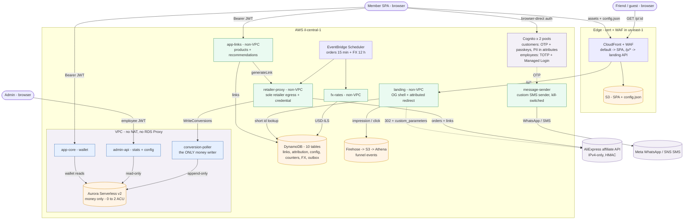
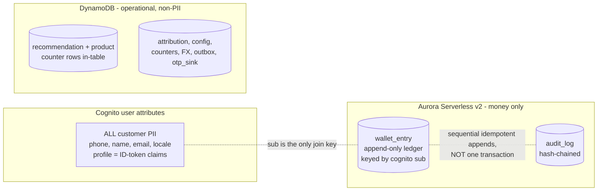
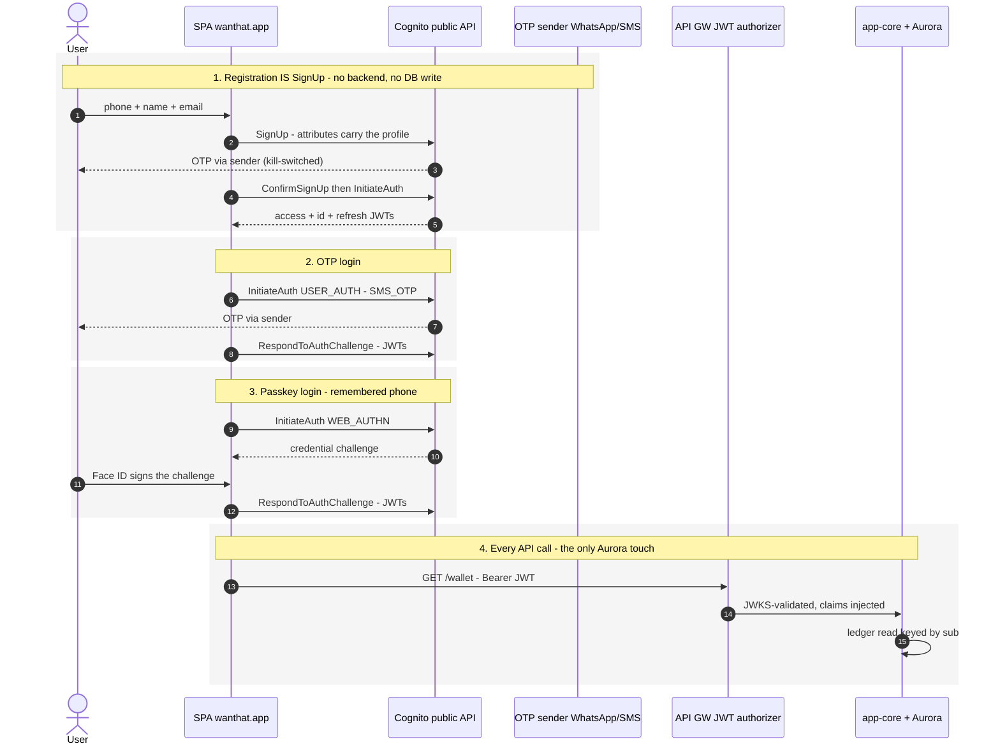
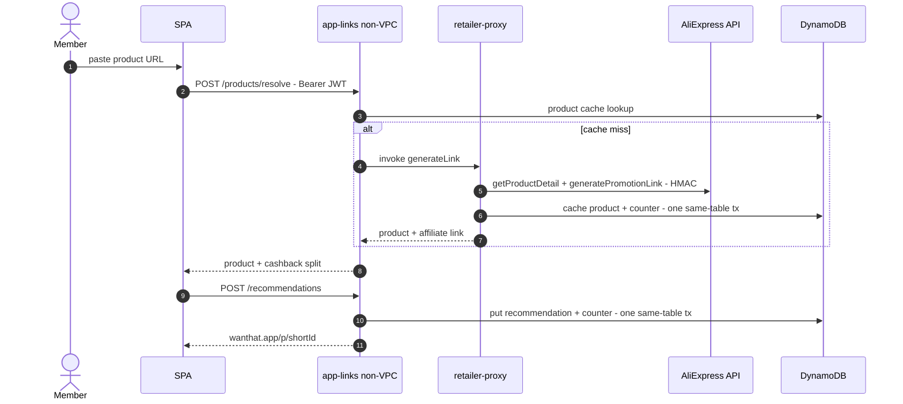
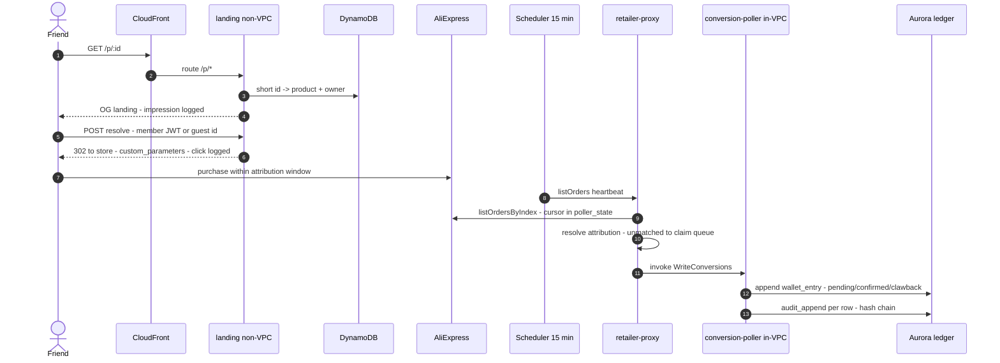
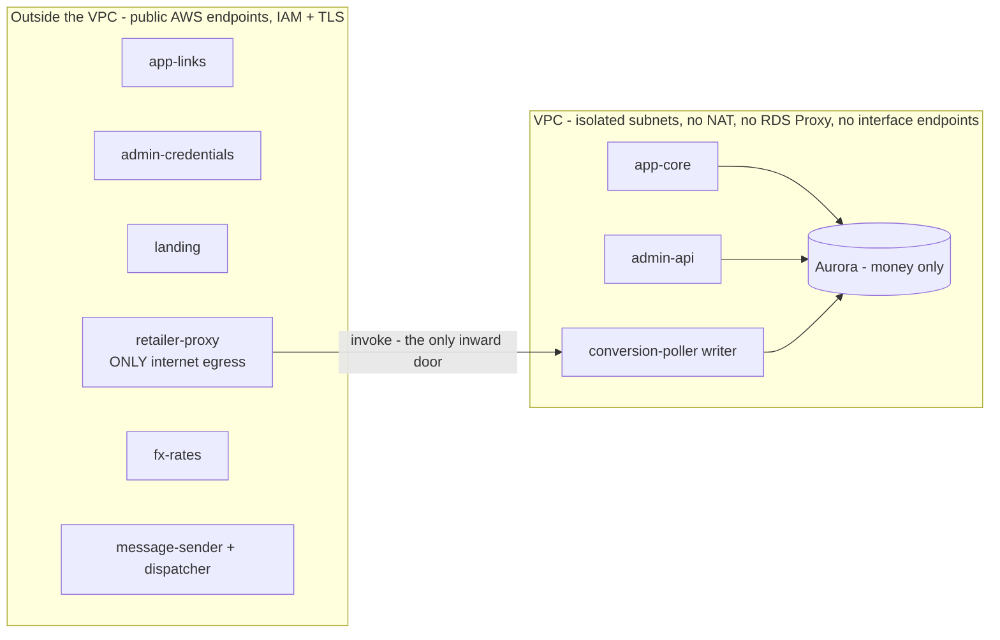

# Wanthat — 20-minute presentation script

> Input for a slides-generation agent. One `## Slide` section per slide: timing, layout hint,
> on-slide content, visual (image asset or mermaid source), and speaker notes. Facts are
> verified against code + the live AWS account (2026-07-14); the authoritative references are
> `docs/AWS_Architecture.md` and `adrs/`. Mermaid sources are ASCII-only with no semicolons.

**Global style:** clean startup-pitch look, white background, one teal-green accent
(evergreen `#1F7A57` — the product design-system accent), dark slate text. Diagram color
code (keep consistent everywhere): green = our compute, orange = data stores, purple =
external/managed services, gray = clients. Phone snapshots in `assets/` are ~2x captures of
340x587 frames — display at equal width in a row, card border + slight shadow.

**Timing plan (20:00):** title 0:30 - business 3:30 - user flows 2:00 - engineering 14:00.
Backup slides are for Q&A only.

---

## Slide 1 — Title (0:30)

Layout: hero title.
- **wanthat** — Earn cashback by sharing what you love.
- Subtitle: Product and architecture overview.
- Footer chips: `Israel MVP` - `AWS serverless` - `il-central-1 (Tel Aviv)`.

Speaker notes: One sentence: "Wanthat turns the product links people already send to friends
into cashback — I'll show the product in two minutes, then spend the rest on how it's built."

## Slide 2 — The why (2:00)

Layout: two columns — problem left, insight right.

Left, "The gap" (three short rows):
- **Shoppers**: people share product links every day — "where did you get that?" — and earn
  nothing for the purchases they drive.
- **Cashback platforms**: Rakuten and Honey reward passive shopping through their own portal;
  the social recommendation goes unpaid and unmeasured.
- **Brands**: influencer budgets keep growing while organic word-of-mouth — which converts
  better — stays invisible.

Right, "The product":
- Wanthat turns the link you already send into a **tracked affiliate link**. Wanthat is the
  single registered affiliate across AliExpress / Awin / eBay; when a friend buys, the
  commission flows in and the **majority is credited back to the recommender** as cashback.
- Punchline: **it monetizes a behavior that already exists — without changing it.**

Speaker notes: word-of-mouth drives 20-50% of purchases and nobody pays for it. We are not
building an influencer platform — the persona is a regular person in four family WhatsApp
groups.

## Slide 3 — Why Israel, why now (1:30)

Layout: stat tiles (2x3) + one footer line.
- **66%** of Israeli online orders are AliExpress — the MVP integration.
- **#1** WhatsApp penetration among the highest globally — group sharing is a daily habit.
- **$17B+** global affiliate market — a proven commercial model.
- **3 days** AliExpress attribution window — sharing must be instant.
- **>=₪50** payout via bank / card / Bit / PayBox.
- Month-3 go/no-go gates: 500 active sharers, >20% CTR, >6% conversion, >50% 30-day return.

Speaker notes: the gates decide Phase 2 (group sharing, two-sided rewards) and a pre-seed
raise.

## Slide 4 — User flow: share a recommendation (1:00)

Layout: five phone snapshots left-to-right with arrows, a small URL chip above each, one-line
caption below each.

| # | Image | URL chip | Caption |
|---|---|---|---|
| 1 | `assets/flow-1-create-link.jpg` | `wanthat.app/create` | Member pastes a product link |
| 2 | `assets/flow-2-link-ready.jpg` | `wanthat.app/create` | Link ready — product pulled, cashback split shown |
| 3 | `assets/flow-3-whatsapp-share.png` | WhatsApp — off-platform | Shared on WhatsApp — disclosure included |
| 4 | `assets/flow-4-friend-landing.jpg` | `wanthat.app/p/Mx7Qa` | Friend opens the branded landing — with the review |
| 5 | `assets/flow-5-redirect-store.jpg` | `-> aliexpress.com — attributed` | Signed in, sent to the store — purchase attributed |

Speaker notes: the whole loop is two taps for the member; the friend's landing carries the
personal review, which is the trust mechanic. Screens are the design-handoff mocks.

## Slide 5 — User flow: the cashback comes back (1:00)

Layout: three phone snapshots with arrows, URL chips, captions.

| # | Image | URL chip | Caption |
|---|---|---|---|
| 1 | `assets/earn-1-activity.jpg` | `wanthat.app/activity` | Conversion tracked — pending until the store confirms |
| 2 | `assets/earn-2-wallet-home.jpg` | `wanthat.app/home` | Wallet credited — estimated ILS over real currencies |
| 3 | `assets/earn-3-withdraw.jpg` | `wanthat.app/withdraw` | Withdraw from ₪50 — bank, card, Bit or PayBox |

Speaker notes: note the "Estimated" chip — cashback is held in the settlement currency and
the ILS headline is a display estimate (ADR-0017); conversion happens at withdrawal.

## Slide 6 — Engineering principles (2:00)

Layout: five principle cards.
- **Monorepo, schema-first** — pnpm + Turborepo, TypeScript everywhere (Node 24, arm64);
  Zod contracts in one package are the single source of truth: inferred types + runtime
  validation at every boundary.
- **Everything as code** — AWS CDK v2; per-env stacks (dev/prod); zero manual console
  changes; PRs run CI + a `cdk diff` dry run that flags destructive changes; merge to main
  deploys dev, prod promotes explicitly; SQL migrations run in-deploy.
- **Decisions on record** — 21 ADRs beside the code; locked: change = a new superseding ADR,
  never an edit.
- **Optimize for cost** — no NAT Gateway, no RDS Proxy, zero VPC interface endpoints,
  scale-to-zero Aurora, on-demand DynamoDB; the dominant cost line is OTP delivery, not
  infrastructure.
- **Zero to scale** — a link going viral in a WhatsApp group is the design load: the redirect
  hot path is non-VPC Lambda + DynamoDB and never touches the SQL database.

Speaker notes: these five drove every decision that follows; when two conflicted, cost and
money-safety won.

## Slide 7 — Architecture (3:00)

Layout: full-slide diagram. Render the mermaid below (or restyle it) — keep the color code.

Speaker notes (walk it left to right): (1) there is **no auth service** — the browser talks
to Cognito directly; OTP rides a custom sender with WhatsApp-default and kill switches.
(2) The member APIs split into non-VPC app-links and in-VPC app-core — only what touches
money enters the VPC. (3) The friend's click never leaves DynamoDB. (4) Money enters only
through the scheduled pipeline on the right — retailer-proxy fetches, the in-VPC writer
appends. Full per-table version lives in `docs/AWS_Architecture.md`.

## Slide 8 — Data: three homes, one rule each (2:30)

Layout: three-column diagram + a one-line rule under each; mermaid below as the visual.

On-slide bullets:
- **PII lives in Cognito** — profile = ID-token claims; GDPR delete = one API call; nothing
  on the auth path touches a database (ADR-0027).
- **Aurora holds money only** — an append-only ledger (`pending -> confirmed -> clawback`
  as immutable rows, balance always derived) + a hash-chained audit log. Postgres GRANTs are
  the enforcement: `app_rw` can only SELECT, `poller_writer` can only INSERT, UPDATE/DELETE
  revoked from everyone (ADR-0003).
- **DynamoDB for everything else** — 10 on-demand tables; $0 idle, unlimited burst.
- **No cross-table transactions anywhere, by design** — exact counters live as counter rows
  inside the counted table (single-table `TransactWriteItems`); ledger + audit are sequential
  idempotent appends protected by a unique `(order_id, kind, status)` index.

Speaker notes: the sub is the only join key between the three worlds — that's what makes
user deletion clean and keeps the ledger pseudonymous.

## Slide 9 — Auth without an auth service (1:30)

Layout: bullets left, mini flow right.
- The SPA calls the public Cognito API directly: `SignUp`, `InitiateAuth (USER_AUTH)`,
  native `WEB_AUTHN` passkeys. **Zero backend calls to log in**; first backend touch is
  `GET /wallet`.
- OTP: WhatsApp-default / SMS-fallback via the custom-sender Lambda — sticky per-user
  preference, runtime-config kill switches, account-wide SMS spend hard cap.
- Face ID on returning devices: one-prompt Cognito-native passkey (remembered phone).
- Abuse control at the pool boundary: WAF rate rules on the unauthenticated Cognito
  operations + quotas — no app-side velocity tables.
- Admin is a separate pool: employees, mandatory TOTP, Managed Login + PKCE — a customer
  token structurally cannot reach `/admin`.

Speaker notes: the previous design proxied every ceremony through app code to win one
feature (userless Face ID); waiving that requirement deleted two Lambdas, three tables and a
crypto path — backup slide B1 has the full sequence diagram.

## Slide 10 — The viral hot path (1:30)

Layout: horizontal chip flow + three callouts.
Flow: `friend taps wanthat.app/p/{id}` -> `CloudFront /p/*` -> `landing (non-VPC)` ->
`DynamoDB: short id -> product + owner` -> `OG landing with the review` ->
`302 to store, custom_parameters = who`.
- Crawlers get server-injected OG tags — links look rich in WhatsApp.
- **Cookieless**: attribution rides the URL (`custom_parameters`), not a cookie (ADR-0008).
- Aurora is never on this path — a viral burst cannot touch the money database.

## Slide 11 — Following the money (1:30)

Layout: horizontal chip flow + three callouts.
Flow: `EventBridge heartbeat 15 min` -> `retailer-proxy: listOrdersByIndex (HMAC)` ->
`attribution resolve (link / guest / unmatched -> admin claim queue)` ->
`invoke in-VPC writer` -> `append ledger rows + audit chain`.
- **Poll, don't listen**: a scheduled reconciliation poll is auditable and replayable; no
  inbound webhook to spoof (ADR-0009).
- One writer: only `poller_writer` can INSERT into the ledger; every row is audit-chained.
- Unmatched orders park in a DynamoDB claim queue; admin claims settle on the next beat.

## Slide 12 — Cost and security posture (1:00)

Layout: two columns.
Cost: Aurora paused = storage only; DynamoDB $0 idle; no NAT / no RDS Proxy / zero interface
endpoints; OTP delivery is the dominant line item — and it is hard-capped.
Security: two WAF layers (CloudFront + Cognito pool); per-function IAM; money invariants in
Postgres GRANTs, not just IAM; the retailer credential readable by exactly one function
(the admin panel can rotate it but never read it); customer/admin separated at pool level.

## Slide 13 — Status and what's next (1:00)

- Live in dev + prod: create-link, landing `/p/`, conversion pipeline (15-min heartbeat),
  wallet, admin console with money KPIs, funnel analytics.
- Critical path: Meta WhatsApp onboarding (OTP at scale) + AliExpress app approval.
- Month-3 gates decide Phase 2: group sharing + two-sided rewards.
- Close: "Questions? Backup slides have the sequence diagrams and the ADR map."

---

# Backup slides (Q&A)

## Slide B1 — Sequence: customer auth, all four flows

## Slide B2 — Sequence: create a link

## Slide B3 — Sequence: click to ledger

## Slide B4 — ADR map

Layout: two-column list; highlight the architecture set (0001-0009) vs stack set.
- 0001 monorepo + Zod contracts - 0002 compute seams - 0003 polyglot data, no RDS Proxy -
  0004 NAT-free network - 0005 single region + cross-region backups - 0006 Cognito-native
  auth + PII - 0007 landing path + latency - 0008 attribution via custom_parameters -
  0009 poller, not webhook.
- Stack: 0010 ESM/Node - 0011 Hono + Powertools - 0012 Kysely + SQL migrations -
  0013 Vitest + Testcontainers - 0014 Biome - 0015 GitHub Actions OIDC - 0016 Vite SPA.
- Extensions: 0017 currency + FX - 0018 CloudFront front door - 0019 WhatsApp messaging -
  0020 sub = canonical id - 0021 retailer throttling (interim).
- Policy: **locked — supersede, never edit.**

## Slide B5 — ADR-0002 + 0004: compute seams and the NAT-free bet

Talking points: only what touches Aurora enters the VPC; in-VPC functions cannot call out —
the conversion chain is always proxy -> writer; a NAT Gateway would be the single biggest
fixed cost in the account.

## Slide B6 — ADR-0003 + 0027: where data lives (and the transaction rule)

Reuse the slide-8 mermaid. Extra talking points:
- The `customer` table was dropped when PII moved to Cognito (migration `0006_money_only`) —
  the ledger is keyed by the Cognito sub directly.
- Admin user search runs on `ListUsers` (one-attribute filters); acceptable at MVP scale,
  dual-write projection is the documented escape hatch.
- Trade-offs accepted: no SQL over PII, no PITR for the user pool, attribute changes have no
  built-in history.

## Slide B7 — ADR-0008 + 0009: attribution and polling

- Attribution rides `custom_parameters` on the retailer redirect — no click-log lookup, no
  cookies; the 3-day window is the retailer's, not ours.
- Conversion via scheduled `listOrdersByIndex` reconciliation: idempotent by the ledger's
  unique `(order_id, kind, status)` index; replayable from the cursor in `poller_state`;
  nothing to spoof.
- Orders that arrive with no attribution park in `unattributed_order` — an admin claim queue
  settled on the next heartbeat.

## Slide B8 — ADR-0017: currency model

- Cashback is **held in the settlement currency** (what AliExpress actually pays) — the
  wallet shows real per-currency holdings.
- The ILS headline is always a **display estimate** (`~₪142.50`, "Estimated" chip) from the
  fx_rate cache (Bank of Israel rate, refreshed 12 h).
- Conversion happens once, at withdrawal — no FX risk carried on displayed balances.
